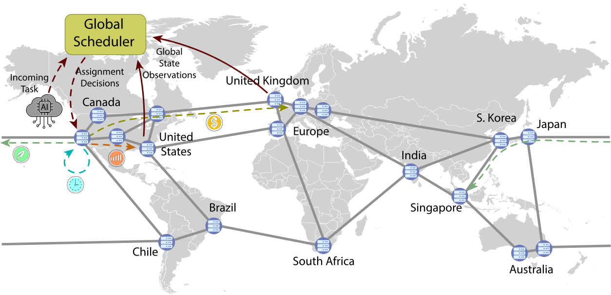
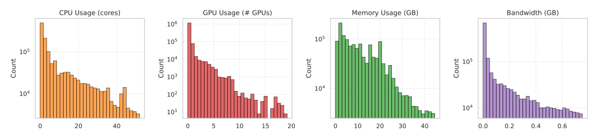
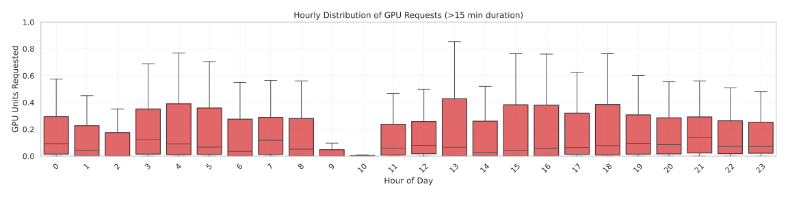
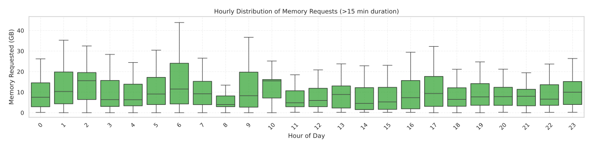
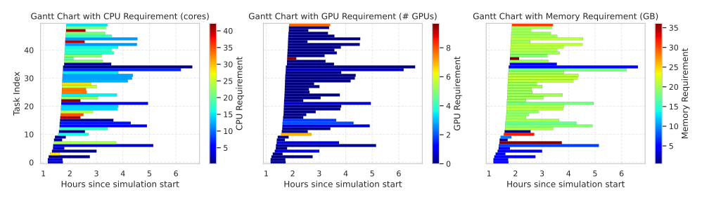
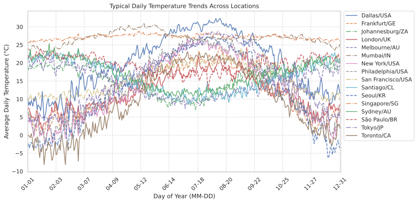
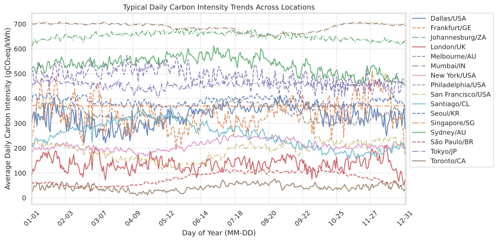
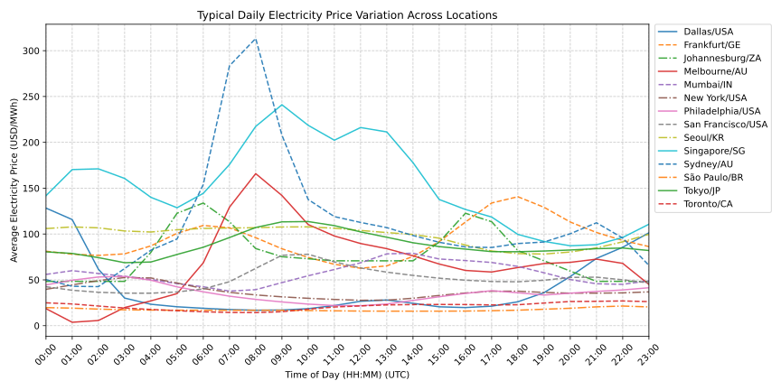

# Multi-Data Center Sustainable Scheduling Benchmark

## 1. Introduction

The rapid growth of large-scale AI and machine learning workloads in globally distributed data centers has brought with it unprecedented computing power and, with it, an ever-increasing carbon footprint. Today’s hyperscale training jobs routinely consume megawatt‑hours of electricity and generate tonnes of CO₂, driven not only by the compute itself but also by the energy and cooling required to keep racks humming. At the same time, modern cloud providers span dozens of regions with wildly varying grid carbon intensities, wholesale electricity prices, and inter‑datacenter network characteristics.

Existing schedulers and benchmarks tend to focus on either local resource utilization, energy cost, or carbon intensity in isolation. None capture the full picture of geo‑temporal trade‑offs: the fact that one site may be greener at 2 AM but more expensive at 2 PM, while another site has cheaper power but sits on a carbon‑intensive grid, or suffers from high network latency and limited throughput. To make sustainable AI scheduling truly realistic, a benchmark must tie together five dimensions simultaneously:
- **Geographic diversity** (multi‑region cloud / edge locations)  
- **Time‑of‑day dynamics** (15‑minute resolution of prices, carbon, weather)  
- **Energy pricing** (normalized \$ / kWh from heterogeneous markets)  
- **Grid carbon intensity** (region‑specific gCO₂eq / kWh)  
- **Network transfer** (per‑GB cost, serialization + propagation delay)

We introduce **GreenDCC** (“Green Data‑Center Cluster”), an open‑source benchmark and Gym‑compatible simulation environment designed to fill this gap. GreenDCC provides:
1. A **reproducible**, end‑to‑end pipeline from real‑world datasets (Alibaba GPU trace, Open‑Meteo, Electricity Maps, cloud bandwidth pricing) to RL‑ready scenarios.  
2. A **centralized global scheduler** that observes system‑wide state and issues “defer or assign” global decisions every 15 minutes.  
3. A **full physics‑informed datacenter model** (CPU/GPU power curves, thermal response, HVAC proxy) coupled with transmission‑aware routing (cost + delay).  
4. A **modular reward engine** supporting single or multi‑objective optimization (energy cost, carbon emissions, SLA adherence, transfer overhead).

By proposing GreenDCC, we aim to foster among the scientific community and enterprises a common testbed for sustainable scheduling of AI workloads that captures the nuanced, geo‑temporal trade‑offs of modern cloud workloads must overcome.

<p align="center">
  
</p>

# Table of Contents
- [Multi-Data Center Sustainable Scheduling Benchmark](#multi-data-center-sustainable-scheduling-benchmark)
  - [1. Introduction](#1-introduction)
- [Table of Contents](#table-of-contents)
  - [2. Features \& Highlights](#2-features--highlights)
  - [3. Benchmark Design](#3-benchmark-design)
    - [3.1 State, Action \& Reward Overview](#31-state-action--reward-overview)
    - [3.2 Supported Optimization Objectives](#32-supported-optimization-objectives)
    - [3.3 Task Lifecycle \& Routing Penalty (cost + delay)](#33-task-lifecycle--routing-penalty-cost--delay)
    - [3.4 Time Granularity](#34-time-granularity)
  - [4. Real‑World Datasets \& Visualizations](#4-realworld-datasets--visualizations)
    - [4.1 AI Workloads (Alibaba GPU Cluster Trace)](#41-ai-workloads-alibaba-gpu-cluster-trace)
    - [4.2 Electricity Prices](#42-electricity-prices)
    - [4.3 Carbon Intensity](#43-carbon-intensity)
    - [4.4 Weather](#44-weather)
    - [4.5 Transmission Costs (per‑GB)](#45-transmission-costs-pergb)
    - [4.6 Dataset Visualizations](#46-dataset-visualizations)
  - [5. Supported Locations \& Custom Regions](#5-supported-locations--custom-regions)
  - [6. Datacenter Modeling](#6-datacenter-modeling)
    - [6.1 Short Explanation of the DC Models](#61-short-explanation-of-the-dc-models)
    - [6.2 Customizing Datacenter](#62-customizing-datacenter)
    - [6.3 Modeling Details](#63-modeling-details)
  - [7. Environment \& API](#7-environment--api)
    - [7.1 Observations](#71-observations)
    - [7.2 Actions \& Deferral](#72-actions--deferral)
    - [7.3 Task Origin Logic](#73-task-origin-logic)
    - [7.4 SLA Modeling](#74-sla-modeling)
    - [7.5 Transmission Delay Model](#75-transmission-delay-model)
  - [8. Modular Reward System](#8-modular-reward-system)
    - [8.1 Built-in Reward Functions](#81-built-in-reward-functions)
    - [8.2 Composite \& Custom Rewards](#82-composite--custom-rewards)
  - [9. Code Organization](#9-code-organization)
    - [9.1 Code Architecture](#91-code-architecture)
    - [9.2 Directory Structure](#92-directory-structure)
  - [10. Quickstart \& Examples](#10-quickstart--examples)
    - [10.1 Installation](#101-installation)
    - [10.2 Training (SAC + Configs)](#102-training-sac--configs)
    - [10.3 Monitoring (TensorBoard)](#103-monitoring-tensorboard)
    - [10.4 Checkpointing](#104-checkpointing)
  - [11. Evaluation \& Demo](#11-evaluation--demo)
    - [11.1 Rule-based vs RL Evaluation](#111-rule-based-vs-rl-evaluation)
    - [11.2 Google Colab Notebook](#112-google-colab-notebook)
    - [11.3 Key Benchmark Metrics / Dashboard](#113-key-benchmark-metrics--dashboard)
  - [12. Planned Features \& Roadmap](#12-planned-features--roadmap)
  - [13. Citation, License \& Contributors](#13-citation-license--contributors)
    - [13.1 Citation / Credits](#131-citation--credits)
    - [13.2 License](#132-license)
    - [13.3 Contributors](#133-contributors)
  
## 2. Features & Highlights

SustainCluster provides a comprehensive and realistic benchmark environment for developing and evaluating sustainable task scheduling algorithms across geo-distributed data centers. Key features include:

*   **Rich Real-World Data Integration:** Incorporates time-series data for **over 20 global locations**, including:
    *   **AI Workloads:** Based on the Alibaba Cluster Trace 2020 GPU dataset.
    *   **Electricity Prices:** Sourced from Electricity Maps, GridStatus, and regional operators.
    *   **Grid Carbon Intensity:** Real gCO₂eq/kWh data from Electricity Maps.
    *   **Weather Data:** From Open-Meteo for temperature-aware cooling models.
    *   **Transmission Costs:** Region-to-region per-GB pricing from AWS, GCP, and Azure.

*   **Physics-Informed Datacenter Modeling:** Simulates detailed energy consumption within each datacenter, including CPU/GPU/Memory power draw based on utilization, and a temperature-aware cooling/HVAC proxy model grounded in established thermal dynamics.
*   **Transmission-Aware Routing (Cost & Delay):** Accounts for both monetary transfer costs (per-GB pricing) and realistic transmission delays calculated using empirical inter-datacenter throughput and RTT data (based on [Persico et al. (IEEE GLOBECOM 2016)](https://www.sciencedirect.com/science/article/abs/pii/S138912861630353X)), impacting task arrival times at remote sites.
*   **Centralized Global Scheduler Simulation:** Models a scheduler overseeing multiple distributed data centers, making dispatch or deferral decisions for incoming tasks based on global system state.
*   **Gymnasium-Compatible Environment:** Offers a standard Reinforcement Learning interface (`TaskSchedulingEnv`) compatible with common RL libraries, facilitating agent development and evaluation.
*   **Flexible Multi-Objective Optimization:** Features a modular reward system enabling users to define custom reward functions or combine built-in components (e.g., energy cost, carbon emissions, SLA violations, transmission overhead) with configurable weights.
*   **Support for Diverse Schedulers:** Natively supports training Deep RL agents (with SAC example) and includes a suite of rule-based controllers (e.g., lowest carbon, lowest price, most available) for baseline comparisons.
*   **Extensible and Configurable:** Designed with modularity, allowing users to easily customize datacenter configurations, add new locations, define new reward structures, or integrate custom scheduling policies.
*   **Reproducible Scenarios:** Enables consistent experimental setups through configuration files and seeding, crucial for benchmarking research.

## 3. Benchmark Design
SustainCluster simulates a centralized global task scheduler interacting with a cluster of geographically distributed data centers. At each time step, the simulation proceeds as follows:

1.  **Task Generation:** New AI tasks (derived from the real-world trace) may arrive at their designated origin datacenters based on a population and time-zone probabilistic model. Any tasks previously time-deferred are also reconsidered.
2.  **Observation:** The central agent (scheduler) observes the current global state, including time, environmental factors (price, carbon intensity), the state of each datacenter (resource availability, load), and the details of all pending tasks (requirements, origin, deadline).
3.  **Action:** For *each* pending task, the agent decides whether to **defer** it to the next timestep or **assign** it to one of the `N` available datacenters for execution.
4.  **Routing & Delay:** When a task is assigned to a remote datacenter (different from its origin), the system calculates and tracks associated transmission impacts:
    *   **Cost:** Monetary cost based on per-GB cloud provider rates (see Section 4.5).
    *   **Energy:** Estimated using a fixed factor (currently 0.06 kWh/GB based on findings in [Aslan et al., 2017](https://doi.org/10.1111/jiec.12630)) multiplied by the task's data size (`bandwidth_gb`).
    *   **Carbon Emissions:** Calculated as Transmission Energy × Origin Grid Carbon Intensity (using real-time data for the origin DC's location).
    *   **Delay:** Computed using serialization + propagation time based on empirical data ([Persico et al., 2016](https://doi.org/10.1109/GLOCOM.2016.7841498)). See Section 7.5 for the formula.
    The task is held "in transit" during this delay and only becomes available for execution at the destination DC after it elapses.
5.  **Execution & State Update:** Each datacenter attempts to schedule its queued tasks based on resource availability. Internal models simulate **energy consumption, carbon emissions, and thermal dynamics**. The global clock advances by 15 minutes.
6.  **Reward Calculation:** A scalar reward signal is computed based on the outcomes of the timestep (e.g., total cost, emissions, SLA violations) according to the configured reward function.

This cycle repeats, allowing RL agents or rule-based controllers to learn or apply scheduling policies that optimize long-term objectives.


### 3.1 State, Action & Reward Overview

*   **State Observation:** The environment provides a detailed observation at each step `t`. This observation is structured as a **list**, where each element corresponds to one of the `k_t` currently pending tasks.
    *   **Per-Task Vector:** By default (`_get_obs` in `TaskSchedulingEnv`), the vector for each pending task `i` contains:
        *   **Global Time Features:** Sine/cosine encoding of the day of the year and hour of the day (4 features).
        *   **Task-Specific Features:** Origin DC ID, CPU core requirement, GPU requirement, estimated duration, and time remaining until SLA deadline (5 features).
        *   **Per-Datacenter Features:** For each of the `N` datacenters: available CPU %, available GPU %, available Memory %, current carbon intensity (kgCO₂/kWh), and current electricity price ($/kWh) (5 * `N` features).
    *   **Variable State Shape:** The full observation `s_t` returned by `env.step()` or `env.reset()` is this list of `k_t` vectors. Since the number of pending tasks `k_t` changes from one timestep to the next (i.e., `k_t` may differ from `k_{t+1}`), the overall **shape of the state observation varies across timesteps**. For example, `s_t` might be a list of 10 vectors (10 tasks), while `s_{t+1}` might be a list of 5 vectors (5 tasks). In general, `s_t` has a shape of `(k_t, 4 + 5 + 5 * N)`, where `N` is the number of datacenters.
    *   **Handling Variability:** Standard RL algorithms often assume fixed-size observations.
        *   The provided *off-policy* SAC example handles this using a replay buffer (`FastReplayBuffer`) that pads the list of observations up to a `max_tasks` length and uses masking during batch processing.
        *   *On-policy* algorithms like A2C can handle this without padding by processing the list of tasks sequentially during rollouts and using appropriate aggregation for the value function.
    *   **Customization:** Users can easily modify `_get_obs` to include other available information from `self.cluster_manager.datacenters` (e.g., pending queue lengths, detailed thermal state, forecasted carbon intensity) or `self.current_tasks` (the current pending tasks) to extract task-specific features to create custom state representations tailored to their specific agent architecture, scheduling strategy or reward function.

*   **Action Space:** At each timestep `t`, the agent is presented with a list of `k_t` pending tasks. For **each task** in this list, the agent must output a single discrete action `a_i` from the set `{0, 1, ..., N}`:
    *   `a_i = 0`: **Defer** the i-th task. The task is held and reconsidered in the next 15-minute timestep.
    *   `a_i = j` (where `1 ≤ j ≤ N`): **Assign** the i-th task to datacenter `j`. The task is sent towards that DC's queue (potentially incurring transmission cost and delay if `j` is different to the DC task's origin).
    *   Therefore, the agent needs to produce a sequence of `k_t` actions in total at step `t`. As `k_t` varies, this constitutes a **variable-length action requirement** per timestep. Refer to the State Observation section for how the provided RL agent examples handle this variability.

*   **Reward Signal:** After all actions for a timestep are taken and the simulation advances, a single, global scalar reward `r_t` is returned. This reward is calculated by a configurable `RewardFunction` (see Section 8). This function aggregates various performance and sustainability metrics based on user-defined weights and objectives, such as minimizing operational costs, carbon footprint, energy consumption, or SLA violations.


### 3.2 Supported Optimization Objectives
GreenDCC allows users to optimize for various objectives, either individually or combined through the modular reward system. Key optimizable metrics tracked by the simulator include:

*   Total operational energy cost (USD) across all datacenters.
*   Total energy consumption (kWh).
*   Total carbon emissions (kg CO₂eq) from compute, cooling, and data transmission.
*   Number or severity of Service Level Agreement (SLA) violations.
*   Total inter-datacenter data transmission costs (USD).
*   Resource utilization efficiency (e.g., minimizing idle power).
*   Multi-objective combinations balancing these factors (e.g., minimizing cost subject to an emissions cap).


### 3.3 Task Lifecycle & Routing Penalty (cost + delay)
When the scheduler assigns a task originating at DC `A` to a remote destination DC `B`, the following steps occur:

1.  **Transmission Cost:** An immediate monetary cost is calculated based on the task's data size (`bandwidth_gb`) and the per-gigabyte egress/transfer cost between the origin and destination regions (using cloud provider pricing tiers from AWS, Azure, GCP). This cost can be included in the reward calculation.
2.  **Transmission Delay Calculation:** A network delay is computed using the formula:
    `delay (s) = (task_size_GB * 8000 / throughput_Mbps) + (RTT_ms / 1000)`
    where `throughput_Mbps` and `RTT_ms` are empirically measured values between the macro-regions (EU, US, SA, AP) based on Persico et al. (2016). This captures both serialization time (dependent on data size and effective bandwidth) and propagation time.
3.  **In-Transit Hold:** The task is conceptually held "in transit". It does not immediately appear in DC `B`'s queue.
4.  **Delayed Enqueue:** Only after `delay` seconds have passed (potentially spanning multiple 15-minute simulation steps) does the task arrive and get added to the pending queue at the destination datacenter (DC `B`), becoming eligible for execution. This accurately models the real-world impact of network latency on task start times.

### 3.4 Time Granularity

GreenDCC operates on a **15-minute timestep**. This granularity was chosen carefully to balance realism and simulation efficiency:

*   **Data Availability:** Key real-world data sources like Electricity Maps (carbon intensity) and grid APIs (electricity prices) typically provide data at 15-minute or hourly intervals.
*   **Cloud Billing:** Major cloud providers often bill compute resources in increments of minutes (sometimes 1, 5, or 15), making 15-minute scheduling decisions relevant for cost optimization.
*   **Operational Cadence:** Large-scale cluster scheduling and resource planning often happen at coarser intervals than per-second or per-minute to reduce overhead and smooth out load variations.
*   **Thermal Inertia:** Datacenter cooling systems (HVAC, chillers) have significant thermal inertia. Their response to changes in load or setpoints occurs over minutes, not seconds. Simulating at a 15-minute interval allows for stable tracking of these thermal dynamics without excessive computational cost or noise.
*   **Supporting Literature:** Several studies on data center energy optimization, cooling control, and job scheduling using RL have successfully employed similar time granularities (e.g., 5-15 minutes) to model system dynamics effectively.
This timestep design is **backed by multiple studies** in the field:

- *DeepEE: Joint Optimization of Job Scheduling and Cooling Control*, ICDCS 2019  
  https://doi.org/10.1109/ICDCS.2019.00070  
  → RL agent jointly controls job placement and cooling actions; the system is updated in aggregated time steps to manage interactions.

- *Green Data Center Cooling Control via Physics-guided Safe Reinforcement Learning*, ACM Transactions on Cyber-Physical Systems (2023)  
  https://doi.org/10.1145/3582577  
  → Uses physics-informed RL on cooling systems, with control cycles aligned to 15-minute windows for safe and stable adaptation.

- *Peak Shaving in Data Centers with Deep Reinforcement Learning*, Oregon State University  
  https://ir.library.oregonstate.edu/concern/graduate_thesis_or_dissertations/nc580v28w  
  → Applies RL to schedule peak power reductions using 15-minute windows based on grid signals.

- *Energy Efficient Control of Data Center HVAC Systems using Reinforcement Learning*, University of Twente (2024)  
  → Shows that minute-level control is impractical due to thermal inertia; uses coarser control cycles for stable performance.

- *Energy Efficient Scheduling of Servers with Multi-Sleep Modes*, IEEE TCC 2020  
  https://doi.org/10.1109/TCC.2018.2834376  
  → Models energy transitions and sleep states using coarse time intervals to minimize server wake/sleep cycles.

## 4. Real‑World Datasets & Visualizations
GreenDCC integrates multiple real-world datasets to create realistic and challenging scheduling scenarios that reflect the dynamic nature of global infrastructure and environmental factors.

Summary table of datasets:
| Dataset | Source | Description |
| ------- | ------ | ----------- |
| AI Workloads | Alibaba Cluster Trace 2020 | Real-world GPU workload traces from Alibaba's data centers. |
| Electricity Prices | Electricity Maps, GridStatus | Real-time electricity prices for various regions. |
| Carbon Intensity | Electricity Maps | Real-time carbon intensity data (gCO₂eq/kWh) for various regions. |
| Weather | Open-Meteo | Real-time weather data (temperature, humidity) for cooling proxy. |
| Transmission Costs | AWS, GCP, Azure | Per-GB transfer costs between regions. |

### 4.1 AI Workloads (Alibaba GPU Cluster Trace)

*   **Source:** We use the [Alibaba Cluster Trace 2020](https://github.com/alibaba/clusterdata/tree/master/cluster-trace-gpu-v2020), a real-world dataset of GPU jobs from a large production cluster operated by Alibaba PAI (Platform for AI). It covers two months (July–August 2020), including over **6,500 GPUs** across **~1800 machines**. This trace contains **training and inference jobs** using frameworks like TensorFlow, PyTorch, and Graph-Learn. These jobs span a wide range of machine learning workloads, and each job may consist of multiple tasks with multiple instances.
*   **Preprocessing:** To prepare the trace for long-term sustainable scheduling simulation, we perform several preprocessing steps:
    *   **Filtering:** Remove very short tasks, keeping only those ≥ 15 minutes (typical of substantial training or inference workloads).
    *   **Temporal Extension:** Extend the 2-month trace to cover a full year by replicating observed daily and weekly patterns.
    *   **Origin Assignment:** Assign a **probabilistic origin** datacenter to each task based on regional **population** weights and local **time-of-day** activity boosts (simulating higher generation during business hours). See Section 7.3 for details.
    *   **Grouping:** Aggregate tasks into 15-minute intervals based on their arrival times to align with the simulation timestep.
*   **Dataset Format (After Cleaning):** The cleaned dataset is saved as a Pandas `.pkl` DataFrame file with the following structure:

| interval_15m       | tasks_matrix                                           |
|--------------------|--------------------------------------------------------|
| 2020-03-01 08:00   | [[job1, tstart, tend, start_dt, duration, cpu, gpu, mem, gpu_mem, bw, day_name, day_num], ...] |
| 2020-03-01 08:15   | [[jobN, tstart, tend, start_dt, duration, cpu, gpu, mem, gpu_mem, bw, day_name, day_num], ...] |
| ...                | ...                                                    |


Where:
- `interval_15m`: The 15-minute time window (UTC) when the task starts.
- `tasks_matrix`: A NumPy array representing all tasks in that interval. Each task row includes:
  1. **job_id**: Unique task identifier.
  2. **start_time**: Start timestamp (Unix).
  3. **end_time**: End timestamp (Unix).
  4. **start_dt**: UTC datetime of start.
  5. **duration_min**: Task duration in minutes.
  6. **cpu_usage**: Number of CPU cores requested (e.g., `600.0` -> 6 cores).
  7. **gpu_wrk_util**: Number of GPUs requested (e.g., `50.0` -> 0.5 GPUs).
  8. **avg_mem**: Memory used (GB).
  9. **avg_gpu_wrk_mem**: GPU memory used (GB).
  10. **bandwidth_gb**: Estimated input data size (GB).
  11. **weekday_name**: Day name (e.g., Monday).
  12. **weekday_num**: Integer from 0 (Monday) to 6 (Sunday).

>   **Resource Normalization:**
> In the original Alibaba dataset, both CPU and GPU requirements are stored as percentages:
> - `600.0` = 6 vCPU cores  
> - `50.0` = 0.5 GPUs  
>  
> We keep this representation in the `.pkl` file. However, during task extraction and simulation, we normalize these values into actual hardware units using the logic in `extract_tasks_from_row()` (located in `workload_utils.py`):

```python
job_name = task_data[0]
duration = float(task_data[4])
cores_req = float(task_data[5]) / 100.0    # Convert percentage to core count
gpu_req = float(task_data[6]) / 100.0    # Convert percentage to GPU count
mem_req = float(task_data[7])            # Memory in GB
bandwidth_gb = float(task_data[8])       # Data transfer size in GB

task = Task(job_name, arrival_time, duration, cores_req, gpu_req, mem_req, bandwidth_gb)
tasks.append(task)
```

This transformation allows for more intuitive interpretation and visualization.

### 4.2 Electricity Prices
*   **Sources:** Real historical electricity price data is collected from various sources, including [Electricity Maps](https://www.electricitymaps.com/), [GridStatus.io](https://gridstatus.io/), and regional Independent System Operator (ISO) APIs (e.g., CAISO, NYISO, ERCOT, OMIE).
*   **Coverage:** Data covers the years 2020–2024 for over 20 global regions corresponding to the supported datacenter locations.
*   **Standardization:** Prices are cleaned, converted to a standard format (UTC timestamp, USD/MWh), and aligned with the simulation's 15-minute intervals. For simulation purposes, prices are typically normalized further (e.g., to USD/kWh).
*   **Storage:** Data is organized by region and year in CSV files located under `data/electricity_prices/standardized/`. See `data/electricity_prices/README.md` for details.

### 4.3 Carbon Intensity
*   **Source:** Grid carbon intensity data (measuring the grams of CO₂ equivalent emitted per kilowatt-hour of electricity consumed) is sourced from the [Electricity Maps API](https://www.electricitymaps.com/).
*   **Coverage:** Provides historical data (2021–2024) for the supported global regions.
*   **Resolution:** Data is typically available at hourly or sub-hourly resolution and is aligned with the simulation's 15-minute timestep.
*   **Units:** Stored and used as gCO₂eq/kWh.

### 4.4 Weather
*   **Source:** Historical weather data, primarily air temperature and potentially wet-bulb temperature (relevant for certain cooling models), is obtained via the [Open-Meteo API](https://open-meteo.com/).
*   **Coverage:** Data covers the years 2021–2024 for the supported datacenter locations.
*   **Usage:** Temperature data directly influences the simulated efficiency and energy consumption of datacenter cooling systems (HVAC).

### 4.5 Transmission Costs (per‑GB)
*   **Sources:** Inter-region data transfer costs are based on publicly available pricing information from major cloud providers: [AWS](https://aws.amazon.com/ec2/pricing/on-demand/), [GCP](https://cloud.google.com/vpc/pricing), and [Azure](https://azure.microsoft.com/en-us/pricing/details/bandwidth/).
*   **Format:** We compile this information into matrices representing the cost (in USD) to transfer 1 GB of data between different cloud regions. The specific matrix used depends on the `cloud_provider` configured in the simulation.
*   **Storage:** These cost matrices are typically stored as CSV files within the `data/` directory and loaded by the `transmission_cost_loader.py` utility.

### 4.6 Dataset Visualizations
To provide insights into the characteristics of the integrated datasets, the repository includes several visualizations (located in `assets/figures/` and generated by scripts like `plot_alibaba_workload_stats.py`).

*   **Workload Characteristics:**
    *   *Task Duration Distribution:* Shows the distribution of task lengths.

      <p align="center">
        
      </p>

    *   *Resource Usage Distributions:* Illustrate the distribution of CPU, GPU, memory, and bandwidth requirements per task.

      <p align="center">
        
      </p>

    *   *Temporal Patterns (Heatmap):* Visualize task arrival rates across different hours of the day and days of the week.

      <p align="center">
        
      </p>

    *   *Temporal Patterns (Boxplots):* Show hourly distribution of resource requests.

      <p align="center">
        
        <br><br>
        
        <br><br>
        
      </p>

    *   *Gantt Chart Sample:* Provides a visual timeline of task execution, colored by resource usage.

      <p align="center">
        
      </p>

*   **Environmental Factors:**
    *   *Temperature Trends:* Line plots showing average daily temperatures across different regions.

      <p align="center">
        
      </p>
      <p align="center">
        <em>Average daily temperature across selected datacenter regions (°C)</em>
      </p>

    *   *Carbon Intensity Trends:* Line plots showing average daily carbon intensity and average hourly profiles.

      <p align="center">
        
      </p>
      <p align="center">
        <em>Average daily carbon intensity across selected datacenter regions (gCO₂eq/kWh)</em>
      </p>
      <p align="center">
        
      </p>
      <p align="center">
        <em>Average hourly carbon intensity profile over a typical day (UTC time)</em>
      </p>

    *   *Electricity Price Hourly Profiles:* Plots showing average price for each hour of the day.

      <p align="center">
        
      </p>
      <p align="center">
        <em>Average hourly electricity price profile over a typical day (UTC time)</em>
      </p>

These visualizations help understand the input data driving the simulation and the potential opportunities and challenges for sustainable scheduling algorithms.


## 5. Supported Locations & Custom Regions

GreenDCC includes integrated real-world data (electricity price, carbon intensity, weather) for a growing list of **over 20 global locations**. Use the following `location` codes within your `datacenters.yaml` configuration file to associate a simulated datacenter with these datasets.

The table below shows the built-in locations, the corresponding cloud provider region used for **transmission cost** lookups (based on `utils/transmission_region_mapper.py`), and the macro-cluster used for **transmission delay** lookups (based on `data/network_cost/network_delay.py`). Data availability (Price=P, Carbon Intensity=CI, Weather=W) is indicated based on files present in the `data/` directory (dynamic API calls may supplement missing files).

| Code         | Region / Market                          | Data | Cloud Region Mapping (for Cost) (GCP / AWS / Azure) | Macro-Cluster (for Delay) |
| :----------- | :------------------------------------------- | :--- | :-------------------------------------------------- | :------------------------ |
| US-NY-NYIS   | New York (NYISO)                         | P,CI,W | `us-east1` / `us-east-1` / `East US`                | US                        |
| US-CAL-CISO  | California (CAISO)                       | P,CI,W | `us-west1` / `us-west-1` / `West US`                | US                        |
| US-TEX-ERCO  | Texas (ERCOT)                            | P,CI,W | `us-central1`\* / `us-east-1-dwf-1` / `South Central US` | US                        |
| US-MIDA-PJM  | PJM Interconnection (Mid-Atlantic US)    | P,CI,W | `us-central1`\* / `us-east-1-dwf-1` / `South Central US` | US                 |
| CA-ON        | Ontario (IESO)                           | P,CI,W | `us-east1`\* / `ca-central-1` / `Canada Central`      | US                        |
| BR-SP        | Brazil - São Paulo (ONS)                 | P,CI,W | `southamerica-east1` / `sa-east-1` / `Brazil South`   | SA                        |
| CL-SIC       | Chile (CDEC-SIC)                         | P,CI,W | `southamerica-east1` / `us-east-1-chl-1` / `Chile North` | SA                        |
| DE-LU        | Germany + Luxembourg (ENTSO-E)           | P,CI,W | `europe-west1` / `eu-central-1` / `Germany West Central` | EU                        |
| FR           | France (ENTSO-E)                         | P,(CI),W | `europe-west4` / `eu-west-3` / `France Central`     | EU                        |
| ES           | Spain (OMIE)                             | P,(CI),(W) | `europe-west1` / `eu-south-1` / `Spain Central`       | EU                        |
| PT           | Portugal (OMIE)                          | P,(CI),(W) | `europe-west1` / `eu-south-1` / `Portugal North`      | EU                        |
| BE           | Belgium (ENTSO-E)                        | P,(CI),(W) | `europe-west1` / `eu-west-1` / `West Europe`        | EU                        |
| NL           | Netherlands (ENTSO-E)                    | P,(CI),(W) | `europe-west1` / `eu-west-1` / `North Europe`         | EU                        |
| AT           | Austria (ENTSO-E)                        | P,(CI),(W) | `europe-west4` / `eu-central-1` / `Austria East`      | EU                        |
| CH           | Switzerland (ENTSO-E)                    | P,(CI),(W) | `europe-west4` / `eu-central-1` / `Switzerland North` | EU                        |
| SG           | Singapore (USEP)                         | P,CI,W | `asia-southeast1` / `ap-southeast-1` / `Southeast Asia` | AP                        |
| JP-TK        | Japan - Tokyo Area (JEPX)                | P,CI,W | `asia-northeast1` / `ap-northeast-1` / `Japan East`   | AP                        |
| KR           | South Korea (KPX)                        | P,CI,W | `asia-northeast1` / `ap-northeast-2` / `Korea Central`  | AP                        |
| IN-WE        | India - Mumbai (POSOCO)                  | P,CI,W | `asia-south1` / `ap-south-1` / `Central India`      | AP                        |
| AU-NSW       | Australia - New South Wales (AEMO)       | P,CI,W | `australia-southeast1` / `ap-southeast-2` / `Australia East` | AP                        |
| AU-VIC       | Australia - Victoria (AEMO)              | P,CI,W | `australia-southeast1` / `ap-southeast-2` / `Australia East` | AP                        |
| ZA           | South Africa (Eskom)                     | P,CI,W | `africa-south1`\* / `af-south-1` / `South Africa North` | SA \*\*\*             |

*(\* Approximation used where direct mapping isn't available. \*\* Africa (AF) cluster may use default/proxy values if not explicitly in the Persico et al. delay data.)*

*Data Availability: P=Price, CI=Carbon Intensity, W=Weather (based on files in `data/`). Parentheses indicate data might be partially missing.*
*(\* Approximation used in the code where a direct mapping isn't available.)*
*(\*\*\* Based on current code (`network_delay.py`), South African regions map to the `SA` macro-cluster for delay calculations.)*

We plan to continuously expand this list in future releases.
➡️ Have a region you'd like to see supported? Open an issue or submit a PR!

**How to Add Custom Locations or Regions:**

While GreenDCC provides data for these common locations, the framework is designed to be extensible:

1.  **Define New Location Code:** Add a new entry in `datacenters.yaml` with a unique `location` code (e.g., `"My-Custom-Region"`).
2.  **Provide Data:** Place corresponding time-series data files (electricity price, carbon intensity, weather) into the respective subdirectories within `data/` (e.g., `data/electricity_prices/standardized/My-Custom-Region/2023/...`). Ensure the format matches the existing files.
3.  **Map to Transmission Region:** Update the mapping logic (likely found in `utils/transmission_region_mapper.py` or similar configuration) to associate your new `location` code with:
    *   A cloud provider region (e.g., `us-west-2`) used for looking up per-GB transmission costs from the provider's matrix (e.g., `data/network_cost/aws_transmission_costs.csv`).
    *   A macro-cluster (`EU`, `US`, `SA`, `AP`) used for looking up empirical delay parameters (throughput/RTT) from the Persico et al. data integrated into `data/network_cost/network_delay.py`.
4.  **(Optional) Custom Transmission Data:** If the default cloud provider costs or empirical delay data do not suit your needs, you can modify the loading functions (e.g., `utils/transmission_cost_loader.py`, `data/network_cost/network_delay.py`) to point to your own custom CSV files containing region-to-region costs or delay parameters.

This flexibility allows researchers to adapt GreenDCC to specific geographical footprints or network assumptions beyond the initially provided datasets.

## 6. Datacenter Modeling

Each simulated datacenter within GreenDCC incorporates a physics-informed model to estimate energy consumption, carbon emissions, and thermal behavior based on the scheduled workload and environmental conditions.

### 6.1 Short Explanation of the DC Models

The datacenter model operates in layers, capturing the relationship between IT workload, power draw, heat generation, and cooling requirements:

*   **IT Power Modeling:**
    *   **CPU Power:** Calculated based on utilization (`Load`) and the server's inlet air temperature (`T_in`), using configurable idle/max power values and efficiency curves (`P_cpu = f(Load, T_in)`).
    *   **GPU Power:** Modeled based on assigned workload, contributing significantly to IT power, especially for training tasks. Uses configurable idle/max power characteristics (e.g., based on NVIDIA V100 defaults in `dc_config.json`).
    *   **Memory Power:** A baseline power overhead associated with memory capacity is included in the IT load calculation.
    *   **Fan Power:** Server fan power scales cubically with required airflow (`V_fan`), which itself depends on the heat generated by CPU/GPU/Memory and the inlet temperature.
*   **Thermal Modeling:**
    *   **Heat Generation:** The total IT power (CPU + GPU + Memory + Fans) is treated as heat generated within the racks.
    *   **Rack Airflow:** Air flows through racks, picking up heat. The outlet air temperature (`T_out`) is calculated based on inlet temperature, IT heat load, and fan airflow.
    *   **Room Mixing:** Return air temperature to the cooling units (`avg_CRAC_return_temp`) is estimated based on the average rack outlet temperatures, adjusted for rack-specific approach temperatures.
*   **HVAC System (Cooling):**
    *   **Cooling Load:** The CRAC (Computer Room Air Conditioner) units must remove the heat generated by the IT equipment (`Q_CRAC`).
    *   **CRAC Fan Power:** Power consumed by CRAC fans depends on the required air circulation rate (`CRAC_Fan_load = P_ref * (flow_rate / ref_flow_rate)^3`).
    *   **Chiller Power:** Modeled using performance curves derived from **EnergyPlus** simulation data. The chiller power dynamically adjusts based on the current cooling `load`, the `ambient_temp` (from weather data), its design specifications (e.g., `rated_cop`, `design_cond_temp`), and part-load ratio (PLR) characteristics. The model (`calculate_chiller_power`) accounts for efficiency variations at different load levels and ambient conditions.
    *   **Cooling Tower & Pumps:** Power for associated pumps (`power_consumed_CW`, `power_consumed_CT`) and cooling tower fans (`CT_Fan_pwr`) are calculated based on flow rates, pressure drops, efficiencies, and ambient conditions.
*   **Water Usage:** Water evaporation in the cooling tower is estimated based on load and ambient wet-bulb temperature (derived from weather data).
*   **Total Power:** The sum of all IT power components and all HVAC power components (`CRAC_Fan_load`, `chiller_power`, `CT_Fan_pwr`, pump powers) constitutes the total instantaneous power draw of the datacenter. This is used alongside electricity price and carbon intensity data to calculate cost and emissions.

### 6.2 Customizing Datacenter

Users configure the cluster of datacenters via the `datacenters.yaml` file. Each entry defines a single datacenter and its high-level properties:

*   `dc_id`: A unique integer identifier for the datacenter.
*   `location`: A location code (e.g., `"US-NY-NYIS"`, `"DE-LU"`) used to link the DC to corresponding real-world datasets (price, carbon, weather) and network region mappings (see Section 5).
*   `timezone_shift`: The timezone offset from UTC in hours (e.g., `-5` for US East, `+1` for Central Europe). Used for local time calculations (e.g., task origin logic).
*   `population_weight`: A relative weight used in the probabilistic task origin generation logic (see Section 7.3).
*   `total_cores`: The total number of schedulable CPU cores in the datacenter.
*   `total_gpus`: The total number of schedulable GPUs in the datacenter.
*   `total_mem`: The total memory capacity in GB.
*   `dc_config_file`: Path to a JSON file containing detailed low-level parameters for the physical model, such as:
    *   Datacenter layout (rows, racks per row, CPUs/GPUs per rack).
    *   HVAC system parameters (reference fan power, flow rates, chiller coefficients, pump efficiencies). **Note:** The chiller model uses coefficients derived from EnergyPlus test files, as implemented in `calculate_chiller_power`.
    *   Server power characteristics (idle/max power for CPU/GPU types, fan curves).
    *   Thermal properties (approach temperatures).

An example `dc_config.json` is provided in `configs/dcs/`, allowing users to simulate different hardware efficiencies or cooling system designs by modifying these parameters.

### 6.3 Modeling Details

For a comprehensive description of the underlying mathematical models, equations, and assumptions used in the datacenter simulation (particularly the thermal and HVAC components inherited from the core SustainDC environment), please refer to:

📄 [`envs/sustaindc/README_SustainDC.md`](envs/sustaindc/README_SustainDC.md)

This document details the CPU power curves, fan laws, heat transfer calculations, and general cooling system component models, citing key references such as [Sun et al. (2021)](https://www.sciencedirect.com/science/article/abs/pii/S0378778820333892) and [Breen et al. (2010)](https://pure.ul.ie/en/publications/from-chip-to-cooling-tower-data-center-modeling-part-i-influence-).

The specific implementation of the **chiller power calculation** (`calculate_chiller_power` function, used within `calculate_HVAC_power`) is based on performance curves and part-load ratio logic derived from **EnergyPlus** examples and documentation (refer to code comments for specific source links within the EnergyPlus GitHub repository).

**Note:** While the detailed `README_SustainDC.md` focuses heavily on the CPU and cooling aspects, the implementation within GreenDCC **has been extended** to explicitly incorporate **GPU and Memory power consumption** into the total IT load (`P_IT`) calculations, using parameters defined in the `dc_config_file` (e.g., `DEFAULT_GPU_POWER_CHARACTERISTICS`). This ensures that the energy impact of these critical components for AI workloads is accounted for in the simulation.

## 7. Environment & API

GreenDCC provides a standard Reinforcement Learning interface through its `TaskSchedulingEnv` class, compatible with the [Gymnasium](https://gymnasium.farama.org/) API. This wrapper manages the interaction between the RL agent and the `DatacenterClusterManager` backend.

### 7.1 Observations

As described in Section 3.1, the environment state observation varies in shape depending on the number of pending tasks (`k_t`) at each timestep `t`.

*   **API Structure:** The `env.reset()` and `env.step()` methods return the observation `s_t` as a Python **list** of NumPy arrays. If `k_t > 0`, the list contains `k_t` arrays, each representing the feature vector for one pending task. If `k_t = 0`, an empty list is returned.
*   **Default Features:** The default implementation (`TaskSchedulingEnv._get_obs`) constructs each per-task feature vector by concatenating global time features, task-specific attributes (requirements, deadline), and the current state of all datacenters (resource availability, price, carbon intensity). See the code comments in `_get_obs` for the exact default feature order and composition.
*   **Customization:** Users can tailor the observation space by modifying the `_get_obs` method. The full state of the simulation is accessible within the environment instance, primarily through:
    *   `self.cluster_manager.datacenters`: A dictionary providing access to each `SustainDC` instance and its internal state (e.g., `dc.available_cores`, `dc.pending_tasks`, `dc.price_manager.get_current_price()`).
    *   `self.current_tasks`: The list of `Task` objects currently awaiting agent decisions.
    *   `self.current_time`: The current simulation timestamp.
    This allows adding features like forecasted data, queue lengths, detailed thermal states, task bandwidth/memory needs, or pre-calculated transmission metrics.

### 7.2 Actions & Deferral

Consistent with the design outlined in Section 3.1, the agent must provide an action for each pending task.

*   **API Interaction:** The `env.step()` method expects an `actions` argument which should be a **list** or array of integers with length `k_t` (matching the number of tasks in the observation list returned by the previous step).
*   **Action Values:** Each integer `a_i` in the `actions` list must be in the range `{0, 1, ..., N}`, where `N` is the number of datacenters. `a_i = 0` signifies deferral of the i-th task, while `a_i = j` (for `1 <= j <= N`) assigns the task to datacenter `j`.
*   **Handling `k_t = 0`:** If no tasks are pending (`k_t = 0`), the agent should pass an empty list `[]` to `env.step()`.

### 7.3 Task Origin Logic

To simulate realistic workload arrival patterns across the globe, tasks extracted from the trace are assigned an origin datacenter using a hybrid probabilistic model implemented in `utils/workload_utils.py::assign_task_origins()`. This logic aims to reflect that different regions generate varying amounts of work at different times of day.

*   **Population Weight:** Each datacenter defined in `datacenters.yaml` is assigned a `population_weight`. This parameter represents the relative size or baseline activity level of the region the datacenter serves. Datacenters with higher weights have a proportionally higher base probability of being selected as a task's origin.
*   **Local Time Activity Boost:** Task generation probability for a specific datacenter is temporarily increased if the current simulation time (UTC) corresponds to its local business hours (defined as 8:00 AM to 8:00 PM local time within the code). This simulates temporal peaks in user activity or workload submission during typical working hours in that datacenter's timezone (calculated using its `timezone_shift`). An `activity_factor` (e.g., `1.0` during peak hours, `0.3` otherwise) multiplies the population weight.
*   **Probabilistic Sampling:** For each task extracted from the trace, the final probability of originating from a specific datacenter is calculated by normalizing the combined score (`population_weight * activity_factor`) across all datacenters. The origin DC ID is then randomly sampled according to this calculated probability distribution (`np.random.choice`).
*   **Implementation:** This assignment happens within the `extract_tasks_from_row()` function immediately after tasks for the current timestep are created from the raw trace data and before they are passed to the environment or scheduler.

### 7.4 SLA Modeling

GreenDCC incorporates Service Level Agreement (SLA) constraints to evaluate the timeliness of task completion.

*   **Deadline Calculation:** Each task is assigned an SLA deadline upon arrival, calculated as:
    `sla_deadline = arrival_time + sla_multiplier * duration`
    where `arrival_time` is when the task *first* becomes available (either initially or after transmission delay), `duration` is the task's estimated execution time, and `sla_multiplier` controls the allowed slack (default: `1.5`, meaning a task must finish within 150% of its duration).
*   **Violation:** An SLA violation occurs if a task's actual completion time exceeds its calculated `sla_deadline`. The number of violations can be tracked and penalized via the reward function (using the `sla_penalty` component).
*   **Per-Task Urgency:** The framework supports assigning different `sla_multiplier` values per task (e.g., 1.1 for urgent, 2.0 for flexible) to model workloads with mixed time sensitivities, although this is not implemented by default in the current task generation.

### 7.5 Transmission Delay Model

To accurately model the impact of network latency when routing tasks between geographically distant datacenters, GreenDCC calculates and applies a transmission delay.

*   **Purpose:** Represents the time taken for the task's input data to travel from the origin DC to the destination DC.
*   **Calculation (`get_transmission_delay` in `data/network_cost/network_delay.py`):** The delay is composed of two parts:
    *   **Serialization Time:** `(task_size_GB * 8000) / throughput_Mbps` (Time to push bits onto the wire).
    *   **Propagation Time:** `RTT_ms / 1000` (Time for the first bit to travel across the network and back, approximated as one-way latency).
*   **Empirical Data Source:** The `throughput_Mbps` and `RTT_ms` values are derived from empirical measurements between major cloud regions (macro-clusters: EU, US, SA, AP) published by [Persico et al. (IEEE GLOBECOM 2016)](https://www.sciencedirect.com/science/article/abs/pii/S138912861630353X). The code maps the specific origin/destination locations to these macro-clusters to look up the relevant parameters.
*   **Simulation Impact:** When a task is assigned remotely, it is held "in transit" for the calculated `delay` (in seconds) before being added to the destination DC's pending queue. This delay can significantly impact when a task starts execution and whether it meets its SLA.

## 8. Modular Reward System

A core feature of GreenDCC is its highly flexible and extensible reward system, designed to facilitate research into multi-objective sustainable scheduling. Instead of a single fixed reward, users can easily define complex reward signals that balance various environmental, economic, and operational goals.

The system is built around the concept of composable reward functions, located in the `rewards/` directory.

### 8.1 Built-in Reward Functions

GreenDCC provides several pre-defined reward components, each inheriting from `rewards.base_reward.BaseReward` and targeting a specific optimization objective. These components calculate a reward value based on the simulation results (`cluster_info`) from the latest timestep:

| Reward Name                  | File (`rewards/predefined/`)           | Description                                                     | Key Input from `cluster_info`                                     |
| :--------------------------- | :------------------------------------- | :-------------------------------------------------------------- | :---------------------------------------------------------------- |
| `energy_price`               | `energy_price_reward.py`               | Penalizes the total monetary cost of energy consumed.           | `energy_cost_usd` per DC                                          |
| `carbon_emissions`           | `carbon_emissions_reward.py`           | Penalizes total CO₂ equivalent emissions (compute + transfer).  | `carbon_emissions_kg` per DC, `transmission_emissions_total_kg` |
| `energy_consumption`         | `energy_consumption_reward.py`         | Penalizes total energy consumed (kWh) (compute + transfer).     | `energy_consumption_kwh` per DC, `transmission_energy_total_kwh`|
| `transmission_cost`          | `transmission_cost_reward.py`          | Penalizes the monetary cost of inter-datacenter data transfers. | `transmission_cost_total_usd`                                     |
| `transmission_emissions`     | `transmission_emissions_reward.py`     | Specifically penalizes CO₂ emissions from data transfers.       | `transmission_emissions_total_kg`                                 |
| `sla_penalty`                | `sla_penalty_reward.py`                | Applies a penalty for each task that violates its SLA deadline. | `sla_violations` count per DC                                     |
| `efficiency` (Example)       | `efficiency_reward.py`                 | Rewards scheduling efficiency (e.g., tasks completed per kWh).  | Task completion counts, energy consumption                        |
| `composite`                  | `composite_reward.py`                  | Meta-reward: Combines multiple other reward components.         | Aggregates outputs of constituent reward functions                |

Most basic reward functions accept a `normalize_factor` argument during initialization to scale the raw metric into a suitable reward range (typically negative for penalties).

### 8.2 Composite & Custom Rewards

The power of the system lies in its ability to combine these building blocks or introduce entirely new ones:

*   **Composite Rewards:** The `CompositeReward` class allows users to define a multi-objective reward function by specifying a dictionary of components and their respective weights. It automatically instantiates the required sub-reward functions and calculates the final reward as a weighted sum.
    *   **Configuration:** This is typically done in the `reward_config.yaml` file passed during training setup.
    *   **Example (`reward_config.yaml`):**
        ```yaml
        reward:
          normalize: false # Normalization can be handled by CompositeReward if needed
          components:
            energy_price:
              weight: 0.4
              args: { normalize_factor: 10000 } # Optional args for sub-rewards
            carbon_emissions:
              weight: 0.4
              args: { normalize_factor: 100 }
            sla_penalty:
              weight: 0.2
              args: { penalty_per_violation: 5.0 }
            transmission_cost:
              weight: 0.1
              args: { normalize_factor: 50 }
        ```
    *   **Instantiation:** The `CompositeReward` class uses a registry system (`rewards.reward_registry`) to find and instantiate the necessary sub-reward classes (`EnergyPriceReward`, `CarbonEmissionsReward`, etc.) based on the names provided in the configuration.
    *   **Internal Normalization (Optional):** `CompositeReward` itself can optionally apply running mean/std normalization to the raw output of each component before weighting and summing, providing adaptive reward scaling during training (`normalize=True`).

*   **Custom Rewards:** Users can easily implement novel reward criteria:
    1.  Create a new Python file in `rewards/predefined/`.
    2.  Define a class inheriting from `BaseReward`.
    3.  Implement the `__call__(self, cluster_info, current_tasks, current_time)` method to calculate the custom reward logic based on the simulation state.
    4.  Register the new class using the `@register_reward("your_custom_reward_name")` decorator (imported from `rewards.registry_utils`).
    5.  Import the new class within `rewards/reward_registry.py` to ensure the decorator runs and the reward is available for use in composite configurations.

This modular design facilitates reproducible experiments comparing different objective functions and allows researchers to easily inject domain-specific knowledge or novel sustainability metrics into the RL training process.

A more detailed explanation of the reward system, including the mathematical formulations and examples of how to create custom rewards, can be found in the `rewards/README.md` file.

## 9. Code Organization

The GreenDCC repository is structured to separate concerns, making it easier to understand, configure, and extend the benchmark.

### 9.1 Code Architecture

The core simulation and RL interaction follows a hierarchical structure:

```
         +-----------------------+
         |  TaskSchedulingEnv    |  <- Gymnasium Env Wrapper (envs/task_scheduling_env.py)
         |  (Agent Interface)    |  - Provides step(), reset(), observation/action spaces
         +-----------+-----------+
                     | (Manages)
                     v
 +---------------------------------------------+
 |      DatacenterClusterManager               |  <- Cluster Simulation Backend (simulation/cluster_manager.py)
 |  (Manages DCs, Task Routing, Global Clock)  |  - Loads tasks, handles routing/deferral/delay logic
 |                                             |  - Steps individual DCs, aggregates results
 |  +----------------+    +----------------+   |
 |  | SustainDC(DC1) |    | SustainDC(DC2) |...|  <- Individual DC Simulators (envs/sustaindc/sustaindc_env.py)
 |  +-------+--------+    +-------+--------+   |  - Simulate IT load, cooling, energy, carbon, resources
 |          | (Uses)              | (Uses)     |
 |          v                     v            |
 |  +-------+--------+    +-------+--------+   |
 |  | DatacenterModel|    | DatacenterModel|   |  <- Physics Models (envs/sustaindc/datacenter_model.py)
 |  +----------------+    +----------------+   |  - Equations for power, thermal, HVAC dynamics
 +---------------------------------------------+
```

*   **`TaskSchedulingEnv`:** The top-level Gymnasium-compatible environment that RL agents interact with. It translates agent actions (defer/assign) into simulation commands, manages the flow of observations (constructing per-task state vectors), calls the reward function, and advances the simulation clock via the `DatacenterClusterManager`.
*   **`DatacenterClusterManager`:** The main backend simulation orchestrator. It initializes and holds instances of all `SustainDC` environments. It manages the master simulation clock, loads tasks from the workload trace, implements routing logic (rule-based or receiving assignments from `TaskSchedulingEnv`), handles transmission delays, calls the `step()` method of each individual `SustainDC`, and aggregates their results (energy, cost, emissions, etc.).
*   **`SustainDC`:** Represents a single datacenter. It manages the internal state (resource availability, running/pending tasks), interacts with its own physical model (`DatacenterModel`), and tracks local metrics. It receives tasks assigned by the `DatacenterClusterManager`, simulates their execution, and reports its status back.
*   **`DatacenterModel`:** Contains the core physics-based equations for calculating IT power (CPU, GPU, Memory, Fans), heat generation, airflow, cooling load, and HVAC system power consumption based on workload, configuration, and environmental conditions.

### 9.2 Directory Structure

The codebase is organized into the following main directories:

*   `configs/`: Contains YAML configuration files for simulation parameters (`sim_config.yaml`), datacenter definitions (`datacenters.yaml`), reward functions (`reward_config.yaml`), RL algorithm hyperparameters (`algorithm_config.yaml`), and detailed DC physical parameters (`configs/dcs/dc_config.json`).
*   `data/`: Stores all input datasets and related processing scripts.
    *   `carbon_intensity/`: Real-world grid carbon intensity data (gCO₂/kWh), organized by location code and year.
    *   `electricity_prices/`: Real-world electricity price data (USD/MWh), organized by location code and year, including raw data, processing scripts, and standardized outputs.
    *   `network_cost/`: Data and logic for inter-datacenter transmission costs (per-GB matrices for AWS/GCP/Azure) and transmission delay calculations (`network_delay.py`).
    *   `weather/`: Historical weather data (temperature), organized by location code and year.
    *   `workload/`: Processed Alibaba GPU cluster trace (`.pkl` file), raw trace files (if downloaded), analysis/processing scripts, and documentation.
*   `envs/`: Contains the Gymnasium environment implementations.
    *   `task_scheduling_env.py`: The main top-level environment (`TaskSchedulingEnv`) for RL agents.
    *   `sustaindc/`: Sub-package implementing the individual datacenter simulation (`SustainDC`) and its underlying physical models (`DatacenterModel`, `battery_model.py`, etc.).
*   `rewards/`: Defines the modular reward system.
    *   `base_reward.py`: Abstract base class for all reward functions.
    *   `predefined/`: Implementations of built-in reward components (e.g., `energy_price_reward.py`, `carbon_emissions_reward.py`, `composite_reward.py`).
    *   `reward_registry.py`, `registry_utils.py`: System for registering and dynamically loading reward functions.
*   `rl_components/`: Contains building blocks for RL agents.
    *   `agent_net.py`: Neural network definitions (e.g., `ActorNet`, `CriticNet` used by SAC).
    *   `replay_buffer.py`: Replay buffer implementation (`FastReplayBuffer`) handling variable task lists via padding/masking.
    *   `task.py`: Defines the `Task` class holding job information.
*   `simulation/`: Core simulation logic outside the Gym environment structure.
    *   `cluster_manager.py`: Implements the `DatacenterClusterManager` responsible for orchestrating multiple DCs.
*   `utils/`: Helper functions and utilities for various tasks.
    *   Configuration loading (`config_loader.py`), logging (`config_logger.py`), checkpointing (`checkpoint_manager.py`).
    *   Data loading and management (`managers.py`, `transmission_cost_loader.py`, `dc_config_reader.py`).
    *   Task processing (`workload_utils.py`), rule-based assignment strategies (`task_assignment_strategies.py`), region mapping (`transmission_region_mapper.py`).
*   `assets/`: Static files like figures and potentially CSS/JS for future dashboards.
*   `checkpoints/`: Default directory for saving RL agent checkpoints during training.
*   `logs/`: Default directory for saving log files during training or evaluation.
*   `tests/`: Unit tests for various components of the codebase.
*   `train_rl_agent.py`: Example script for training the default SAC agent.
*   `eval_agent_notebook.py`: Script/notebook for evaluating trained agents or rule-based controllers.
*   `requirements.txt`: Python package dependencies.


## 10. Quickstart & Examples

This section provides instructions on how to quickly set up the environment, run the provided Reinforcement Learning training example, and monitor its progress.

### 10.1 Installation

Ensure you have Conda (or Miniconda/Mamba) installed.

1.  **Clone the repository:**
    ```bash
    git clone https://github.com/HewlettPackard/green-dcc/
    cd green-dcc
    ```
2.  **Create Conda Environment:**
    ```bash
    conda create -n green-dcc python=3.10
    conda activate green-dcc
    ```
3.  **Install Dependencies:**
    ```bash
    pip install -r requirements.txt
    ```
4.  **Workload Dataset (Automatic Unzip):**
    *   The processed Alibaba workload trace is expected as a `.pkl` file (e.g., `data/workload/alibaba_2020_dataset/result_df_full_year_2020.pkl`, path defined in `sim_config.yaml`).
    *   Due to its size, this `.pkl` file is distributed within a `.zip` archive (e.g., `result_df_full_year_2020.zip`) located in the *same directory* where the `.pkl` file is expected.
    *   **No manual unzipping is required.** The first time you run a simulation or training script that needs the workload data (`DatacenterClusterManager`), the code will automatically detect if the `.pkl` file is missing and attempt to extract it from the corresponding `.zip` file in the same location.
    *   Ensure the `.zip` archive containing the workload data is present in the correct directory (`data/workload/alibaba_2020_dataset/` by default) after cloning or downloading the repository.

### 10.2 Training (SAC + Configs)

GreenDCC includes an example training script (`train_rl_agent.py`) using the Soft Actor-Critic (SAC) algorithm. The training process is highly configurable via YAML files located in `configs/env/`.

*   **Configuration Files:**
    *   `sim_config.yaml`: Controls simulation settings.
        *   `year`, `month`, `init_day`, `init_hour`: Start date/time of the simulation period.
        *   `duration_days`: Length of the simulation period.
        *   `timestep_minutes`: Simulation step duration (fixed at 15).
        *   `workload_path`: Path to the processed workload trace file (`.pkl`).
        *   `cloud_provider`: Specifies which provider's transmission cost matrix to use (`aws`, `gcp`, `azure`, or `custom`).
        *   `shuffle_datacenters`: Whether to randomize DC order internally (can affect some rule-based strategies).
        *   `strategy`: Set to `"manual_rl"` for RL training, allowing the agent to control assignments. Other values invoke rule-based controllers.
        *   `use_tensorboard`: Enable/disable TensorBoard logging.
    *   `datacenters.yaml`: Defines the cluster composition: list of DCs with their `dc_id`, `location`, resource capacities (`total_cores`, `total_gpus`, `total_mem`), `timezone_shift`, `population_weight`, and path to the detailed `dc_config_file`.
    *   `reward_config.yaml`: Specifies the reward function, typically a `CompositeReward` combining multiple objectives with weights and normalization arguments (see Section 8).
    *   `algorithm_config.yaml`: Configures the RL algorithm's hyperparameters (specific to SAC in the default example).
        *   `gamma`: Discount factor.
        *   `alpha`: SAC entropy temperature coefficient.
        *   `actor_learning_rate`, `critic_learning_rate`: Learning rates for optimizers.
        *   `batch_size`: Number of transitions sampled from the replay buffer per update.
        *   `tau`: Soft update coefficient for target networks.
        *   `replay_buffer_size`: Capacity of the experience replay buffer.
        *   `warmup_steps`: Number of initial steps using random actions before training starts.
        *   `total_steps`: Total number of environment steps for the training run.
        *   `update_frequency`: Perform RL updates every N environment steps.
        *   `policy_update_frequency`: Delay actor updates relative to critic updates (SAC specific).
        *   `save_interval`, `log_interval`: Frequency for saving checkpoints and logging metrics.
        *   `hidden_dim`: Size of hidden layers in actor/critic networks.
        *   `max_tasks`: Maximum number of tasks per timestep the replay buffer pads to. Crucial for memory usage; should be large enough to accommodate peak task arrivals but not excessively large.
        *   `device`: `cpu`, `cuda`, or `auto`.

*   **Start Training:**
    *   **Default Configuration:**
        ```bash
        python train_rl_agent.py
        ```
    *   **Custom Configuration:** Specify paths to your modified config files:
        ```bash
        python train_rl_agent.py \
            --sim-config path/to/your/sim_config.yaml \
            --dc-config path/to/your/datacenters.yaml \
            --reward-config path/to/your/reward_config.yaml \
            --algo-config path/to/your/algorithm_config.yaml \
            --enable-logger True \
            --tag my_custom_experiment_run # Optional tag for organizing runs
        ```

### 10.3 Monitoring (TensorBoard)

Training progress, including rewards, losses, entropy, and potentially custom metrics, can be monitored using TensorBoard.

*   **Log Location:** TensorBoard logs are saved by default to the `runs/` directory, within a subdirectory named `train_<timestamp>` or `train_<tag>_<timestamp>`. Debug logs are separately saved to the `logs/` directory.
*   **Launch TensorBoard:** From the root directory of the project:
    ```bash
    tensorboard --logdir runs/
    ```
*   **Access Dashboard:** Open your web browser and navigate to `http://localhost:6006` (or the URL provided by TensorBoard). You can compare multiple training runs side-by-side.

### 10.4 Checkpointing

Model checkpoints (actor, critic networks, and optimizer states) are saved during training to allow for resumption or later evaluation.

*   **Save Location:** Checkpoints are saved by default to the `checkpoints/` directory, within a subdirectory named `train_<timestamp>` or `train_<tag>_<timestamp>`.
*   **Save Frequency:** Controlled by `save_interval` in `algorithm_config.yaml`.
*   **Best Model:** The checkpoint corresponding to the best average reward (over a trailing window, e.g., 10 episodes) is typically saved as `best_checkpoint.pth`.

## 11. Evaluation & Demo

GreenDCC provides tools and examples for evaluating the performance of different scheduling strategies, including trained RL agents and rule-based controllers.

### 11.1 Rule-based vs RL Evaluation

You can compare the performance of a trained RL agent against various built-in rule-based heuristics using the provided evaluation script.

*   **Available Rule-Based Controllers (RBCs):** These strategies are implemented in `utils/task_assignment_strategies.py` and can be selected by setting the `strategy` parameter in `configs/env/sim_config.yaml` (or by modifying the evaluation script):
    *   `random`: Assigns tasks randomly to any available DC.
    *   `round_robin`: Cycles through DCs in order for assignment.
    *   `most_available`: Assigns tasks to the DC with the most available resources (e.g., highest percentage of free cores).
    *   `least_pending`: Assigns tasks to the DC with the fewest tasks already in its pending queue.
    *   `lowest_carbon`: Assigns tasks to the DC with the lowest current grid carbon intensity.
    *   `lowest_price`: Assigns tasks to the DC with the lowest current electricity price.
    *   *(Note: These RBCs do not utilize the "defer" action.)*

*   **Running Evaluation:** The script `eval_agent_notebook.py` is designed for this comparison.
    1.  **Configure the Run:**
        *   **For RL Agent:** Set `use_actor = True` (or ensure `strategy: "manual_rl"` is set in `sim_config.yaml` used by the script). Update the `checkpoint_path` variable in the script to point to your trained agent's `.pth` file.
        *   **For RBC:** Set `use_actor = False`. Modify the `sim_config.yaml` file loaded by the `make_eval_env` function within the script to set the desired `strategy` (e.g., `"lowest_carbon"`).
    2.  **Execute:** Run the script (e.g., as a Python script or within a Jupyter environment):
        ```bash
        python eval_agent_notebook.py
        ```
        or execute the cells within a notebook interface.
    3.  **Output:** The script simulates a predefined period (e.g., 7 days), collects detailed metrics at each timestep, and generates:
        *   A summary table (`summary` DataFrame) aggregating key metrics (Total Energy Cost, Total CO₂, SLA Violation Rate, Avg Utilizations, etc.) per datacenter over the evaluation period.
        *   A series of plots visualizing the time evolution of metrics like energy price, carbon intensity, resource utilization, running tasks, assigned tasks, transmission costs, and (for RL agents) the number of deferred tasks per step.
        *   A log file (`logs/evaluation_<timestamp>.log`) capturing detailed simulation events.

*   **Comparing Results:** Run the script once for your trained RL agent and then separately for each RBC you want to compare against (by changing the `strategy` in the config) and using the same random seed. Compare the generated summary tables and plots to assess the trade-offs achieved by each approach across different objectives (cost, carbon, SLA, utilization).

### 11.2 Google Colab Notebook

For convenience and easy experimentation without local setup, a Google Colab notebook is provided:

👉 **[Run GreenDCC Evaluation in Colab](https://colab.research.google.com/drive/1LLw313sG56l2I29E0Q9zh6KM0q5Z23WX?usp=sharing)**

This notebook typically includes functionality to:

*   Set up the GreenDCC environment within Colab.
*   Upload a pre-trained agent checkpoint file (`.pth`).
*   Run a simulation for a specified duration (e.g., 7 days) using either the uploaded agent or a selected rule-based controller.
*   Generate summary statistics and visualizations similar to the local evaluation script, allowing for quick analysis and demonstration of scheduling performance.

*(Note: The specific features and usage might evolve; refer to the notebook itself for the latest instructions.)*

### 11.3 Key Benchmark Metrics / Dashboard

While a dedicated real-time dashboard is a planned feature, the standard evaluation output focuses on comparing strategies across key performance indicators (KPIs). Common ways to present benchmark results include:

*   **Summary Tables:** Showing aggregated totals and averages for cost, energy, carbon, SLA violations, and utilization per DC and globally for each tested strategy (similar to the `summary` DataFrame in `eval_agent_notebook.py`).
*   **Trade-off Plots:** Scatter plots visualizing the Pareto frontier or trade-offs between conflicting objectives (e.g., plotting Total Energy Cost vs. Total Carbon Emissions for different agents/strategies).
*   **Time-Series Visualizations:** Line plots showing how key metrics evolve over the simulation period for different strategies (as generated by the evaluation script), highlighting dynamic behavior and adaptation to changing conditions.

These metrics and visualizations provide a quantitative basis for comparing the effectiveness of different sustainable scheduling approaches within the GreenDCC benchmark.

## 12. Planned Features & Roadmap

GreenDCC is under active development. We plan to enhance the benchmark with several features to increase its realism, scope, and usability:

*   **Geographic and Policy-based Transfer Constraints:** Introduce mechanisms to model and enforce restrictions on inter-datacenter task transfers based on data residency requirements (e.g., GDPR), national regulations, or other policy constraints.
*   **Refined Transmission Emissions Modeling:** Move beyond the current origin-based approximation for transmission carbon emissions towards more sophisticated bottom-up network models that account for path routing, network segment efficiencies (core vs. access), and potentially dynamic energy consumption based on traffic load (e.g., based on [Guennebaud et al., 2024](https://doi.org/10.1111/jiec.13513)).
*   **Enhanced GPU/Memory Power Modeling:** Further refine the power models for GPUs and memory components to better capture variations based on specific workload types (e.g., training vs. inference) or hardware generations, potentially incorporating idle power states.
*   **Workload Prioritization and Tiers:** Integrate distinct job types with varying priorities or SLA strictness (e.g., critical vs. best-effort, interactive vs. batch) and resource guarantees.
*   **Expanded Regional Coverage:** Continue adding support for more datacenter locations and associated real-world datasets, particularly focusing on underrepresented regions in Africa, South America, and Southeast Asia.
*   **Co-location and Multi-Tenancy Modeling:** Introduce features to simulate scenarios where multiple tenants or services with different objectives share the same physical infrastructure.
*   **Visualization Dashboard:** Develop a web-based dashboard for real-time visualization of key metrics (energy, carbon, cost, utilization, queue lengths) during simulation runs or for interactive exploration of results.
*   **Advanced Cooling Models:** Option to integrate more detailed HVAC models or allow agent control over cooling setpoints (e.g., CRAC temperature).
*   **Battery Storage Integration:** Activate and enhance the battery simulation module, potentially allowing RL agents to control charging/discharging cycles for cost/carbon arbitrage or peak shaving.

We welcome contributions and suggestions from the community! Feel free to open an issue on GitHub to discuss potential features or enhancements.

## 13. Citation, License & Contributors
If you use the GreenDCC benchmark or codebase in your research, please cite our work. 

### 13.1 Citation / Credits

This project builds on work from:

- Alibaba Cluster Trace Dataset
- Electricity Maps Dataset
- Open-Meteo API
- GridStatus.io

### 13.2 License

MIT License. Attribution to original dataset sources is required.

### 13.3 Contributors

Feel free to open issues or PRs for improvements, bugs, or suggestions.
