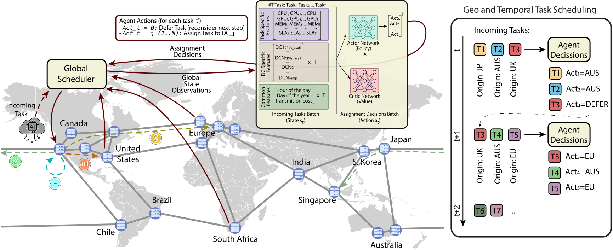
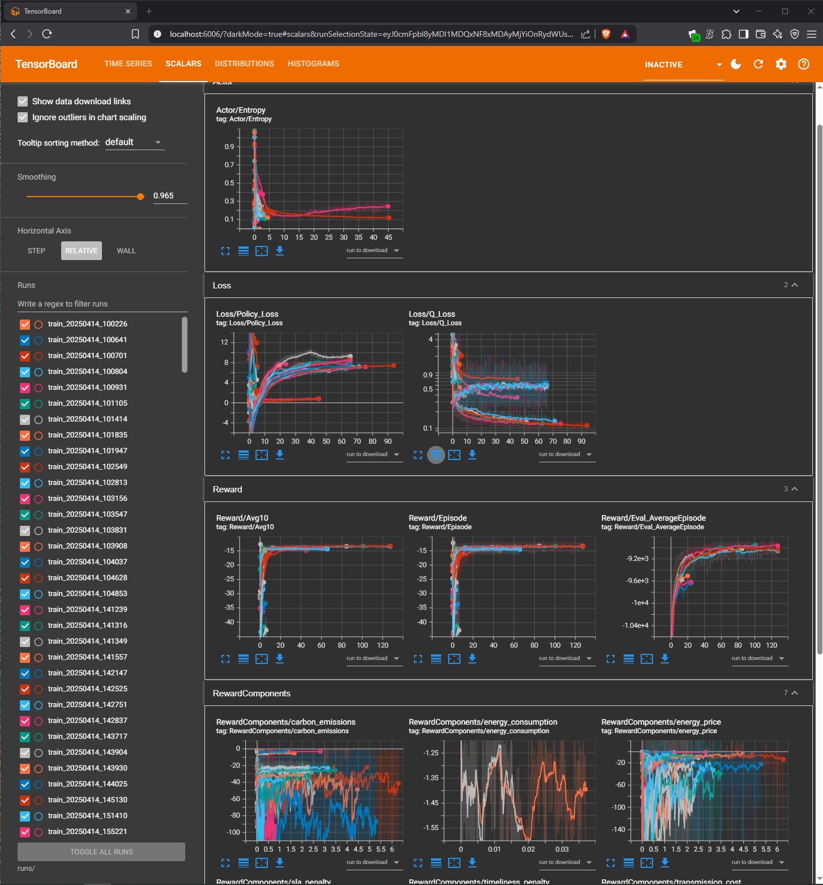

# SustainCluster -- Multi-Data Center Sustainable Scheduling Benchmark

## 1. Introduction

The rapid growth of large-scale AI and machine learning workloads in globally distributed data centers has brought with it unprecedented computing power and, with it, an ever-increasing carbon footprint. Today’s hyperscale training jobs routinely consume megawatt‑hours of electricity and generate tonnes of CO₂, driven not only by the compute itself but also by the energy and cooling required to keep racks humming. At the same time, modern cloud providers span dozens of regions with wildly varying grid carbon intensities, wholesale electricity prices, and inter‑datacenter network characteristics.

Existing schedulers and benchmarks tend to focus on either local resource utilization, energy cost, or carbon intensity in isolation. None capture the full picture of geo‑temporal trade‑offs: the fact that one site may be greener at 2 AM but more expensive at 2 PM, while another site has cheaper power but sits on a carbon‑intensive grid, or suffers from high network latency and limited throughput. To make sustainable AI scheduling truly realistic, a benchmark must tie together five dimensions simultaneously:
- **Geographic diversity** (multi‑region cloud / edge locations)  
- **Time‑of‑day dynamics** (15‑minute resolution of prices, carbon, weather)  
- **Energy pricing** (normalized \$ / kWh from heterogeneous markets)  
- **Grid carbon intensity** (region‑specific gCO₂eq / kWh)  
- **Network transfer** (per‑GB cost, serialization + propagation delay)


We introduce **SustainCluster** (“Sustainable Data‑Center Cluster”), an open‑source benchmark and Gym‑compatible simulation environment designed to fill this gap. SustainCluster provides:
1. A **reproducible**, end‑to‑end pipeline from real‑world datasets (Alibaba GPU trace, Open‑Meteo, Electricity Maps, cloud bandwidth pricing) to RL‑ready scenarios.  
2. A **centralized global scheduler** that observes system‑wide state and issues “defer or assign” global decisions every 15 minutes.  
3. A **full physics‑informed datacenter model** (CPU/GPU power curves, thermal response, HVAC proxy) coupled with transmission‑aware routing (cost + delay).  
4. A **modular reward engine** supporting single or multi‑objective optimization (energy cost, carbon emissions, SLA adherence, transfer overhead).

By proposing SustainCluster, we aim to foster among the scientific community and enterprises a common testbed for sustainable scheduling of AI workloads that captures the nuanced, geo‑temporal trade‑offs of modern cloud workloads must overcome.

<div style="background-color:white; display:inline-block; padding:10px; border-radius:10px; box-shadow:0 0 10px rgba(0,0,0,0.1);">
  <p align="center">
    
  </p>
  <p align="center" style="font-size: 0.9em; color: black;">
    <em>Geo-distributed data centers with varying carbon intensity, electricity prices, and network characteristics.</em>
  </p>
</div>

### Affiliation with ExaDigiT Consortium

<div style="background-color:white; display:inline-block; padding:10px; border-radius:10px; box-shadow:0 0 10px rgba(0,0,0,0.1);">
  <p align="center">
    <a href="https://exadigit.github.io/">
      
    </a>
  </p>
  <p align="center" style="font-size: 0.9em; color: black;">
    <em>SustainCluster is a contributing project to the <a href="https://exadigit.github.io/">ExaDigiT Consortium</a>.</em>
  </p>
</div>

SustainCluster is proud to be part of the **[ExaDigiT Consortium](https://exadigit.github.io/)**, an open framework initiative involving research faculties and supercomputing entities dedicated to developing comprehensive digital twins of supercomputers and large-scale computing facilities. ExaDigiT aims to optimize the design, operation, and energy efficiency of advanced computing systems by integrating diverse modeling techniques, telemetry, and AI.

While ExaDigiT often focuses on highly detailed models of individual supercomputing sites (including specific cooling systems, power infrastructure, and internal networks), **SustainCluster complements this vision by providing a specialized benchmark focused on the challenges of *managing AI workloads across a cluster of geo-distributed data centers***. Our emphasis is on the dynamic, multi-objective scheduling decisions needed to balance sustainability (carbon, energy cost, water) with operational performance (SLAs, resource utilization) in a global context, leveraging the detailed physical modeling principles advocated by ExaDigiT for each simulated datacenter.

# Table of Contents
- [SustainCluster -- Multi-Data Center Sustainable Scheduling Benchmark](#sustaincluster----multi-data-center-sustainable-scheduling-benchmark)
  - [1. Introduction](#1-introduction)
    - [Affiliation with ExaDigiT Consortium](#affiliation-with-exadigit-consortium)
- [Table of Contents](#table-of-contents)
  - [2. Features \& Highlights](#2-features--highlights)
  - [3. Benchmark Design](#3-benchmark-design)
    - [3.1 State, Action \& Reward Overview](#31-state-action--reward-overview)
    - [3.2 Supported Optimization Objectives](#32-supported-optimization-objectives)
    - [3.3 Task Lifecycle \& Routing Penalty (cost + delay)](#33-task-lifecycle--routing-penalty-cost--delay)
    - [3.4 Time Granularity](#34-time-granularity)
  - [4. Real‑World Datasets \& Visualizations](#4-realworld-datasets--visualizations)
    - [4.1 AI Workloads (Alibaba GPU Cluster Trace)](#41-ai-workloads-alibaba-gpu-cluster-trace)
    - [4.2 Electricity Prices](#42-electricity-prices)
    - [4.3 Carbon Intensity](#43-carbon-intensity)
    - [4.4 Weather](#44-weather)
    - [4.5 Transmission Costs (per‑GB)](#45-transmission-costs-pergb)
    - [4.6 Dataset Visualizations](#46-dataset-visualizations)
  - [5. Supported Locations \& Custom Regions](#5-supported-locations--custom-regions)
  - [6. Datacenter Modeling](#6-datacenter-modeling)
    - [6.1 Short Explanation of the DC Models](#61-short-explanation-of-the-dc-models)
    - [6.2 Datacenter Configuration and Model Details](#62-datacenter-configuration-and-model-details)
  - [7. Environment \& API](#7-environment--api)
    - [7.1 Observations](#71-observations)
    - [7.2 Actions \& Deferral: Single-Action vs. Multi-Action](#72-actions--deferral-single-action-vs-multi-action)
    - [7.3 Task Origin Logic](#73-task-origin-logic)
    - [7.4 SLA Modeling](#74-sla-modeling)
    - [7.5 Transmission Delay Model](#75-transmission-delay-model)
    - [7.6 Agent Interaction Modes: `single_action_mode` and `disable_defer_action`](#76-agent-interaction-modes-single_action_mode-and-disable_defer_action)
      - [7.6.1 `single_action_mode` Flag](#761-single_action_mode-flag)
      - [7.6.2 `disable_defer_action` Flag](#762-disable_defer_action-flag)
      - [7.6.3 Interaction and Usage](#763-interaction-and-usage)
  - [8. Modular Reward System](#8-modular-reward-system)
    - [8.1 Built-in Reward Functions](#81-built-in-reward-functions)
    - [8.2 Composite \& Custom Rewards](#82-composite--custom-rewards)
  - [9. Code Organization](#9-code-organization)
    - [9.1 Code Architecture](#91-code-architecture)
    - [9.2 Directory Structure](#92-directory-structure)
  - [10. Quickstart \& Examples](#10-quickstart--examples)
    - [10.1 Installation](#101-installation)
    - [10.2.1 Training with the Custom SAC Implementation](#1021-training-with-the-custom-sac-implementation)
      - [10.2.2 Training with RLlib (Single-Action Agents)](#1022-training-with-rllib-single-action-agents)
    - [10.3 Monitoring (TensorBoard)](#103-monitoring-tensorboard)
    - [10.4 Checkpointing](#104-checkpointing)
    - [10.5 (Optional) Training and Using an RL-Controlled HVAC Agent](#105-optional-training-and-using-an-rl-controlled-hvac-agent)
      - [10.5.1 Training a Local HVAC Control Agent](#1051-training-a-local-hvac-control-agent)
      - [10.5.2 Using a Trained HVAC Agent in SustainCluster Simulations](#1052-using-a-trained-hvac-agent-in-sustaincluster-simulations)
  - [11. Evaluation \& Demo](#11-evaluation--demo)
    - [11.1 Rule-based vs RL Evaluation](#111-rule-based-vs-rl-evaluation)
    - [11.2 Google Colab Notebook](#112-google-colab-notebook)
    - [11.3 Key Benchmark Metrics / Dashboard](#113-key-benchmark-metrics--dashboard)
  - [12. Future Work and Research Directions](#12-future-work-and-research-directions)
    - [12.1 Core Benchmark Enhancements](#121-core-benchmark-enhancements)
    - [12.2 Advanced Agent Architectures and Learning Paradigms](#122-advanced-agent-architectures-and-learning-paradigms)
  - [13. Citation, License \& Contributors](#13-citation-license--contributors)
    - [13.1 How to Cite SustainCluster](#131-how-to-cite-sustaincluster)
    - [13.2 Acknowledgements, Data Sources, and Licenses](#132-acknowledgements-data-sources-and-licenses)
      - [13.2.1 SustainCluster License](#1321-sustaincluster-license)
    - [13.3 Contributions](#133-contributions)
    - [13.4 Contributors](#134-contributors)
  
## 2. Features & Highlights

SustainCluster provides a comprehensive and realistic benchmark environment for developing and evaluating sustainable task scheduling algorithms across geo-distributed data centers. Key features include:

*   **Rich Real-World Data Integration:** Incorporates time-series data for **over 20 global locations**, including:
    *   **AI Workloads:** Based on the Alibaba Cluster Trace 2020 GPU dataset.
    *   **Electricity Prices:** Sourced from Electricity Maps, GridStatus, and regional operators.
    *   **Grid Carbon Intensity:** Real gCO₂eq/kWh data from Electricity Maps.
    *   **Weather Data:** From Open-Meteo for temperature-aware cooling models.
    *   **Transmission Costs:** Region-to-region per-GB pricing from AWS, GCP, and Azure.

*   **Physics-Informed Datacenter Modeling:** Simulates detailed energy consumption within each datacenter, including CPU/GPU/Memory power draw based on utilization, and a temperature-aware cooling/HVAC proxy model grounded in established thermal dynamics.
*   **Transmission-Aware Routing (Cost & Delay):** Accounts for both monetary transfer costs (per-GB pricing) and realistic transmission delays calculated using empirical inter-datacenter throughput and RTT data (based on [Persico et al. (IEEE GLOBECOM 2016)](https://www.sciencedirect.com/science/article/abs/pii/S138912861630353X)), impacting task arrival times at remote sites.
*   **Centralized Global Scheduler Simulation:** Models a scheduler overseeing multiple distributed data centers, making dispatch or deferral decisions for incoming tasks based on global system state.
*   **Gymnasium-Compatible Environment:** Offers a standard Reinforcement Learning interface (`TaskSchedulingEnv`) compatible with common RL libraries, facilitating agent development and evaluation.
*   **Flexible Multi-Objective Optimization:** Features a modular reward system enabling users to define custom reward functions or combine built-in components (e.g., energy cost, carbon emissions, SLA violations, transmission overhead) with configurable weights.
*   **Support for Diverse Schedulers:** Natively supports training Deep RL agents (with SAC example) and includes a suite of rule-based controllers (e.g., lowest carbon, lowest price, most available) for baseline comparisons.
*   **Extensible and Configurable:** Designed with modularity, allowing users to easily customize datacenter configurations, add new locations, define new reward structures, or integrate custom scheduling policies.
*   **Reproducible Scenarios:** Enables consistent experimental setups through configuration files and seeding, crucial for benchmarking research.

## 3. Benchmark Design
SustainCluster simulates a centralized global task scheduler interacting with a cluster of geographically distributed data centers. At each time step, the simulation proceeds as follows:

1.  **Task Generation:** New AI tasks (derived from the real-world trace) may arrive at their designated origin datacenters based on a population and time-zone probabilistic model. Any tasks previously time-deferred are also reconsidered.
2.  **Observation:** The central agent (scheduler) observes the current global state, including time, environmental factors (price, carbon intensity), the state of each datacenter (resource availability, load), and the details of all pending tasks (requirements, origin, deadline).
3.  **Action:** For *each* pending task, the agent decides whether to **defer** it to the next timestep or **assign** it to one of the `N` available datacenters for execution.
4.  **Routing & Delay:** When a task is assigned to a remote datacenter (different from its origin), the system calculates and tracks associated transmission impacts:
    *   **Cost:** Monetary cost based on per-GB cloud provider rates (see Section 4.5).
    *   **Energy:** Estimated using a fixed factor (currently 0.06 kWh/GB based on findings in [Aslan et al., 2017](https://doi.org/10.1111/jiec.12630)) multiplied by the task's data size (`bandwidth_gb`).
    *   **Carbon Emissions:** Calculated as Transmission Energy × Origin Grid Carbon Intensity (using real-time data for the origin DC's location).
    *   **Delay:** Computed using serialization + propagation time based on empirical data ([Persico et al., 2016](https://doi.org/10.1109/GLOCOM.2016.7841498)). See Section 7.5 for the formula.
    The task is held "in transit" during this delay and only becomes available for execution at the destination DC after it elapses.
5.  **Execution & State Update:** Each datacenter attempts to schedule its queued tasks based on resource availability. Internal models simulate **energy consumption, carbon emissions, and thermal dynamics**. The global clock advances by 15 minutes.
6.  **Reward Calculation:** A scalar reward signal is computed based on the outcomes of the timestep (e.g., total cost, emissions, SLA violations) according to the configured reward function.

This cycle repeats, allowing RL agents or rule-based controllers to learn or apply scheduling policies that optimize long-term objectives.


### 3.1 State, Action & Reward Overview

*   **State Observation:** The environment provides a detailed observation at each step `t`. This observation is structured as a **list**, where each element corresponds to one of the `k_t` currently pending tasks.
    *   **Per-Task Vector:** By default (`_get_obs` in `TaskSchedulingEnv`), the vector for each pending task `i` contains:
        *   **Global Time Features:** Sine/cosine encoding of the day of the year and hour of the day (4 features).
        *   **Task-Specific Features:** Origin DC ID, CPU core requirement, GPU requirement, estimated duration, and time remaining until SLA deadline (5 features).
        *   **Per-Datacenter Features:** For each of the `N` datacenters: available CPU %, available GPU %, available Memory %, current carbon intensity (kgCO₂/kWh), and current electricity price ($/kWh) (5 * `N` features).
    *   **Variable State Shape:** The full observation `s_t` returned by `env.step()` or `env.reset()` is this list of `k_t` vectors. Since the number of pending tasks `k_t` changes from one timestep to the next (i.e., `k_t` may differ from `k_{t+1}`), the overall **shape of the state observation varies across timesteps**. For example, `s_t` might be a list of 10 vectors (10 tasks), while `s_{t+1}` might be a list of 5 vectors (5 tasks). In general, `s_t` has a shape of `(k_t, 4 + 5 + 5 * N)`, where `N` is the number of datacenters.
    *   **Handling Variability:** Standard RL algorithms often assume fixed-size observations. The variable number of pending tasks (`k_t`) at each step in SustainCluster presents a challenge.
        *   The provided *off-policy* **custom SAC implementation** (`train_SAC_agent.py`) handles this in its multi-action mode by using a replay buffer (`FastReplayBuffer`) that pads the list of task observation vectors and action vectors up to a configurable `max_tasks` length. Boolean masks are used during batch processing to ensure only valid task data contributes to training updates (see Section 10.2.1 for more details).
        *   For agents trained with **RLlib** (e.g., PPO, APPO, IMPALA), the environment is typically run in `single_action_mode`. In this mode, the environment itself provides a fixed-size aggregated observation vector to the agent, and the agent outputs a single global action, simplifying compatibility (see Sections 7.6.1 and 10.2.2).
        *   Alternative approaches for multi-action mode could involve using recurrent neural networks (RNNs) to process the sequence of tasks or employing attention mechanisms (like the experimental `AttentionActorNet` provided) to handle sets of tasks.
    *   **Customization:** Users can easily modify `_get_obs` to include other available information from `self.cluster_manager.datacenters` (e.g., pending queue lengths, detailed thermal state, forecasted carbon intensity) or `self.current_tasks` (the current pending tasks) to extract task-specific features to create custom state representations tailored to their specific agent architecture, scheduling strategy or reward function.

*   **Action Space:** At each timestep `t`, the agent is presented with a list of `k_t` pending tasks. For **each task** in this list, the agent must output a single discrete action `a_i` from the set `{0, 1, ..., N}`:
    *   `a_i = 0`: **Defer** the i-th task. The task is held and reconsidered in the next 15-minute timestep.
    *   `a_i = j` (where `1 ≤ j ≤ N`): **Assign** the i-th task to datacenter `j`. The task is sent towards that DC's queue (potentially incurring transmission cost and delay if `j` is different to the DC task's origin).
    *   Therefore, the agent needs to produce a sequence of `k_t` actions in total at step `t`. As `k_t` varies, this constitutes a **variable-length action requirement** per timestep. Refer to the State Observation section for how the provided RL agent examples handle this variability.

*   **Reward Signal:** After all actions for a timestep are taken and the simulation advances, a single, global scalar reward `r_t` is returned. This reward is calculated by a configurable `RewardFunction` (see Section 8). This function aggregates various performance and sustainability metrics based on user-defined weights and objectives, such as minimizing operational costs, carbon footprint, energy consumption, or SLA violations.


### 3.2 Supported Optimization Objectives
SustainCluster allows users to optimize for various objectives, either individually or combined through the modular reward system. Key optimizable metrics tracked by the simulator include:

*   Total operational energy cost (USD) across all datacenters.
*   Total energy consumption (kWh).
*   Total carbon emissions (kg CO₂eq) from compute, cooling, and data transmission.
*   Number or severity of Service Level Agreement (SLA) violations.
*   Total inter-datacenter data transmission costs (USD).
*   Resource utilization efficiency (e.g., minimizing idle power).
*   Multi-objective combinations balancing these factors (e.g., minimizing cost subject to an emissions cap).


### 3.3 Task Lifecycle & Routing Penalty (cost + delay)
When the scheduler assigns a task originating at DC `A` to a remote destination DC `B`, the following steps occur:

1.  **Transmission Cost:** An immediate monetary cost is calculated based on the task's data size (`bandwidth_gb`) and the per-gigabyte egress/transfer cost between the origin and destination regions (using cloud provider pricing tiers from AWS, Azure, GCP). This cost can be included in the reward calculation.
2.  **Transmission Delay Calculation:** A network delay is computed using the formula:
    `delay (s) = (task_size_GB * 8000 / throughput_Mbps) + (RTT_ms / 1000)`
    where `throughput_Mbps` and `RTT_ms` are empirically measured values between the macro-regions (EU, US, SA, AP) based on Persico et al. (2016). This captures both serialization time (dependent on data size and effective bandwidth) and propagation time.
3.  **In-Transit Hold:** The task is conceptually held "in transit". It does not immediately appear in DC `B`'s queue.
4.  **Delayed Enqueue:** Only after `delay` seconds have passed (potentially spanning multiple 15-minute simulation steps) does the task arrive and get added to the pending queue at the destination datacenter (DC `B`), becoming eligible for execution. This accurately models the real-world impact of network latency on task start times.

### 3.4 Time Granularity

SustainCluster operates on a **15-minute timestep**. This granularity was chosen carefully to balance realism and simulation efficiency:

*   **Data Availability:** Key real-world data sources like Electricity Maps (carbon intensity) and grid APIs (electricity prices) typically provide data at 15-minute or hourly intervals.
*   **Cloud Billing:** Major cloud providers often bill compute resources in increments of minutes (sometimes 1, 5, or 15), making 15-minute scheduling decisions relevant for cost optimization.
*   **Operational Cadence:** Large-scale cluster scheduling and resource planning often happen at coarser intervals than per-second or per-minute to reduce overhead and smooth out load variations.
*   **Thermal Inertia:** Datacenter cooling systems (HVAC, chillers) have significant thermal inertia. Their response to changes in load or setpoints occurs over minutes, not seconds. Simulating at a 15-minute interval allows for stable tracking of these thermal dynamics without excessive computational cost or noise.
*   **Supporting Literature:** Several studies on data center energy optimization, cooling control, and job scheduling using RL have successfully employed similar time granularities (e.g., 5-15 minutes) to model system dynamics effectively.
This timestep design is **backed by multiple studies** in the field:

- *DeepEE: Joint Optimization of Job Scheduling and Cooling Control*, ICDCS 2019  
  https://doi.org/10.1109/ICDCS.2019.00070  
  → RL agent jointly controls job placement and cooling actions; the system is updated in aggregated time steps to manage interactions.

- *Green Data Center Cooling Control via Physics-guided Safe Reinforcement Learning*, ACM Transactions on Cyber-Physical Systems (2023)  
  https://doi.org/10.1145/3582577  
  → Uses physics-informed RL on cooling systems, with control cycles aligned to 15-minute windows for safe and stable adaptation.

- *Peak Shaving in Data Centers with Deep Reinforcement Learning*, Oregon State University  
  https://ir.library.oregonstate.edu/concern/graduate_thesis_or_dissertations/nc580v28w  
  → Applies RL to schedule peak power reductions using 15-minute windows based on grid signals.

- *Energy Efficient Control of Data Center HVAC Systems using Reinforcement Learning*, University of Twente (2024)  
  → Shows that minute-level control is impractical due to thermal inertia; uses coarser control cycles for stable performance.

- *Energy Efficient Scheduling of Servers with Multi-Sleep Modes*, IEEE TCC 2020  
  https://doi.org/10.1109/TCC.2018.2834376  
  → Models energy transitions and sleep states using coarse time intervals to minimize server wake/sleep cycles.

## 4. Real‑World Datasets & Visualizations
SustainCluster integrates multiple real-world datasets to create realistic and challenging scheduling scenarios that reflect the dynamic nature of global infrastructure and environmental factors.

Summary table of datasets:
| Dataset | Source | Description |
| ------- | ------ | ----------- |
| AI Workloads | Alibaba Cluster Trace 2020 | Real-world GPU workload traces from Alibaba's data centers. |
| Electricity Prices | Electricity Maps, GridStatus | Real-time electricity prices for various regions. |
| Carbon Intensity | Electricity Maps | Real-time carbon intensity data (gCO₂eq/kWh) for various regions. |
| Weather | Open-Meteo | Real-time weather data (temperature, humidity) for cooling proxy. |
| Transmission Costs | AWS, GCP, Azure | Per-GB transfer costs between regions. |

### 4.1 AI Workloads (Alibaba GPU Cluster Trace)

*   **Source:** We use the [Alibaba Cluster Trace 2020](https://github.com/alibaba/clusterdata/tree/master/cluster-trace-gpu-v2020), a real-world dataset of GPU jobs from a large production cluster operated by Alibaba PAI (Platform for AI). It covers two months (July–August 2020), including over **6,500 GPUs** across **~1800 machines**. This trace contains **training and inference jobs** using frameworks like TensorFlow, PyTorch, and Graph-Learn. These jobs span a wide range of machine learning workloads, and each job may consist of multiple tasks with multiple instances.
*   **Preprocessing:** To prepare the trace for long-term sustainable scheduling simulation, we perform several preprocessing steps:
    *   **Filtering:** Remove very short tasks, keeping only those ≥ 15 minutes (typical of substantial training or inference workloads).
    *   **Temporal Extension:** Extend the 2-month trace to cover a full year by replicating observed daily and weekly patterns.
    *   **Origin Assignment:** Assign a **probabilistic origin** datacenter to each task based on regional **population** weights and local **time-of-day** activity boosts (simulating higher generation during business hours). See Section 7.3 for details.
    *   **Grouping:** Aggregate tasks into 15-minute intervals based on their arrival times to align with the simulation timestep.
*   **Dataset Format (After Cleaning):** The cleaned dataset is saved as a Pandas `.pkl` DataFrame file with the following structure:

| interval_15m       | tasks_matrix                                           |
|--------------------|--------------------------------------------------------|
| 2020-03-01 08:00   | [[job1, tstart, tend, start_dt, duration, cpu, gpu, mem, gpu_mem, bw, day_name, day_num], ...] |
| 2020-03-01 08:15   | [[jobN, tstart, tend, start_dt, duration, cpu, gpu, mem, gpu_mem, bw, day_name, day_num], ...] |
| ...                | ...                                                    |


Where:
- `interval_15m`: The 15-minute time window (UTC) when the task starts.
- `tasks_matrix`: A NumPy array representing all tasks in that interval. Each task row includes:
  1. **job_id**: Unique task identifier.
  2. **start_time**: Start timestamp (Unix).
  3. **end_time**: End timestamp (Unix).
  4. **start_dt**: UTC datetime of start.
  5. **duration_min**: Task duration in minutes.
  6. **cpu_usage**: Number of CPU cores requested (e.g., `600.0` -> 6 cores).
  7. **gpu_wrk_util**: Number of GPUs requested (e.g., `50.0` -> 0.5 GPUs).
  8. **avg_mem**: Memory used (GB).
  9. **avg_gpu_wrk_mem**: GPU memory used (GB).
  10. **bandwidth_gb**: Estimated input data size (GB).
  11. **weekday_name**: Day name (e.g., Monday).
  12. **weekday_num**: Integer from 0 (Monday) to 6 (Sunday).

>   **Resource Normalization:**
> In the original Alibaba dataset, both CPU and GPU requirements are stored as percentages:
> - `600.0` = 6 vCPU cores  
> - `50.0` = 0.5 GPUs  
>  
> We keep this representation in the `.pkl` file. However, during task extraction and simulation, we normalize these values into actual hardware units using the logic in `extract_tasks_from_row()` (located in `workload_utils.py`):

```python
job_name = task_data[0]
duration = float(task_data[4])
cores_req = float(task_data[5]) / 100.0    # Convert percentage to core count
gpu_req = float(task_data[6]) / 100.0    # Convert percentage to GPU count
mem_req = float(task_data[7])            # Memory in GB
bandwidth_gb = float(task_data[8])       # Data transfer size in GB

task = Task(job_name, arrival_time, duration, cores_req, gpu_req, mem_req, bandwidth_gb)
tasks.append(task)
```

This transformation allows for more intuitive interpretation and visualization.

### 4.2 Electricity Prices
*   **Sources:** Real historical electricity price data is collected from various sources, including [Electricity Maps](https://www.electricitymaps.com/), [GridStatus.io](https://gridstatus.io/), and regional Independent System Operator (ISO) APIs (e.g., CAISO, NYISO, ERCOT, OMIE).
*   **Coverage:** Data covers the years 2020–2024 for over 20 global regions corresponding to the supported datacenter locations.
*   **Standardization:** Prices are cleaned, converted to a standard format (UTC timestamp, USD/MWh), and aligned with the simulation's 15-minute intervals. For simulation purposes, prices are typically normalized further (e.g., to USD/kWh).
*   **Storage:** Data is organized by region and year in CSV files located under `data/electricity_prices/standardized/`. See `data/electricity_prices/README.md` for details.

### 4.3 Carbon Intensity
*   **Source:** Grid carbon intensity data (measuring the grams of CO₂ equivalent emitted per kilowatt-hour of electricity consumed) is sourced from the [Electricity Maps API](https://www.electricitymaps.com/).
*   **Coverage:** Provides historical data (2021–2024) for the supported global regions.
*   **Resolution:** Data is typically available at hourly or sub-hourly resolution and is aligned with the simulation's 15-minute timestep.
*   **Units:** Stored and used as gCO₂eq/kWh.

### 4.4 Weather
*   **Source:** Historical weather data, primarily air temperature and potentially wet-bulb temperature (relevant for certain cooling models), is obtained via the [Open-Meteo API](https://open-meteo.com/).
*   **Coverage:** Data covers the years 2021–2024 for the supported datacenter locations.
*   **Usage:** Temperature data directly influences the simulated efficiency and energy consumption of datacenter cooling systems (HVAC).

### 4.5 Transmission Costs (per‑GB)
*   **Sources:** Inter-region data transfer costs are based on publicly available pricing information from major cloud providers: [AWS](https://aws.amazon.com/ec2/pricing/on-demand/), [GCP](https://cloud.google.com/vpc/pricing), and [Azure](https://azure.microsoft.com/en-us/pricing/details/bandwidth/).
*   **Format:** We compile this information into matrices representing the cost (in USD) to transfer 1 GB of data between different cloud regions. The specific matrix used depends on the `cloud_provider` configured in the simulation.
*   **Storage:** These cost matrices are typically stored as CSV files within the `data/` directory and loaded by the `transmission_cost_loader.py` utility.

### 4.6 Dataset Visualizations
To provide insights into the characteristics of the integrated datasets, the repository includes several visualizations (located in `assets/figures/` and generated by scripts like `plot_alibaba_workload_stats.py`).

*   **Workload Characteristics:**
    *   *Task Duration Distribution:* Shows the distribution of task lengths.

      <p align="center">
        
      </p>

    *   *Resource Usage Distributions:* Illustrate the distribution of CPU, GPU, memory, and bandwidth requirements per task.

      <p align="center">
        
      </p>

    *   *Temporal Patterns (Heatmap):* Visualize task arrival rates across different hours of the day and days of the week.

      <p align="center">
        
      </p>

    *   *Temporal Patterns (Boxplots):* Show hourly distribution of resource requests.

      <p align="center">
        
        <br><br>
        
        <br><br>
        
      </p>

    *   *Gantt Chart Sample:* Provides a visual timeline of task execution, colored by resource usage.

      <p align="center">
        
      </p>

*   **Environmental Factors:**
    *   *Temperature Trends:* Line plots showing average daily temperatures across different regions.

      <p align="center">
        
      </p>
      <p align="center">
        <em>Average daily temperature across selected datacenter regions (°C)</em>
      </p>

    *   *Carbon Intensity Trends:* Line plots showing average daily carbon intensity and average hourly profiles.

      <p align="center">
        
      </p>
      <p align="center">
        <em>Average daily carbon intensity across selected datacenter regions (gCO₂eq/kWh)</em>
      </p>
      <p align="center">
        
      </p>
      <p align="center">
        <em>Average hourly carbon intensity profile over a typical day (UTC time)</em>
      </p>

    *   *Electricity Price Hourly Profiles:* Plots showing average price for each hour of the day.

      <p align="center">
        
      </p>
      <p align="center">
        <em>Average hourly electricity price profile over a typical day (UTC time)</em>
      </p>

These visualizations help understand the input data driving the simulation and the potential opportunities and challenges for sustainable scheduling algorithms.


## 5. Supported Locations & Custom Regions

SustainCluster includes integrated real-world data (electricity price, carbon intensity, weather) for a growing list of **over 20 global locations**. Use the following `location` codes within your `datacenters.yaml` configuration file to associate a simulated datacenter with these datasets.

The table below shows the built-in locations, the corresponding cloud provider region used for **transmission cost** lookups (based on `utils/transmission_region_mapper.py`), and the macro-cluster used for **transmission delay** lookups (based on `data/network_cost/network_delay.py`). Data availability (Price=P, Carbon Intensity=CI, Weather=W) is indicated based on files present in the `data/` directory (dynamic API calls may supplement missing files).

| Code         | Region / Market                          | Data | Cloud Region Mapping (for Cost) (GCP / AWS / Azure) | Macro-Cluster (for Delay) |
| :----------- | :------------------------------------------- | :--- | :-------------------------------------------------- | :------------------------ |
| US-NY-NYIS   | New York (NYISO)                         | P,CI,W | `us-east1` / `us-east-1` / `East US`                | US                        |
| US-CAL-CISO  | California (CAISO)                       | P,CI,W | `us-west1` / `us-west-1` / `West US`                | US                        |
| US-TEX-ERCO  | Texas (ERCOT)                            | P,CI,W | `us-central1`\* / `us-east-1-dwf-1` / `South Central US` | US                        |
| US-MIDA-PJM  | PJM Interconnection (Mid-Atlantic US)    | P,CI,W | `us-central1`\* / `us-east-1-dwf-1` / `South Central US` | US                 |
| CA-ON        | Ontario (IESO)                           | P,CI,W | `us-east1`\* / `ca-central-1` / `Canada Central`      | US                        |
| BR-SP        | Brazil - São Paulo (ONS)                 | P,CI,W | `southamerica-east1` / `sa-east-1` / `Brazil South`   | SA                        |
| CL-SIC       | Chile (CDEC-SIC)                         | P,CI,W | `southamerica-east1` / `us-east-1-chl-1` / `Chile North` | SA                        |
| DE-LU        | Germany + Luxembourg (ENTSO-E)           | P,CI,W | `europe-west1` / `eu-central-1` / `Germany West Central` | EU                        |
| FR           | France (ENTSO-E)                         | P,(CI),W | `europe-west4` / `eu-west-3` / `France Central`     | EU                        |
| ES           | Spain (OMIE)                             | P,(CI),(W) | `europe-west1` / `eu-south-1` / `Spain Central`       | EU                        |
| PT           | Portugal (OMIE)                          | P,(CI),(W) | `europe-west1` / `eu-south-1` / `Portugal North`      | EU                        |
| BE           | Belgium (ENTSO-E)                        | P,(CI),(W) | `europe-west1` / `eu-west-1` / `West Europe`        | EU                        |
| NL           | Netherlands (ENTSO-E)                    | P,(CI),(W) | `europe-west1` / `eu-west-1` / `North Europe`         | EU                        |
| AT           | Austria (ENTSO-E)                        | P,(CI),(W) | `europe-west4` / `eu-central-1` / `Austria East`      | EU                        |
| CH           | Switzerland (ENTSO-E)                    | P,(CI),(W) | `europe-west4` / `eu-central-1` / `Switzerland North` | EU                        |
| SG           | Singapore (USEP)                         | P,CI,W | `asia-southeast1` / `ap-southeast-1` / `Southeast Asia` | AP                        |
| JP-TK        | Japan - Tokyo Area (JEPX)                | P,CI,W | `asia-northeast1` / `ap-northeast-1` / `Japan East`   | AP                        |
| KR           | South Korea (KPX)                        | P,CI,W | `asia-northeast1` / `ap-northeast-2` / `Korea Central`  | AP                        |
| IN-WE        | India - Mumbai (POSOCO)                  | P,CI,W | `asia-south1` / `ap-south-1` / `Central India`      | AP                        |
| AU-NSW       | Australia - New South Wales (AEMO)       | P,CI,W | `australia-southeast1` / `ap-southeast-2` / `Australia East` | AP                        |
| AU-VIC       | Australia - Victoria (AEMO)              | P,CI,W | `australia-southeast1` / `ap-southeast-2` / `Australia East` | AP                        |
| ZA           | South Africa (Eskom)                     | P,CI,W | `africa-south1`\* / `af-south-1` / `South Africa North` | SA \*\*\*             |

*(\* Approximation used where direct mapping isn't available. \*\* Africa (AF) cluster may use default/proxy values if not explicitly in the Persico et al. delay data.)*

*Data Availability: P=Price, CI=Carbon Intensity, W=Weather (based on files in `data/`). Parentheses indicate data might be partially missing.*
*(\* Approximation used in the code where a direct mapping isn't available.)*
*(\*\*\* Based on current code (`network_delay.py`), South African regions map to the `SA` macro-cluster for delay calculations.)*

We plan to continuously expand this list in future releases.
➡️ Have a region you'd like to see supported? Open an issue or submit a PR!

**How to Add Custom Locations or Regions:**

While SustainCluster provides data for these common locations, the framework is designed to be extensible:

1.  **Define New Location Code:** Add a new entry in `datacenters.yaml` with a unique `location` code (e.g., `"My-Custom-Region"`).
2.  **Provide Data:** Place corresponding time-series data files (electricity price, carbon intensity, weather) into the respective subdirectories within `data/` (e.g., `data/electricity_prices/standardized/My-Custom-Region/2023/...`). Ensure the format matches the existing files.
3.  **Map to Transmission Region:** Update the mapping logic (likely found in `utils/transmission_region_mapper.py` or similar configuration) to associate your new `location` code with:
    *   A cloud provider region (e.g., `us-west-2`) used for looking up per-GB transmission costs from the provider's matrix (e.g., `data/network_cost/aws_transmission_costs.csv`).
    *   A macro-cluster (`EU`, `US`, `SA`, `AP`) used for looking up empirical delay parameters (throughput/RTT) from the Persico et al. data integrated into `data/network_cost/network_delay.py`.
4.  **(Optional) Custom Transmission Data:** If the default cloud provider costs or empirical delay data do not suit your needs, you can modify the loading functions (e.g., `utils/transmission_cost_loader.py`, `data/network_cost/network_delay.py`) to point to your own custom CSV files containing region-to-region costs or delay parameters.

This flexibility allows researchers to adapt SustainCluster to specific geographical footprints or network assumptions beyond the initially provided datasets.

## 6. Datacenter Modeling

Each simulated datacenter within SustainCluster incorporates a physics-informed model to estimate energy consumption, carbon emissions, and thermal behavior based on the scheduled workload and environmental conditions.

### 6.1 Short Explanation of the DC Models

The datacenter model operates in layers, capturing the relationship between IT workload, power draw, heat generation, and cooling requirements:

*   **IT Power Modeling:**
    *   **CPU Power:** Calculated based on utilization (`Load`) and the server's inlet air temperature (`T_in`), using configurable idle/max power values and efficiency curves (`P_cpu = f(Load, T_in)`).
    *   **GPU Power:** Modeled based on assigned workload, contributing significantly to IT power, especially for training tasks. Uses configurable idle/max power characteristics (e.g., based on NVIDIA V100 defaults in `dc_config.json`).
    *   **Memory Power:** A baseline power overhead associated with memory capacity is included in the IT load calculation.
    *   **Fan Power:** Server fan power scales cubically with required airflow (`V_fan`), which itself depends on the heat generated by CPU/GPU/Memory and the inlet temperature.
*   **Thermal Modeling:**
    *   **Heat Generation:** The total IT power (CPU + GPU + Memory + Fans) is treated as heat generated within the racks.
    *   **Rack Airflow:** Air flows through racks, picking up heat. The outlet air temperature (`T_out`) is calculated based on inlet temperature, IT heat load, and fan airflow.
    *   **Room Mixing:** Return air temperature to the cooling units (`avg_CRAC_return_temp`) is estimated based on the average rack outlet temperatures, adjusted for rack-specific approach temperatures.
*   **HVAC System (Cooling):**
    *   **Cooling Load:** The CRAC (Computer Room Air Conditioner) units must remove the heat generated by the IT equipment (`Q_CRAC`).
    *   **CRAC Fan Power:** Power consumed by CRAC fans depends on the required air circulation rate (`CRAC_Fan_load = P_ref * (flow_rate / ref_flow_rate)^3`).
    *   **Chiller Power:** Modeled using performance curves derived from **EnergyPlus** simulation data. The chiller power dynamically adjusts based on the current cooling `load`, the `ambient_temp` (from weather data), its design specifications (e.g., `rated_cop`, `design_cond_temp`), and part-load ratio (PLR) characteristics. The model (`calculate_chiller_power`) accounts for efficiency variations at different load levels and ambient conditions.
    *   **Cooling Tower & Pumps:** Power for associated pumps (`power_consumed_CW`, `power_consumed_CT`) and cooling tower fans (`CT_Fan_pwr`) are calculated based on flow rates, pressure drops, efficiencies, and ambient conditions.
*   **Water Usage:** Water evaporation in the cooling tower is estimated based on load and ambient wet-bulb temperature (derived from weather data).
*   **Total Power:** The sum of all IT power components and all HVAC power components (`CRAC_Fan_load`, `chiller_power`, `CT_Fan_pwr`, pump powers) constitutes the total instantaneous power draw of the datacenter. This is used alongside electricity price and carbon intensity data to calculate cost and emissions.

### 6.2 Datacenter Configuration and Model Details

Users configure the cluster of datacenters primarily via two types of files: `datacenters.yaml` for high-level cluster composition and individual JSON files (e.g., `configs/dcs/dc_config.json`) for detailed physical parameters of each datacenter model.

*   **`configs/env/datacenters.yaml`**: This file defines the overall cluster. Each entry represents a single datacenter and specifies its high-level properties:
    *   `dc_id`: A unique integer identifier.
    *   `location`: A location code (e.g., `"US-NY-NYIS"`) linking the DC to real-world datasets (price, carbon, weather) and network region mappings (see Section 5).
    *   `timezone_shift`: Offset from UTC in hours, for local time calculations.
    *   `population_weight`: Relative weight for probabilistic task origin generation (see Section 7.3).
    *   `total_cores`, `total_gpus`, `total_mem`: Schedulable resource capacities.
    *   `dc_config_file`: **Path to a specific JSON file** (e.g., `"configs/dcs/dc_config.json"`) that contains the detailed low-level physical parameters for this datacenter's simulation model.
    *   Optional flags for enabling RL-controlled HVAC or Heat Recovery Units (HRU) for that specific DC.

*   **Detailed Physical Parameters (`dc_config_file` e.g., `configs/dcs/dc_config.json`):**
    The JSON file pointed to by `dc_config_file` is crucial for defining the specific physical characteristics and operational parameters of the underlying data center model (`SustainDC`). Modifying this file allows researchers to simulate different hardware efficiencies, cooling system designs, or thermal management strategies. It typically includes:
    *   **Data Center Layout:** Number of racks, and distribution of CPUs/GPUs per rack.
    *   **Server Characteristics:** Idle and full load power for different CPU and GPU types (e.g., "HP_PROLIANT", "NVIDIA_V100" defaults), parameters for CPU power scaling curves based on utilization and temperature, and IT fan airflow ratios.
    *   **HVAC System Parameters:** Reference power and flow rates for CRAC fans and cooling tower fans, chiller performance coefficients (the model uses coefficients derived from EnergyPlus test files, as implemented in the `calculate_chiller_power` function within `envs/sustaindc/datacenter_model.py`), pump efficiencies, and pressure drops for water circuits. Many default parameters for IT components (e.g., CPU/GPU power curves, fan characteristics) and HVAC systems are based on typical industry hardware specifications and data from published research, such as [Sun et al. (2021)](https://www.sciencedirect.com/science/article/abs/pii/S0378778820333892) and [Breen et al. (2010)](https://pure.ul.ie/en/publications/from-chip-to-cooling-tower-data-center-modeling-part-i-influence-), aiming for realistic baseline configurations.
    *   **Thermal Properties:** Rack-specific supply and return air approach temperatures, which model air mixing and distribution inefficiencies.
    *   **Heat Recovery Unit (Optional):** Parameters for the heat recovery system if enabled.

    An example `dc_config.json` is provided in `configs/dcs/`, and users can create multiple such files to represent heterogeneous datacenter types within their cluster.

*   **Underlying Model Equations and Further Details:**
    For a comprehensive description of the underlying mathematical models, equations, and assumptions used in the data center simulation (particularly the IT power, thermal, and HVAC components inherited from the core SustainDC environment), please refer to:

    📄 **[`envs/sustaindc/README.md`](envs/sustaindc/README.md)**

    This document details the CPU/GPU/Memory power curves, fan laws, heat transfer calculations, the EnergyPlus-based chiller model, and general cooling system component models, citing key references such as [Sun et al. (2021)](https://www.sciencedirect.com/science/article/abs/pii/S0378778820333892) and [Breen et al. (2010)](https://pure.ul.ie/en/publications/from-chip-to-cooling-tower-data-center-modeling-part-i-influence-).

    **Note:** While the detailed `envs/sustaindc/README.md` focuses heavily on CPU and cooling aspects, the SustainCluster implementation explicitly incorporates **GPU and Memory power consumption** into the total IT load (`P_IT`) calculations, using parameters defined in the `dc_config_file`. This ensures that the energy impact of these critical components for AI workloads is accurately accounted for in the simulation.
## 7. Environment & API

SustainCluster provides a standard Reinforcement Learning interface through its `TaskSchedulingEnv` class, compatible with the [Gymnasium](https://gymnasium.farama.org/) API. This wrapper manages the interaction between the RL agent and the `DatacenterClusterManager` backend.

### 7.1 Observations

As described in Section 3.1, the environment state observation varies in shape depending on the number of pending tasks (`k_t`) at each timestep `t`.

*   **API Structure:** The `env.reset()` and `env.step()` methods return the observation `s_t` as a Python **list** of NumPy arrays. If `k_t > 0`, the list contains `k_t` arrays, each representing the feature vector for one pending task. If `k_t = 0`, an empty list is returned.
*   **Default Features:** The default implementation (`TaskSchedulingEnv._get_obs`) constructs each per-task feature vector by concatenating global time features, task-specific attributes (requirements, deadline), and the current state of all datacenters (resource availability, price, carbon intensity). See the code comments in `_get_obs` for the exact default feature order and composition.
*   **Customization:** Users can tailor the observation space by modifying the `_get_obs` method. The full state of the simulation is accessible within the environment instance, primarily through:
    *   `self.cluster_manager.datacenters`: A dictionary providing access to each `SustainDC` instance and its internal state (e.g., `dc.available_cores`, `dc.pending_tasks`, `dc.price_manager.get_current_price()`).
    *   `self.current_tasks`: The list of `Task` objects currently awaiting agent decisions.
    *   `self.current_time`: The current simulation timestamp.
    This allows adding features like forecasted data, queue lengths, detailed thermal states, task bandwidth/memory needs, or pre-calculated transmission metrics.

### 7.2 Actions & Deferral: Single-Action vs. Multi-Action

The agent's primary role is to decide how to handle pending tasks. This is influenced by the `single_action_mode` flag (detailed in Section 7.6.1), which dictates whether the agent makes a single global decision or multiple per-task decisions.

*   **API Interaction:** The `env.step()` method expects an `actions` argument.
    *   **In Multi-Action Mode (`single_action_mode: false`):**
        *   The `actions` argument should be a **list or array of integers** with length `k_t` (matching the number of tasks in the observation list returned by the previous step).
        *   Each integer $a_i$ in the `actions` list corresponds to the $i$-th task in the observation list.
    *   **In Single-Action Mode (`single_action_mode: true`):**
        *   The `actions` argument should be a **single integer**. This single action will be applied by the environment to all $k_t$ currently pending tasks.

*   **Action Values and Interpretation:**
    The interpretation of the integer action values depends on the `disable_defer_action` flag (detailed in Section 7.6.2):

    *   **If Deferral is Enabled (`disable_defer_action: false`):**
        *   The action values are in the range $\{0, 1, ..., N\}$, where $N$ is the number of datacenters.
        *   `action = 0`: **Defer** the task (or all tasks in single-action mode). The task(s) are held and reconsidered in the next 15-minute timestep.
        *   `action = j` (where $1 \le j \le N$): **Assign** the task (or all tasks) to datacenter $j$. The task(s) are sent towards that DC's queue (potentially incurring transmission cost and delay if $j$ is different from the task's origin).

    *   **If Deferral is Disabled (`disable_defer_action: true`):**
        *   The action values are in the range $\{0, 1, ..., N-1\}$.
        *   `action = j'` (where $0 \le j' \le N-1$): **Assign** the task (or all tasks) to datacenter $j'+1$ (i.e., action `0` maps to DC 1, action `1` to DC 2, and so on). Deferral is not an option.

*   **Handling `k_t = 0` (No Pending Tasks):**
    *   **In Multi-Action Mode:** If no tasks are pending ($k_t = 0$), the agent should pass an empty list `[]` as `actions` to `env.step()`.
    *   **In Single-Action Mode:** If no tasks are pending, the agent still outputs a single integer action. The environment will simply note that there were no tasks to apply this global action to.

The chosen mode (`single_action_mode`) and the `disable_defer_action` flag determine the precise nature of the action space the agent must learn to navigate and the way its decisions are implemented by the environment.

### 7.3 Task Origin Logic

To simulate realistic workload arrival patterns across the globe, tasks extracted from the trace are assigned an origin datacenter using a hybrid probabilistic model implemented in `utils/workload_utils.py::assign_task_origins()`. This logic aims to reflect that different regions generate varying amounts of work at different times of day.

The assignment process for each incoming task (or batch of tasks at a timestep) involves:

1.  **Calculating Activity-Weighted Scores:** For each of the $N$ datacenters defined in `datacenters.yaml`, a score is computed:
    *   `score_d = population_weight_d * activity_factor_d(current_local_time_d)`
    *   **`population_weight_d`**: A static parameter from `datacenters.yaml` representing the relative baseline activity level of the region DC `d` serves. Higher weights mean a higher base probability.
    *   **`activity_factor_d`**: A dynamic factor that boosts the score. It's typically `1.0` if the `current_local_time_d` (calculated using the DC's `timezone_shift` from UTC) falls within local business hours (e.g., 8:00 AM to 8:00 PM), and a lower value (e.g., `0.3`) otherwise. This simulates temporal peaks in workload submission.

2.  **Normalizing Scores to Probabilities:** The scores for all datacenters are normalized to form a probability distribution:
    *   `P(origin=d) = score_d / sum(all_scores_j for j in datacenters)`

3.  **Probabilistic Sampling:** Each task is then assigned an origin DC ID by randomly sampling from the set of all DC IDs according to this calculated probability distribution (using `np.random.choice`).

*   **Implementation:** This assignment happens within the `extract_tasks_from_row()` function (called by `DatacenterClusterManager`) immediately after tasks for the current timestep are created from the raw trace data and before they are passed to the environment or scheduler.

**Numerical Example:**

Consider a setup with three datacenters and the current UTC time is 14:00:

| DC ID | Location      | `timezone_shift` | `population_weight` | Local Time | Business Hours? | `activity_factor` | Score (`pop_weight` * `activity_factor`) |
|-------|---------------|------------------|---------------------|------------|-----------------|-------------------|------------------------------------------|
| 1     | US-East (UTC-5) | -5               | 0.4                 | 09:00am      | Yes (8am-8pm)   | 1.0               | 0.4 * 1.0 = 0.4                          |
| 2     | Europe (UTC+1)  | +1               | 0.5                 | 03:00pm      | Yes (8am-8pm)   | 1.0               | 0.5 * 1.0 = 0.5                          |
| 3     | Asia (UTC+8)    | +8               | 0.3                 | 10:00pm      | No (8am-8pm)    | 0.3               | 0.3 * 0.3 = 0.09                         |

*   **Total Score** = 0.4 + 0.5 + 0.09 = 0.99
*   **Probabilities:**
    *   P(origin=DC1) = 0.4 / 0.99 $\approx$ 0.404
    *   P(origin=DC2) = 0.5 / 0.99 $\approx$ 0.505
    *   P(origin=DC3) = 0.09 / 0.99 $\approx$ 0.091
*   A newly arriving task would then be assigned origin DC1 with ~40.4% probability, DC2 with ~50.5%, and DC3 with ~9.1%.

This mechanism ensures a dynamic and plausible distribution of workload origins across the simulated global cluster.

### 7.4 SLA Modeling

SustainCluster incorporates Service Level Agreement (SLA) constraints to evaluate the timeliness of task completion.

*   **Deadline Calculation:** Each task is assigned an SLA deadline upon arrival, calculated as:
    `sla_deadline = arrival_time + sla_multiplier * duration`
    where `arrival_time` is when the task *first* becomes available (either initially or after transmission delay), `duration` is the task's estimated execution time, and `sla_multiplier` controls the allowed slack (default: `1.5`, meaning a task must finish within 150% of its duration).
*   **Violation:** An SLA violation occurs if a task's actual completion time exceeds its calculated `sla_deadline`. The number of violations can be tracked and penalized via the reward function (using the `sla_penalty` component).
*   **Per-Task Urgency:** The framework supports assigning different `sla_multiplier` values per task (e.g., 1.1 for urgent, 2.0 for flexible) to model workloads with mixed time sensitivities, although this is not implemented by default in the current task generation.

### 7.5 Transmission Delay Model

To accurately model the impact of network latency when routing tasks between geographically distant datacenters, SustainCluster calculates and applies a transmission delay.

*   **Purpose:** Represents the time taken for the task's input data to travel from the origin DC to the destination DC.
*   **Calculation (`get_transmission_delay` in `data/network_cost/network_delay.py`):** The delay is composed of two parts:
    *   **Serialization Time:** `(task_size_GB * 8000) / throughput_Mbps` (Time to push bits onto the wire).
    *   **Propagation Time:** `RTT_ms / 1000` (Time for the first bit to travel across the network and back, approximated as one-way latency).
*   **Empirical Data Source:** The `throughput_Mbps` and `RTT_ms` values are derived from empirical measurements between major cloud regions (macro-clusters: EU, US, SA, AP) published by [Persico et al. (IEEE GLOBECOM 2016)](https://www.sciencedirect.com/science/article/abs/pii/S138912861630353X). The code maps the specific origin/destination locations to these macro-clusters to look up the relevant parameters.
*   **Simulation Impact:** When a task is assigned remotely, it is held "in transit" for the calculated `delay` (in seconds) before being added to the destination DC's pending queue. This delay can significantly impact when a task starts execution and whether it meets its SLA.

### 7.6 Agent Interaction Modes: `single_action_mode` and `disable_defer_action`

SustainCluster offers two key boolean flags, typically configured in `configs/env/sim_config.yaml` and passed to the `TaskSchedulingEnv`, that fundamentally alter the agent's interaction with the environment and the nature of the scheduling problem. Understanding these flags is crucial for designing experiments and interpreting results.

#### 7.6.1 `single_action_mode` Flag

This flag determines whether the agent makes decisions on a per-task basis or a global per-timestep basis.

*   **`single_action_mode: false` (Default)**
    *   **Behavior:** This is the **multi-action mode**.
        *   The environment provides the agent with a **list of observation vectors**, where each vector corresponds to one of the `k_t` currently pending tasks (as described in Section 7.1).
        *   The agent must output a **list of `k_t` actions**, one for each pending task. Each action decides whether to defer that specific task or assign it to one of the `N` datacenters.
    *   **Advantages:**
        *   Allows for fine-grained, per-task decision-making, potentially leading to higher overall system optimization.
        *   Enables the agent to consider the unique characteristics and requirements of each task individually.
    *   **Disadvantages:**
        *   Presents a more complex RL problem due to variable-length observation and action lists per timestep.
        *   Requires RL agents and network architectures capable of handling this variability (e.g., using padding and masking as in the provided SAC example, or attention mechanisms).

*   **`single_action_mode: true`**
    *   **Behavior:** This is the **single-action mode**.
        *   The environment computes and provides the agent with a **single, fixed-size aggregated observation vector** at each timestep. This vector summarizes the global state. The aggregation logic (e.g., taking averages or sums of individual task features) can be influenced by the `aggregation_method` parameter in `sim_config.yaml`, with the default implementation in `TaskSchedulingEnv._aggregate_task_observations()`. This includes aggregated statistics of all `k_t` pending tasks (e.g., number of tasks, average resource demand, minimum time-to-SLA) and the state of all datacenters.
        *   The agent outputs a **single discrete action**. This global action is then uniformly applied by the environment to *all* `k_t` pending tasks for that timestep (e.g., all pending tasks are deferred, or all pending tasks are assigned to a specific datacenter).
    *   **Advantages:**
        *   Significantly simplifies the RL problem by providing fixed-size observation and action spaces.
        *   Makes the environment directly compatible with standard MLP-based agent architectures commonly found in RL libraries like RLlib, without requiring custom models for sequence processing.
        *   Can lead to faster training iterations due to simpler agent architecture.
    *   **Disadvantages:**
        *   Results in coarse-grained control, as all pending tasks receive the same scheduling decision regardless of their individual characteristics.
        *   The aggregated state might obscure critical details needed for optimal per-task decisions.
        *   Likely leads to suboptimal performance compared to a well-trained multi-action agent that can make nuanced per-task choices.

#### 7.6.2 `disable_defer_action` Flag

This flag controls whether the "defer" action is available to the agent.

*   **`disable_defer_action: false` (Default)**
    *   **Behavior:** Deferral is **enabled**.
        *   The agent can choose action `0` (defer) for a task (in multi-action mode) or for all tasks (in single-action mode).
        *   The action space dimension for assignments is typically `num_dcs + 1` (0 for defer, 1 to `num_dcs` for assignment).
    *   **Advantages:**
        *   Provides the agent with temporal flexibility to delay tasks, potentially waiting for more favorable conditions (e.g., lower electricity prices, lower carbon intensity, or increased resource availability).
        *   Can lead to better long-term optimization of cost and carbon emissions.
        *   More realistic for many scheduling scenarios where not all tasks must be executed immediately.
    *   **Disadvantages:**
        *   Increases the complexity of the agent's decision-making.
        *   Carries the risk of increased Service Level Agreement (SLA) violations if tasks are deferred excessively. **However, the environment implements a safeguard:** if a task's SLA deadline has already passed by the time it is considered for an action, it is automatically assigned to its origin datacenter to minimize further SLA violation, bypassing the agent's decision for that specific task. The `sla_penalty` reward component then penalizes this violation.
        *   **Impact on Pending Task Queue (`k_t`):** Even with the SLA safeguard, frequent deferrals can lead to a large number of tasks pending decision at each subsequent timestep (`k_t`). This `k_t` includes newly arrived tasks, tasks that have completed their transmission delay from remote assignments, *and* all previously deferred tasks (not yet past their SLA deadline for forced assignment).
        *   **Impact on `max_tasks` Hyperparameter:** In multi-action mode (`single_action_mode: false`), the growth in `k_t` due to deferrals directly affects the `max_tasks` hyperparameter required for the replay buffer (e.g., `FastReplayBuffer` in the SAC example).
            *   `max_tasks` defines the padding limit for the list of task observation vectors stored in the buffer.
            *   If `max_tasks` is set too low, an unexpectedly large number of deferred tasks could exceed this limit, leading to errors or data truncation.
            *   If `max_tasks` is set very high to accommodate worst-case deferral scenarios, the replay buffer can become very memory-intensive.
            *   This creates a practical trade-off in configuring the RL agent and highlights a challenge in managing unbounded deferral.
        *   **Managing Deferral Queue Growth:** While the SLA safeguard handles tasks that have *already* violated their deadline, managing the growth of the deferred task queue *before* SLAs are breached is important. Uncontrolled deferral could still lead to a large number of pending tasks. Exploring more proactive mechanisms to limit deferrals (e.g., maximum deferral count per task, or a cap on the total number of actively deferred tasks) remains a relevant area for future research (see Section 12).


*   **`disable_defer_action: true`**
    *   **Behavior:** Deferral is **disabled**.
        *   The agent cannot choose action `0`. Tasks must be assigned to one of the `N` datacenters.
        *   The action space dimension for assignments becomes `num_dcs`.
    *   **Advantages:**
        *   Simplifies the action space for the agent.
        *   Ensures tasks are acted upon immediately, preventing deferral-induced SLA violations.
        *   Keeps the number of pending tasks more directly tied to new arrivals and tasks finishing their transmission delay.
    *   **Disadvantages:**
        *   The agent loses temporal flexibility, potentially forcing suboptimal placements if current conditions are poor across all datacenters.
        *   May lead to higher operational costs or carbon emissions if tasks cannot be shifted to more opportune times.

#### 7.6.3 Interaction and Usage

*   These two flags are independent but their combination defines the specific scheduling problem variant:
    *   `single_action_mode=false`, `disable_defer_action=false`: Default SAC (multi-action, deferral enabled).
    *   `single_action_mode=false`, `disable_defer_action=true`: Multi-action, no deferral (forces placement).
    *   `single_action_mode=true`, `disable_defer_action=false`: RLlib examples (single global action, deferral enabled for all).
    *   `single_action_mode=true`, `disable_defer_action=true`: RLlib examples (single global action, no deferral, forces placement for all).
*   The `TaskSchedulingEnv` class adjusts its `observation_space` and `action_space` attributes based on these flags, particularly `single_action_mode`. The interpretation of agent outputs by the environment also changes accordingly.
*   These flags are powerful tools for ablation studies (e.g., quantifying the benefit of deferral or per-task decisions) and for adapting the benchmark to different agent capabilities or research questions.
*   **Example Usage in Config:**
    ```yaml
    env:
      single_action_mode: false  # Use multi-action mode
      disable_defer_action: false # Allow deferral actions
    ```
    
## 8. Modular Reward System

A core feature of SustainCluster is its highly flexible and extensible reward system, designed to facilitate research into multi-objective sustainable scheduling. Instead of a single fixed reward, users can easily define complex reward signals that balance various environmental, economic, and operational goals.

The system is built around the concept of composable reward functions, located in the `rewards/` directory.

### 8.1 Built-in Reward Functions

SustainCluster provides several pre-defined reward components, each inheriting from `rewards.base_reward.BaseReward` and targeting a specific optimization objective. These components calculate a reward value based on the simulation results (`cluster_info`) from the latest timestep:

| Reward Name                  | File (`rewards/predefined/`)           | Description                                                     | Key Input from `cluster_info`                                     |
| :--------------------------- | :------------------------------------- | :-------------------------------------------------------------- | :---------------------------------------------------------------- |
| `energy_price`               | `energy_price_reward.py`               | Penalizes the total monetary cost of energy consumed.           | `energy_cost_usd` per DC                                          |
| `carbon_emissions`           | `carbon_emissions_reward.py`           | Penalizes total CO₂ equivalent emissions (compute + transfer).  | `carbon_emissions_kg` per DC, `transmission_emissions_total_kg` |
| `energy_consumption`         | `energy_consumption_reward.py`         | Penalizes total energy consumed (kWh) (compute + transfer).     | `energy_consumption_kwh` per DC, `transmission_energy_total_kwh`|
| `transmission_cost`          | `transmission_cost_reward.py`          | Penalizes the monetary cost of inter-datacenter data transfers. | `transmission_cost_total_usd`                                     |
| `transmission_emissions`     | `transmission_emissions_reward.py`     | Specifically penalizes CO₂ emissions from data transfers.       | `transmission_emissions_total_kg`                                 |
| `sla_penalty`                | `sla_penalty_reward.py`                | Applies a penalty for each task that violates its SLA deadline. | `sla_violations` count per DC                                     |
| `efficiency` (Example)       | `efficiency_reward.py`                 | Rewards scheduling efficiency (e.g., tasks completed per kWh).  | Task completion counts, energy consumption                        |
| `composite`                  | `composite_reward.py`                  | Meta-reward: Combines multiple other reward components.         | Aggregates outputs of constituent reward functions                |

Most basic reward functions accept a `normalize_factor` argument during initialization to scale the raw metric into a suitable reward range (typically negative for penalties).

### 8.2 Composite & Custom Rewards

The power of the system lies in its ability to combine these building blocks or introduce entirely new ones:

*   **Composite Rewards:** The `CompositeReward` class allows users to define a multi-objective reward function by specifying a dictionary of components and their respective weights. It automatically instantiates the required sub-reward functions and calculates the final reward as a weighted sum.
    *   **Configuration:** This is typically done in the `reward_config.yaml` file passed during training setup.
    *   **Example (`reward_config.yaml`):**
        ```yaml
        reward:
          normalize: false # Normalization can be handled by CompositeReward if needed
          components:
            energy_price:
              weight: 0.4
              args: { normalize_factor: 10000 } # Optional args for sub-rewards
            carbon_emissions:
              weight: 0.4
              args: { normalize_factor: 100 }
            sla_penalty:
              weight: 0.2
              args: { penalty_per_violation: 5.0 }
            transmission_cost:
              weight: 0.1
              args: { normalize_factor: 50 }
        ```
    *   **Instantiation:** The `CompositeReward` class uses a registry system (`rewards.reward_registry`) to find and instantiate the necessary sub-reward classes (`EnergyPriceReward`, `CarbonEmissionsReward`, etc.) based on the names provided in the configuration.
    *   **Internal Normalization (Optional):** `CompositeReward` itself can optionally apply running mean/std normalization to the raw output of each component before weighting and summing, providing adaptive reward scaling during training (`normalize=True`).

*   **Custom Rewards:** Users can easily implement novel reward criteria:
    1.  Create a new Python file in `rewards/predefined/`.
    2.  Define a class inheriting from `BaseReward`.
    3.  Implement the `__call__(self, cluster_info, current_tasks, current_time)` method to calculate the custom reward logic based on the simulation state.
    4.  Register the new class using the `@register_reward("your_custom_reward_name")` decorator (imported from `rewards.registry_utils`).
    5.  Import the new class within `rewards/reward_registry.py` to ensure the decorator runs and the reward is available for use in composite configurations.

This modular design facilitates reproducible experiments comparing different objective functions and allows researchers to easily inject domain-specific knowledge or novel sustainability metrics into the RL training process.

A more detailed explanation of the reward system, including the mathematical formulations and examples of how to create custom rewards, can be found in the `rewards/README.md` file.

## 9. Code Organization

The SustainCluster repository is structured to separate concerns, making it easier to understand, configure, and extend the benchmark.

### 9.1 Code Architecture

The core simulation and RL interaction follows a hierarchical structure:

```
         +-----------------------+
         |  TaskSchedulingEnv    |  <- Gymnasium Env Wrapper (envs/task_scheduling_env.py)
         |  (Agent Interface)    |  - Provides step(), reset(), observation/action spaces
         +-----------+-----------+
                     | (Manages)
                     v
 +---------------------------------------------+
 |      DatacenterClusterManager               |  <- Cluster Simulation Backend (simulation/cluster_manager.py)
 |  (Manages DCs, Task Routing, Global Clock)  |  - Loads tasks, handles routing/deferral/delay logic
 |                                             |  - Steps individual DCs, aggregates results
 |  +----------------+    +----------------+   |
 |  | SustainDC(DC1) |    | SustainDC(DC2) |...|  <- Individual DC Simulators (envs/sustaindc/sustaindc_env.py)
 |  +-------+--------+    +-------+--------+   |  - Simulate IT load, cooling, energy, carbon, resources
 |          | (Uses)              | (Uses)     |
 |          v                     v            |
 |  +-------+--------+    +-------+--------+   |
 |  | DatacenterModel|    | DatacenterModel|   |  <- Physics Models (envs/sustaindc/datacenter_model.py)
 |  +----------------+    +----------------+   |  - Equations for power, thermal, HVAC dynamics
 +---------------------------------------------+
```

*   **`TaskSchedulingEnv`:** The top-level Gymnasium-compatible environment that RL agents interact with. It translates agent actions (defer/assign) into simulation commands, manages the flow of observations (constructing per-task state vectors), calls the reward function, and advances the simulation clock via the `DatacenterClusterManager`.
*   **`DatacenterClusterManager`:** The main backend simulation orchestrator. It initializes and holds instances of all `SustainDC` environments. It manages the master simulation clock, loads tasks from the workload trace, implements routing logic (rule-based or receiving assignments from `TaskSchedulingEnv`), handles transmission delays, calls the `step()` method of each individual `SustainDC`, and aggregates their results (energy, cost, emissions, etc.).
*   **`SustainDC`:** Represents a single datacenter. It manages the internal state (resource availability, running/pending tasks), interacts with its own physical model (`DatacenterModel`), and tracks local metrics. It receives tasks assigned by the `DatacenterClusterManager`, simulates their execution, and reports its status back.
*   **`DatacenterModel`:** Contains the core physics-based equations for calculating IT power (CPU, GPU, Memory, Fans), heat generation, airflow, cooling load, and HVAC system power consumption based on workload, configuration, and environmental conditions.

### 9.2 Directory Structure

The codebase is organized into the following main directories:

*   `configs/`: Contains YAML and JSON configuration files.
    *   `configs/env/`: Simulation parameters (`sim_config.yaml`), datacenter cluster definitions (`datacenters.yaml`), reward functions (`reward_config.yaml`), and custom SAC hyperparameters (`algorithm_config.yaml`).
    *   `configs/dcs/`: Detailed physical parameters for individual datacenter models (e.g., `dc_config.json`).
    *   `configs/rllib/`: Hyperparameter configurations for RLlib agents (e.g., `ppo_config.yaml`).
*   `data/`: Stores all input datasets, their processing scripts, and documentation (see `data/.../README.md` files for details on each).
    *   `carbon_intensity/`: Real-world grid carbon intensity data (gCO₂/kWh).
    *   `electricity_prices/`: Real-world electricity price data (USD/MWh).
    *   `network_cost/`: Inter-datacenter transmission cost matrices and delay calculation logic.
    *   `weather/`: Historical weather data (temperature, humidity).
    *   `workload/`: Processed Alibaba GPU cluster trace (`.pkl` file) and raw trace files.
*   `envs/`: Contains the Gymnasium environment implementations.
    *   `task_scheduling_env.py`: The main top-level environment (`TaskSchedulingEnv`) for RL agents.
    *   `sustaindc/`: Sub-package implementing the individual datacenter simulation (`SustainDC`) and its underlying physical models (`DatacenterModel`, `battery_model.py`, etc.). Includes `envs/sustaindc/README.md` with detailed model equations.
*   `rewards/`: Defines the modular reward system. Includes `rewards/README.md` explaining its usage.
    *   `base_reward.py`: Abstract base class for all reward functions.
    *   `predefined/`: Implementations of built-in reward components (e.g., `energy_price_reward.py`, `carbon_emissions_reward.py`, `composite_reward.py`).
    *   `reward_registry.py`, `registry_utils.py`: System for registering and dynamically loading reward functions.
*   `rl_components/`: Contains building blocks for RL agents.
    *   `agent_net.py`: Neural network definitions (e.g., `ActorNet`, `CriticNet`, `AttentionActorNet` used by the custom SAC agent).
    *   `replay_buffer.py`: Replay buffer implementations (e.g., `FastReplayBuffer` for handling variable task lists via padding/masking, `SimpleReplayBuffer` for single-action mode).
    *   `task.py`: Defines the `Task` class holding job information.
*   `simulation/`: Core simulation logic outside the Gym environment structure.
    *   `cluster_manager.py`: Implements the `DatacenterClusterManager` responsible for orchestrating multiple DCs.
*   `utils/`: Helper functions and utilities for various tasks.
    *   Configuration loading (`config_loader.py`), logging (`config_logger.py`), checkpointing (`checkpoint_manager.py`).
    *   Data loading and management (`managers.py` for environmental data, `transmission_cost_loader.py`, `dc_config_reader.py`).
    *   Task processing (`workload_utils.py`), rule-based assignment strategies (`task_assignment_strategies.py`), region mapping (`transmission_region_mapper.py`).
*   `assets/`: Static files like figures used in documentation and potentially CSS/JS for future dashboards.
*   `checkpoints/`: Default directory for saving RL agent checkpoints during training.
*   `logs/`: Default directory for saving detailed log files during training or evaluation (distinct from TensorBoard `runs/`).
*   `runs/`: Default directory for saving TensorBoard event files.
*   `tests/`: Unit tests for various components of the codebase.
*   `train_SAC_agent.py`: Example script for training the custom SAC agent.
*   `train_rllib_ppo.py`, `train_rllib_appo.py`, `train_rllib_impala.py`: Example scripts for training agents with RLlib (typically in single-action mode).
*   `train_hvac_ppo_agent.py`: Example script for training a local PPO agent to control HVAC setpoints.
*   `evaluate_sustaincluster_agent.ipynb`: Jupyter notebook for evaluating trained agents or rule-based controllers.
*   `eval_rllib.py`: Example script for evaluating RLlib-trained agents.
*   `requirements.txt`: Python package dependencies.
*   `LICENSE`: Project license file (MIT License).
*   `README.md`: The main project README file (this document).


## 10. Quickstart & Examples

This section provides instructions on how to quickly set up the environment, run the provided Reinforcement Learning training example, and monitor its progress.

### 10.1 Installation

Ensure you have Conda (or Miniconda/Mamba) installed.

1.  **Clone the repository:**
    ```bash
    git clone https://github.com/HewlettPackard/sustain-cluster/
    cd sustain-cluster
    ```
2.  **Create Conda Environment:**
    ```bash
    conda create -n sustain-cluster python=3.10
    conda activate sustain-cluster
    ```
3.  **Install Dependencies:**
    ```bash
    pip install -r requirements.txt
    ```
4.  **Workload Dataset (Automatic Unzip):**
    *   The processed Alibaba workload trace is expected as a `.pkl` file (e.g., `data/workload/alibaba_2020_dataset/result_df_full_year_2020.pkl`, path defined in `sim_config.yaml`).
    *   Due to its size, this `.pkl` file is distributed within a `.zip` archive (e.g., `result_df_full_year_2020.zip`) located in the *same directory* where the `.pkl` file is expected.
    *   **No manual unzipping is required.** The first time you run a simulation or training script that needs the workload data (`DatacenterClusterManager`), the code will automatically detect if the `.pkl` file is missing and attempt to extract it from the corresponding `.zip` file in the same location.
    *   Ensure the `.zip` archive containing the workload data is present in the correct directory (`data/workload/alibaba_2020_dataset/` by default) after cloning or downloading the repository.

### 10.2.1 Training with the Custom SAC Implementation

SustainCluster includes a versatile example training script, `train_SAC_agent.py`, which implements a Soft Actor-Critic (SAC) agent. This script can operate in two distinct modes, controlled by the `single_action_mode` flag in `configs/env/sim_config.yaml`:

1.  **Multi-Action Mode (`single_action_mode: false`):**
    *   The agent makes an independent assignment or deferral decision for each of the `k_t` pending tasks at every timestep.
    *   This mode leverages the `FastReplayBuffer` and masking techniques to handle the variable number of tasks, as detailed below. This allows for fine-grained control.

2.  **Single-Action Mode (`single_action_mode: true`):**
    *   The agent receives a single, fixed-size aggregated observation vector and outputs one global action that is applied to all pending tasks.
    *   This mode uses a `SimpleReplayBuffer` and simplifies the agent's input/output, making it conceptually similar to how standard RLlib agents might interact with an aggregated environment state.

This section primarily details the configuration and mechanisms for the **multi-action mode**, which is often preferred for achieving nuanced control, while noting that the same script supports the simpler single-action mode if configured.

*   **Configuration Files:**
    The training process is highly configurable via YAML files located primarily in `configs/env/`:
    *   **`sim_config.yaml`**: Controls global simulation settings:
        *   `year`, `month`, `init_day`, `init_hour`: Start date/time of the simulation period.
        *   `duration_days`: Length of the simulation period (e.g., for one training episode).
        *   `timestep_minutes`: Simulation step duration (fixed at 15 minutes).
        *   `workload_path`: Path to the processed AI workload trace file (e.g., `data/workload/alibaba_2020_dataset/result_df_full_year_2020.pkl`).
        *   `cloud_provider`: Specifies which provider's transmission cost matrix to use (`aws`, `gcp`, `azure`, or `custom`).
        *   `shuffle_datacenters`: Whether to randomize the internal order of datacenters at the start of each episode.
        *   `strategy`: Must be set to `"manual_rl"` for RL training, allowing the agent to control assignments.
        *   `use_tensorboard`: Enable/disable TensorBoard logging.
        *   `single_action_mode`: (Boolean) Set to `false` (default for this script's primary design) for multi-action SAC. Set to `true` to run SAC in single-action mode (using aggregated observations and `SimpleReplayBuffer`). See Section 7.6.1.
        *   `disable_defer_action`: (Boolean) Set to `false` to allow the agent to use the "defer" action. Set to `true` to restrict the agent to only assign tasks. See Section 7.6.2.
        *    `aggregation_method`: (String, e.g., "average", "sum") Relevant if `single_action_mode: true`. Defines how per-task features are aggregated into a fixed-size observation vector.
    *   **`datacenters.yaml`**: Defines the cluster composition. Each entry specifies a datacenter's `dc_id`, `location` (linking to environmental data), resource capacities (`total_cores`, `total_gpus`, `total_mem`), `timezone_shift`, `population_weight` (for task origin generation), and the path to its detailed physical configuration file (`dc_config_file`).
    *   **`reward_config.yaml`**: Specifies the reward function, typically a `CompositeReward` combining multiple objectives (e.g., energy cost, carbon emissions, SLA violations) with configurable weights and normalization arguments (see Section 8 for details).
    *   **`algorithm_config.yaml`**: Configures the SAC algorithm's hyperparameters:
        *   `gamma`: Discount factor for future rewards.
        *   `alpha`: SAC entropy temperature coefficient (controls exploration-exploitation balance).
        *   `actor_learning_rate`, `critic_learning_rate`: Learning rates for the actor and critic network optimizers.
        *   `batch_size`: Number of transitions sampled from the replay buffer per training update.
        *   `tau`: Soft update coefficient for synchronizing target critic networks.
        *   `replay_buffer_size`: Capacity of the experience replay buffer.
        *   `warmup_steps`: Number of initial steps taken with random actions before training begins, to populate the replay buffer.
        *   `total_steps`: Total number of environment steps for the entire training run.
        *   `update_frequency`: Perform an RL update every `N` environment steps.
        *   `policy_update_frequency`: How often the actor (policy) is updated relative to the critic (typically 2 for SAC, meaning critic updates twice as often).
        *   `save_interval`, `log_interval`: Frequency (in environment steps) for saving model checkpoints and logging metrics to TensorBoard.
        *   `hidden_dim`: Size of hidden layers in the actor and critic MLP networks.
        *   `max_tasks`: **Crucial hyperparameter.** This is the maximum number of tasks per timestep that the `FastReplayBuffer` will pad observations and actions to. It must be large enough to accommodate the peak number of pending tasks (newly arrived + in-transit + deferred) in a timestep, but not excessively large to avoid high memory usage.
        *   `device`: Computation device (`cpu`, `cuda`, or `auto` to use GPU if available).
        *   `use_attention`: (Boolean, Optional) Set to `true` to use the experimental `AttentionActorNet` and `AttentionCriticNet` instead of MLPs. Defaults to `false`.
        *   `attention`: (Dict, Optional) Hyperparameters for the attention mechanism if `use_attention: true` (e.g., `embed_dim`, `num_heads`).

A summary of the default hyperparameters for the SAC agent, as defined in `configs/env/algorithm_config.yaml`, is provided below:

| Hyperparameter              | Default Value          | Description                                                           |
|-----------------------------|------------------------|-----------------------------------------------------------------------|
| `gamma`                     | 0.99                   | Discount factor for future rewards.                                   |
| `alpha`                     | 0.01                   | SAC entropy temperature coefficient.                                  |
| `actor_learning_rate`       | 3e-4                   | Learning rate for the actor network optimizer.                        |
| `critic_learning_rate`      | 3e-4                   | Learning rate for the critic network optimizer.                       |
| `batch_size`                | 512                    | Transitions sampled from replay buffer per update.                  |
| `tau`                       | 0.005                  | Soft update coefficient for target critic networks.                   |
| `replay_buffer_size`        | 1,000,000              | Capacity of the experience replay buffer.                             |
| `warmup_steps`              | 20,000                 | Initial steps with random actions before training.                    |
| `total_steps`               | 20,000,000             | Total environment steps for training.                                 |
| `update_frequency`          | 1                      | Perform RL update every N environment steps.                          |
| `policy_update_frequency`   | 2                      | Actor updates relative to critic updates (critic updates more often). |
| `save_interval`             | 10,000                 | Frequency for saving model checkpoints.                               |
| `log_interval`              | 100                    | Frequency for logging metrics to TensorBoard.                         |
| `hidden_dim`                | 256                    | Size of hidden layers in MLP actor/critic networks.                   |
| `use_layer_norm`            | true                   | Whether to use Layer Normalization in MLPs.                           |
| `max_tasks`                 | 750                    | Max tasks per timestep for replay buffer padding.                     |
| `device`                    | `auto`                 | Computation device (`cpu`, `cuda`, or `auto`).                        |
| `eval_frequency`            | 10,000                 | Evaluate agent every N training steps.                                |
| `eval_episodes`             | 5                      | Number of episodes for each evaluation run.                           |
| `use_attention`             | `false`                | Use MLP by default. Set to `true` for attention networks.             |
| `attention.embed_dim`       | 64                     | Embedding dimension for attention mechanism.                          |
| `attention.num_heads`       | 1                      | Number of attention heads.                                            |
| `attention.num_attention_layers`| 1                  | Number of stacked attention blocks.                                   |
| `attention.hidden_dim_ff`   | 64                     | Dimension of feed-forward layer in attention block.                   |
| `attention.dropout`         | 0.1                    | Dropout rate in attention mechanism.                                  |

These parameters provide a starting point for training the custom SAC agent. Users are encouraged to experiment with these values based on their specific scenarios and computational resources.

*   **Handling Variable Task Numbers in Multi-Action SAC (`single_action_mode: false`):**
    The core challenge in applying standard RL algorithms like SAC to SustainCluster in multi-action mode is that the number of pending tasks (`k_t`) varies at each timestep. The custom SAC implementation in `train_SAC_agent.py` addresses this as follows:
    1.  **Observation:** The environment returns a list of `k_t` observation vectors, each vector representing one task in its global context.
    2.  **Action:** The actor network processes each of these `k_t` task observation vectors (typically in a batch if using attention, or sequentially if iterating) and outputs `k_t` discrete actions (defer or assign to a DC).
    3.  **Replay Buffer (`FastReplayBuffer`):**
        *   When a transition $(s_t, a_t, r_t, s_{t+1}, d_t)$ is stored:
            *   The list of $k_t$ observation vectors for $s_t$ (and $k_{t+1}$ for $s_{t+1}$) is padded with dummy zero vectors up to `max_tasks` length.
            *   The list of $k_t$ actions $a_t$ is similarly padded (e.g., with -1).
            *   Boolean masks (`mask_obs_b` for $s_t$, `mask_next_obs_b` for $s_{t+1}$), also of length `max_tasks`, are stored to indicate which entries in the padded tensors correspond to actual tasks versus padding.
    4.  **Training Update:**
        *   A batch sampled from the replay buffer consists of fixed-size padded tensors (e.g., observations of shape `[BatchSize, max_tasks, ObsDimPerTask]`).
        *   These tensors are typically flattened or reshaped (e.g., to `[BatchSize * max_tasks, ObsDimPerTask]`) before being fed into the MLP-based actor and critic networks. The same network weights process each valid task's feature vector.
        *   **Masked Computation:** The crucial step is applying the masks. All subsequent computations (Q-value estimation, policy log-probabilities, loss calculations, target value calculations) are performed element-wise for all `max_tasks` slots. However, before any aggregation (like summing or averaging losses), the computed values corresponding to padded/invalid entries are effectively nullified or excluded by multiplying with the flattened mask or by selecting only the outputs corresponding to valid (unmasked) tasks.
        *   This ensures that only real task transitions contribute to the learning signal and gradients, allowing standard MLP architectures to be used despite the variable number of active tasks per original timestep.

*   **Operation in Single-Action SAC (`single_action_mode: true`):**
    If `single_action_mode` is set to `true` in `sim_config.yaml`, the `train_SAC_agent.py` script adapts:
    *   It uses the `SimpleReplayBuffer`, which stores fixed-size *aggregated observations*.
    *   The actor and critic networks process these fixed-size *aggregated observations*.
    *   The `max_tasks` hyperparameter is not used by `SimpleReplayBuffer`.
    *   The agent outputs a single global action, and the update logic within SAC is adjusted accordingly to handle single discrete actions rather than lists of actions.
* 
*   **Start Training:**
    *   **Default Configuration:**
        ```bash
        python train_SAC_agent.py
        ```
    *   **Custom Configuration:** To use your own configuration files, specify their paths:
        ```bash
        python train_SAC_agent.py \
            --sim-config path/to/your/sim_config.yaml \
            --dc-config path/to/your/datacenters.yaml \
            --reward-config path/to/your/reward_config.yaml \
            --algo-config path/to/your/algorithm_config.yaml \
            --enable-logger True \
            --tag my_custom_experiment_run # Optional tag for organizing runs
        ```

This approach allows the SAC agent to learn a general policy applicable to any number of pending tasks, making effective use of parameter sharing while correctly handling the dynamic nature of the scheduling problem.

#### 10.2.2 Training with RLlib (Single-Action Agents)

SustainCluster also supports training agents using the Ray RLlib library, providing example scripts for popular algorithms like PPO, APPO, and IMPALA (e.g., `train_rllib_ppo.py`, `train_rllib_appo.py`, `train_rllib_impala.py`).

These RLlib examples are typically configured to operate in **`single_action_mode`** (see Section 7.6.1), where the environment provides a fixed-size aggregated observation, and the agent outputs a single global action. This mode is well-suited for straightforward integration with RLlib's standard MLP-based models. *(Note: The custom SAC script `train_SAC_agent.py` can also be run in `single_action_mode` by setting the flag in `sim_config.yaml`, demonstrating the flexibility of that script).*

*   **Single-Action Mode Explained:**
    *   When `single_action_mode: true` (configured in `configs/env/sim_config.yaml` and used by the RLlib training scripts), the `TaskSchedulingEnv` behaves as follows:
        1.  **Observation:** The environment computes and provides the agent with a **single, fixed-size aggregated observation vector** at each timestep (*aggregated observation*).
            *   This aggregation is performed by the `_aggregate_task_observations()` method within `TaskSchedulingEnv` (or a similar customizable function, potentially moved to `utils/state_aggregation.py` in future versions for easier user modification).
            *   The default aggregation strategy (when `aggregation_method: "average"` in `sim_config.yaml`) typically includes:
                *   Global time features (e.g., sine/cosine of hour and day).
                *   Aggregated statistics of all `k_t` pending tasks, such as the total number of tasks, average CPU/GPU requirements, average estimated duration, and the minimum time-to-SLA across all pending tasks.
                *   The current state of all datacenters (resource availability, price, carbon intensity).
            *   The `sim_config.yaml` allows specifying an `aggregation_method` (e.g., "average", "sum", "max"). Users can extend this by modifying the aggregation logic to include different features or use different aggregation techniques (e.g., a small neural network embedder) if desired, to tailor the fixed-size state representation for the single-action agent.
        2.  **Action:** The RLlib agent outputs a **single discrete action**. This global action is then uniformly applied by the environment to *all* `k_t` pending tasks for that timestep. For example, if the agent chooses action `j` (assign to datacenter $j$), all pending tasks are routed to datacenter $j$. If it chooses action `0` (and deferral is enabled), all pending tasks are deferred.
    *   This approach avoids the need for complex handling of variable-length inputs/outputs directly within the RLlib agent's model, allowing standard MLP architectures to be used. Further details on `single_action_mode` can be found in Section 7.6.1. Consequently, the `max_tasks` hyperparameter, which is crucial for managing the replay buffer in the multi-action SAC implementation (see Section 10.2.1), is not directly applicable when training agents in `single_action_mode` with RLlib, as the replay buffer stores fixed-size aggregated observations.

*   **Configuration for RLlib Training:**
    *   **`sim_config.yaml`**:
        *   Ensure `single_action_mode: true`.
        *   The `disable_defer_action` flag can also be set (`true` or `false`) to control whether the global "defer all tasks" action is available to the RLlib agent.
    *   **RLlib Algorithm Configurations**: Hyperparameters specific to PPO, APPO, IMPALA, etc., are defined in separate YAML files within the `configs/rllib/` directory (e.g., `ppo_config.yaml`, `appo_config.yaml`). These files specify learning rates, batch sizes, network architectures (typically `fcnet_hiddens` for MLPs), and rollout worker configurations.

*   **Starting Training (Example for PPO):**
    The training scripts are launched similarly, pointing to the respective RLlib algorithm configuration:
    ```bash
    python train_rllib_ppo.py --rllib-config configs/rllib/ppo_config.yaml \
                              --num-cpus <num_cpus_for_ray> \
                              --num-gpus <num_gpus_for_ray>
    ```
    Replace `<num_cpus_for_ray>` and `<num_gpus_for_ray>` with the resources you want Ray to use for parallel rollouts and training.

*   **Evaluation:** Agents trained with RLlib in `single_action_mode` can be evaluated using the `eval_rllib.py` script. It's important to ensure that during evaluation, the environment is also configured with `single_action_mode: true` and the correct `disable_defer_action` setting that the agent was trained with.

**Comparison with Custom SAC (Multi-Action):**
*   The `single_action_mode` (usable by both the custom SAC script and RLlib examples) offers ease of integration and can be faster for initial experimentation.
*   The `multi-action mode` (primary design for the custom SAC script `train_SAC_agent.py`) allows the SAC agent to make more nuanced, per-task decisions, potentially leading to higher performance but requiring more sophisticated handling of the variable task environment (like the `FastReplayBuffer` and masking).

This provides users with flexible options: simpler single-action setups for rapid prototyping or use with libraries like RLlib, and a more complex multi-action setup for fine-grained control with the custom SAC implementation.


### 10.3 Monitoring (TensorBoard)

Training progress, including rewards, losses, entropy, and potentially custom metrics, can be monitored using TensorBoard.

*   **Log Location:** TensorBoard logs are saved by default to the `runs/` directory, within a subdirectory named `train_<timestamp>` or `train_<tag>_<timestamp>`. Debug logs are separately saved to the `logs/` directory.
*   **Launch TensorBoard:** From the root directory of the project:
    ```bash
    tensorboard --logdir runs/
    ```
*   **Access Dashboard:** Open your web browser and navigate to `http://localhost:6006` (or the URL provided by TensorBoard). You can compare multiple training runs side-by-side.

<p align="center">
  
</p>
<p align="center">
  <em>Example TensorBoard dashboard showing training rewards, evaluation rewards, and individual component rewards, losses (Q-Loss, Policy Loss), and actor entropy over training steps.</em>
</p>

### 10.4 Checkpointing

Model checkpoints (actor, critic networks, and optimizer states) are saved during training to allow for resumption or later evaluation.

*   **Save Location:** Checkpoints are saved by default to the `checkpoints/` directory, within a subdirectory named `train_<timestamp>` or `train_<tag>_<timestamp>`.
*   **Save Frequency:** Controlled by `save_interval` in `algorithm_config.yaml`.
*   **Best Model:** The checkpoint corresponding to the best average reward (over a trailing window, e.g., 10 episodes) is typically saved as `best_checkpoint.pth`.


### 10.5 (Optional) Training and Using an RL-Controlled HVAC Agent

SustainCluster supports the integration of Reinforcement Learning agents to dynamically control local datacenter parameters, such as HVAC (Heating, Ventilation, and Air Conditioning) cooling setpoints. This enables research into hierarchical control, where a global task scheduler interacts with local DC controllers.

#### 10.5.1 Training a Local HVAC Control Agent

A dedicated training script, `train_hvac_ppo_agent.py`, is provided to train a local PPO agent for HVAC control. This agent learns to adjust the CRAC (Computer Room Air Conditioner) temperature setpoint for a single, isolated datacenter model (`SustainDC`) to optimize local energy consumption while considering IT load and ambient weather.

*   **Environment:** The agent is trained directly on an instance of `envs.sustaindc.dc_gym.dc_gymenv`.
*   **Observation Space:** The HVAC agent typically observes local DC state features such as current hour (sine/cosine), ambient temperature, CPU load, GPU load, and the previously applied cooling setpoint. (See  `train_hvac_ppo_agent.py` for exact features).
*   **Action Space:** The agent usually outputs discrete actions like "decrease setpoint by 1°C", "maintain setpoint", or "increase setpoint by 1°C".
*   **Reward:** The reward function penalizes high local DC energy consumption, potentially with additional penalties for violating temperature safety margins.
*   **Configuration:**
    *   Hyperparameters for the PPO HVAC agent are defined in `configs/env/hvac_train_config_ppo.yaml`. This includes learning rates, PPO-specific parameters, total training steps, and the target path to save the trained policy (e.g., `policy_save_path`).
    *   The configuration also specifies the `location` and `simulation_year` to source weather data for training, and the `load_profile` (e.g., "variable", "constant") to drive the IT load during HVAC agent training.
*   **Running Training:**
    ```bash
    python train_hvac_ppo_agent.py
    ```
    This will train the HVAC agent and save the policy (actor network weights, observation normalization stats, and observation dimension) to the path specified in `hvac_train_config_ppo.yaml` (e.g., `checkpoints/hvac_policy_ppo.pth`).

#### 10.5.2 Using a Trained HVAC Agent in SustainCluster Simulations

Once an HVAC control policy is trained (or if you have a pre-trained one), you can enable it for specific datacenters within your global SustainCluster simulation. This is done by modifying the `configs/env/datacenters.yaml` file for the desired datacenter(s):

```yaml
datacenters:
  - dc_id: 1
    location: "US-CAL-CISO"
    # ... other parameters ...
    dc_config_file: "configs/dcs/dc_config.json"
    use_rl_hvac: true                # Set to true to enable RL-based HVAC
    hvac_controller_type: "ppo"      # Specify the type (e.g., "ppo", "sac" if supported)
    hvac_policy_path: "checkpoints/your_trained_hvac_policies/hvac_policy_dc1_ppo.pth" # Path to the trained policy
    # hru_enabled: false             # Optional: Heat Recovery Unit

  - dc_id: 2
    location: "DE-LU"
    # ... other parameters ...
    dc_config_file: "configs/dcs/dc_config.json"
    use_rl_hvac: false               # This DC will use default fixed HVAC setpoints
    # hvac_controller_type: "none"
    # hvac_policy_path: null
```

*   `use_rl_hvac`: `true`: Enables the use of an RL policy for HVAC control for that specific datacenter. If false or omitted, the DC uses its default HVAC logic (typically fixed setpoints or simple heuristics defined in its physical model).
*   `hvac_controller_type`: Specifies the type of RL controller (e.g., `"ppo"` for a PPO-trained agent). This should match the training script used.
*   `hvac_policy_path`: Path to the trained HVAC policy file (e.g., `hvac_policy_dc1_ppo.pth`). This file should contain the actor network weights, observation normalization stats, and observation dimension.
*   `hru_enabled`: Optional parameter to enable or disable the Heat Recovery Unit (HRU) for this datacenter, which can be used to further optimize cooling energy consumption.

When a SustainCluster simulation runs (e.g., via `train_SAC_agent.py` for the global scheduler, or an evaluation script), each `SustainDC` instance will check if `use_rl_hvac` is `true`. If so, it will load the specified RL policy and use it to dynamically adjust each timestep the CRAC setpoint based on the current local state (IT load, ambient conditions, etc.). 

## 11. Evaluation & Demo

SustainCluster provides tools and examples for evaluating the performance of different scheduling strategies, including trained RL agents and rule-based controllers.

### 11.1 Rule-based vs RL Evaluation

You can compare the performance of a trained RL agent against various built-in rule-based heuristics using the provided evaluation script.

*   **Available Rule-Based Controllers (RBCs):** These strategies are implemented in `utils/task_assignment_strategies.py` and can be selected by setting the `strategy` parameter in `configs/env/sim_config.yaml` (or by modifying the evaluation script):
    *   `round_robin`: Cycles through DCs in order for assignment.
    *   `most_available`: Assigns tasks to the DC with the most available resources (e.g., highest percentage of free cores).
    *   `least_pending`: Assigns tasks to the DC with the fewest tasks already in its pending queue.
    *   `lowest_carbon`: Assigns tasks to the DC with the lowest current grid carbon intensity.
    *   `lowest_price`: Assigns tasks to the DC with the lowest current electricity price.
    *   *(Note: These RBCs do not utilize the "defer" action.)*

*   **Running Evaluation:** The script `eval_agent_notebook.py` is designed for this comparison.
    1.  **Configure the Run:**
        *   **For RL Agent:** Set `use_actor = True` (or ensure `strategy: "manual_rl"` is set in `sim_config.yaml` used by the script). Update the `checkpoint_path` variable in the script to point to your trained agent's `.pth` file.
        *   **For RBC:** Set `use_actor = False`. Modify the `sim_config.yaml` file loaded by the `make_eval_env` function within the script to set the desired `strategy` (e.g., `"lowest_carbon"`).
    2.  **Execute:** Run the script (e.g., as a Python script or within a Jupyter environment):
        ```bash
        python eval_agent_notebook.py
        ```
        or execute the cells within a notebook interface.
    3.  **Output:** The script simulates a predefined period (e.g., 7 days), collects detailed metrics at each timestep, and generates:
        *   A summary table (`summary` DataFrame) aggregating key metrics (Total Energy Cost, Total CO₂, SLA Violation Rate, Avg Utilizations, etc.) per datacenter over the evaluation period.
        *   A series of plots visualizing the time evolution of metrics like energy price, carbon intensity, resource utilization, running tasks, assigned tasks, transmission costs, and (for RL agents) the number of deferred tasks per step.
        *   A log file (`logs/evaluation_<timestamp>.log`) capturing detailed simulation events.

*   **Comparing Results:** Run the script once for your trained RL agent and then separately for each RBC you want to compare against (by changing the `strategy` in the config) and using the same random seed. Compare the generated summary tables and plots to assess the trade-offs achieved by each approach across different objectives (cost, carbon, SLA, utilization).

### 11.2 Google Colab Notebook

For convenience and easy experimentation without local setup, a Google Colab notebook is provided:

👉 **[Run SustainCluster Evaluation in Colab](https://colab.research.google.com/drive/1LLw313sG56l2I29E0Q9zh6KM0q5Z23WX?usp=sharing)**

This notebook typically includes functionality to:

*   Set up the SustainCluster environment within Colab.
*   Upload a pre-trained agent checkpoint file (`.pth`).
*   Run a simulation for a specified duration (e.g., 7 days) using either the uploaded agent or a selected rule-based controller.
*   Generate summary statistics and visualizations similar to the local evaluation script, allowing for quick analysis and demonstration of scheduling performance.

*(Note: The specific features and usage might evolve; refer to the notebook itself for the latest instructions.)*

### 11.3 Key Benchmark Metrics / Dashboard

While a dedicated real-time dashboard is a planned feature, the standard evaluation output focuses on comparing strategies across key performance indicators (KPIs). Common ways to present benchmark results include:

*   **Summary Tables:** Showing aggregated totals and averages for cost, energy, carbon, SLA violations, and utilization per DC and globally for each tested strategy (similar to the `summary` DataFrame in `eval_agent_notebook.py`).
*   **Trade-off Plots:** Scatter plots visualizing the Pareto frontier or trade-offs between conflicting objectives (e.g., plotting Total Energy Cost vs. Total Carbon Emissions for different agents/strategies).
*   **Time-Series Visualizations:** Line plots showing how key metrics evolve over the simulation period for different strategies (as generated by the evaluation script), highlighting dynamic behavior and adaptation to changing conditions.

These metrics and visualizations provide a quantitative basis for comparing the effectiveness of different sustainable scheduling approaches within the SustainCluster benchmark.

## 12. Future Work and Research Directions

SustainCluster is an evolving benchmark, and we envision several avenues for future enhancements and advanced research:

### 12.1 Core Benchmark Enhancements

*   **Geographic and Policy-based Transfer Constraints:** Introduce mechanisms to model and enforce restrictions on inter-datacenter task transfers based on data residency requirements (e.g., GDPR), national regulations, or other policy constraints.
*   **Refined Transmission Emissions Modeling:** Move beyond the current origin-based approximation for transmission carbon emissions towards more sophisticated bottom-up network models that account for path routing, network segment efficiencies (core vs. access), and potentially dynamic energy consumption based on traffic load (e.g., based on [Guennebaud et al., 2024](https://doi.org/10.1111/jiec.13513)).
*   **Enhanced GPU/Memory Power Modeling:** Further refine the power models for GPUs and memory components to better capture variations based on specific workload types (e.g., training vs. inference) or hardware generations, potentially incorporating idle power states.
*   **Workload Prioritization and Tiers:** Integrate distinct job types with varying priorities or SLA strictness (e.g., critical vs. best-effort, interactive vs. batch) and resource guarantees.
*   **Expanded Regional Coverage:** Continue adding support for more datacenter locations and associated real-world datasets, particularly focusing on underrepresented regions in Africa, South America, and Southeast Asia.
*   **Co-location and Multi-Tenancy Modeling:** Introduce features to simulate scenarios where multiple tenants or services with different objectives share the same physical infrastructure.
*   **Visualization Dashboard:** Develop a web-based dashboard for real-time visualization of key metrics (energy, carbon, cost, utilization, queue lengths) during simulation runs or for interactive exploration of results.
*   **Advanced Cooling Models:** Option to integrate more detailed HVAC models or allow agent control over cooling setpoints (e.g., CRAC temperature).
*   **On-Site Renewable Generation Modeling:** Explicitly model on-site renewable energy sources (e.g., solar panels, wind turbines) at each datacenter, including their generation profiles and potential curtailment. This would allow agents to directly optimize for maximizing self-consumption of renewables.
*   **Battery Storage Integration (Active Control):** Fully activate and enhance the battery simulation module (`envs/sustaindc/battery_model.py`), allowing RL agents to control charging/discharging cycles for cost/carbon arbitrage or peak shaving at each datacenter.
*   **Fine-grained Local Task Queue Management:** Develop the existing local task queue/time-shifting stubs (`envs/sustaindc/timeloadshifting_env.py`) into a fully controllable module within each `SustainDC`, allowing for finer-grained local reordering or minor time-shifts of tasks assigned by the global scheduler.
*   **Advanced Deferred Task Management:** Introduce optional mechanisms to manage the deferral queue more explicitly and control its growth. This could include:
    *   Setting a cap on the total number of tasks that can be in a "deferred" state globally or per datacenter.
    *   Implementing a maximum number of times a single task can be deferred before it must be assigned (e.g., to its origin DC or a default low-cost/low-carbon option).
    *   Adding aging mechanisms to deferred tasks that increase their priority or influence the reward function as they wait longer.
    *   These features would help mitigate issues with exploding pending task lists (`k_t`) and the associated `max_tasks` replay buffer configuration (see Section 7.6.2), while still allowing for beneficial temporal shifting.
*   **Customizable State Aggregation for Single-Action Mode:** Refactor the state aggregation logic currently within `TaskSchedulingEnv._aggregate_task_observations()` (used when `single_action_mode: true`) into a more modular system, potentially in `utils/state_aggregation.py`. This would allow users to easily define and select different aggregation methods (e.g., beyond simple averages/sums to include min/max, standard deviations, or even small neural network embedders) via the `aggregation_method` parameter in `sim_config.yaml`, enabling more sophisticated fixed-size state representations for single-action agents.
  
### 12.2 Advanced Agent Architectures and Learning Paradigms

*   **Hierarchical / Multi-Agent Reinforcement Learning (MARL):**
    *   **Concept:** Extend the benchmark to support hierarchical or multi-agent control. A high-level global scheduler (as currently implemented) could make coarse-grained task distribution decisions, while local RL agents within each `SustainDC` instance could optimize local operations.
    *   **Local Agent Tasks:** These local agents could manage:
        *   **HVAC Control:** Dynamically adjust cooling setpoints (as demonstrated with the PPO HVAC agent example in this benchmark).
        *   **Battery Storage:** Optimize charging/discharging of local energy storage systems.
        *   **Local Queue Management:** Fine-tune the execution order or apply micro-deferrals to tasks assigned by the global scheduler.
        *   **Dynamic IT Resource Management:** Control server power states (e.g., turn servers on/off based on queue length, activate sleep modes) or apply CPU/GPU power capping to further optimize energy use locally.
    *   **Research Questions:** This opens up research into credit assignment, communication protocols between agents, and emergent system-level behavior from the interaction of global and local policies. It allows for studying the benefits of coordinated vs. decentralized control for sustainability.

*   **Advanced Policy Networks (e.g., Attention Mechanisms):**
    *   **Concept:** For the multi-action scheduling mode (where the agent decides for each pending task), more sophisticated network architectures like Transformers or Graph Neural Networks can be explored.
    *   **Benefits of Attention:** An attention-based policy (like the experimental `AttentionActorNet` provided) can process the variable-length list of pending tasks simultaneously. It can learn to weigh the importance of different tasks and their features relative to each other and the global context before making an assignment or deferral decision for each task. This allows for more contextually aware and potentially smarter per-task decisions compared to processing each task's observation vector independently through a shared MLP.
    *   **Research Questions:** Quantifying the performance improvement of attention-based policies over simpler MLPs in complex, dynamic scheduling environments. Exploring different attention mechanisms or GNN structures for representing task and datacenter relationships.

*   **Offline Reinforcement Learning and Model-Based RL:**
    *   **Concept:** Leverage the rich historical data (workload traces, environmental data) to train agents using offline RL techniques, reducing the need for extensive online interaction with the simulator during initial training phases. Model-based RL could learn a dynamics model of the SustainCluster environment to enable more sample-efficient planning and control.

*   **Incorporating Advanced Forecasting:**
    *   **Concept:** Enhance the observation space with forecasts for key dynamic variables (electricity price, carbon intensity, workload arrivals, renewable generation if added).
    *   **Agent Adaptation:** RL agents could learn to explicitly use these forecasts to make more proactive and anticipatory scheduling decisions.

We believe these extensions and research directions will further increase the value of SustainCluster as a comprehensive testbed for developing and validating next-generation sustainable computing solutions. We welcome contributions and suggestions from the community! Feel free to open an issue on GitHub to discuss potential features or enhancements.

## 13. Citation, License & Contributors

### 13.1 How to Cite SustainCluster

If you use the SustainCluster benchmark or its codebase in your research, please cite our NeurIPS Datasets and Benchmarks paper:

```bibtex
@inproceedings{2025GuillenSustainCluster,
  title={{SustainCluster: Benchmarking Dynamic Multi-Objective Geo-Distributed Workload Management for Sustainable Data Center Cluster}},
  author={Antonio Guillen and Avisek Naug and Vineet Gundecha and Sahand Ghorbanpour and Ricardo Luna Gutierrez and Ashwin Ramesh Babu and Munther Salim and Shubhanker Banerjee and Eoin H. Oude Essink and Damien Fay and Soumyendu Sarkar},
  booktitle={Advances in Neural Information Processing Systems 38 (NeurIPS 2025) Datasets and Benchmarks Track},
  year={2025},
  note={Under Review -- Details to be updated upon publication}
}
```


### 13.2 Acknowledgements, Data Sources, and Licenses
SustainCluster integrates and builds upon several valuable open datasets and tools. We gratefully acknowledge their original creators and providers. Users of SustainCluster are responsible for complying with all applicable licenses and terms of use for these original data sources:

*   **AI Workload Trace:** The core workload is derived from the [Alibaba Cluster Trace 2020](https://github.com/alibaba/clusterdata/tree/master/cluster-trace-gpu-v2020). This dataset is available under a license permitting non-commercial research use and requiring attribution (e.g., Creative Commons Attribution 4.0 International - CC BY 4.0).
*   **Electricity Prices & Carbon Intensity (Electricity Maps):** Data is sourced from [Electricity Maps](https://www.electricitymaps.com). The data obtained via their API or public datasets is generally provided under the [Open Database License (ODbL)](https://opendatacommons.org/licenses/odbl/1-0/).
*   **Electricity Prices (GridStatus.io):** Additional electricity price data is sourced from [GridStatus.io](https://gridstatus.io/). Their open-source client and potentially some data may be available under a [BSD-3-Clause license](https://github.com/gridstatus/gridstatus/blob/master/LICENSE) (as seen on their GitHub).
*   **Weather Data (Open-Meteo):** Sourced from the [Open-Meteo API](https://open-meteo.com), which provides data under the [Attribution 4.0 International (CC BY 4.0)](https://creativecommons.org/licenses/by/4.0/) license.
*   **Transmission Costs (Cloud Providers):** Based on publicly available pricing information from AWS, GCP, and Azure. Usage of this information should align with fair use for research and comparison.
*   **Transmission Delay Parameters (Persico et al.):** Derived from empirical data published by [Persico et al. (IEEE GLOBECOM 2016)](https://www.sciencedirect.com/science/article/abs/pii/S138912861630353X).

The detailed physical modeling for individual datacenters within SustainCluster is an evolution of our prior work on the **SustainDC** benchmark. For more details on the original single-node multi-agent control benchmark, please see:
*   **SustainDC Project:** [HewlettPackard/dc-rl on GitHub](https://github.com/HewlettPackard/dc-rl)
*   **SustainDC Paper:** [Naug, Avisek and Guillen-Perez, Antonio et al., "SustainDC: Benchmarking for Sustainable Data Center Control," NeurIPS 2024.](https://proceedings.neurips.cc/paper_files/paper/2024/hash/b6676756f8a935e208f394a1ba47f0bc-Abstract-Datasets_and_Benchmarks_Track.html)
    ```bibtex
      @inproceedings{NEURIPS2024_b6676756,
      author = {Naug, Avisek and Guillen, Antonio and Luna, Ricardo and Gundecha, Vineet and Bash, Cullen and Ghorbanpour, Sahand and Mousavi, Sajad and Babu, Ashwin Ramesh and Markovikj, Dejan and Kashyap, Lekhapriya D and Rengarajan, Desik and Sarkar, Soumyendu},
      title = {SustainDC: Benchmarking for Sustainable Data Center Control},
      booktitle = {Advances in Neural Information Processing Systems},
      volume = {37},
      year = {2024},
      url = {https://proceedings.neurips.cc/paper_files/paper/2024/file/b6676756f8a935e208f394a1ba47f0bc-Paper-Datasets_and_Benchmarks_Track.pdf},
      }
    ```

#### 13.2.1 SustainCluster License
The SustainCluster codebase, including our data processing scripts, the benchmark framework itself, and any datasets we have directly generated or significantly transformed (distinct from the raw data sources listed above), are licensed under the **MIT License**.

A copy of the MIT License text can be found in the `LICENSE` file in the root of this repository.


### 13.3 Contributions

We welcome contributions and suggestions from the community! If you'd like to contribute to SustainCluster (e.g., by adding new features, fixing bugs, improving documentation, providing new datasets, or implementing new baseline agents), please feel free to:
*   Open an issue on GitHub to discuss your ideas or report bugs.
*   Fork the repository, make your changes, and submit a pull request.
*   Submit a Pull Request with your proposed changes.
*   If you have a larger feature or dataset to contribute, please reach out to us via GitHub discussions or email to discuss how best to integrate it.

We are particularly interested in:
*   New reward functions or composite reward configurations.
*   Additional datacenter models or configurations.
*   New task assignment strategies or RL agent architectures.
*   New locations or datasets for electricity prices, carbon intensity, or workload traces.
*   Enhancements to the simulation engine or environment interfaces.

Your contributions can help make SustainCluster an even more valuable resource for sustainable computing research.

### 13.4 Contributors
We would like to acknowledge the following contributors who have helped shape SustainCluster:
*Antonio Guillen-Perez Avisek Naug, Vineet Gundecha, Sahand Ghorbanpour, Ricardo Luna Gutierrez, Ashwin Ramesh Babu, Munther Salim, Shubhanker Banerjee, Eoin H. Oude Essink, Damien Fay, and Soumyendu Sarkar*.


For more information, updates, and to get involved, visit the [SustainCluster GitHub repository](https://github.com/HewlettPackard/sustain-cluster).