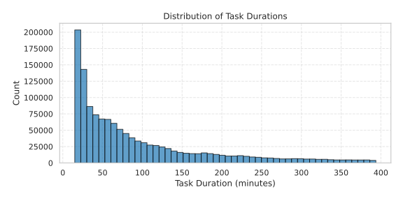
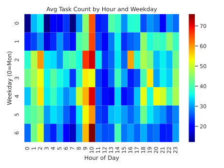

# Multi-Data Center Geographical Scheduling Benchmark

A high-fidelity simulation benchmark for **sustainable task scheduling** across globally distributed data centers. Optimize AI workloads based on **carbon emissions**, **energy cost**, **resource efficiency**, **transmission costs**, and **SLA guarantees**.

> **Goal**: Assign each incoming task to the best datacenter considering real-world sustainability and operational trade-offs.

<p align="center">
  
</p>
---

## Features

- **Centralized global scheduler** with decentralized task generation
- Real-world data from Alibaba, Electricity Maps, Open-Meteo, AWS/GCP/Azure
- Transfer-aware routing (latency, bandwidth, transmission cost)
- Detailed simulation of:
  - Energy use
  - Carbon emissions
  - Cooling (temperature-based proxy)
  - Transmission emissions
- Supports:
  - Rule-based controllers
  - Deep RL agents (SAC pre-implemented)
- Modular reward function system
- RL-ready Gym-compatible environments
- Fully extensible and interpretable

---

## Benchmark Design

At every 15-minute timestep:

1. Task Generation: 
   - Tasks are generated in multiple datacenters using population and time-zone-aware logic.
2. Global Scheduling:
   - A centralized agent observes system-wide state and decides a destination DC for each task.
3. Routing Penalty:
   - Tasks sent to remote DCs incur transfer costs and delays.
4. Execution:
   - Each DC executes tasks when resources are available.
   - Energy, cost, and carbon metrics are recorded.

### Why a 15-Minute Timestep?

We use a 15-minute timestep for our simulation to reflect how real data center operations and sustainability metrics work:

- **Real-world data sources** like Electricity Maps and grid APIs commonly provide energy prices, carbon intensity, and weather data at 15-minute or hourly intervals.
- **Cloud billing models** from AWS, GCP, and Azure often round usage in 5–15-minute blocks, making 15-minute scheduling windows practical and cost-relevant.
- **Batch scheduling and resource planning** in large clusters is typically done in intervals—not every minute—to smooth loads and reduce overhead.

More importantly, our simulator models the **thermal and electrical dynamics of data centers**, including:
- CPU-level energy and fan modeling (based on inlet temperature and utilization)
- Rack-level airflow, temperature, and power draw
- HVAC systems: CRAC setpoints, chiller loads, cooling tower behavior, and water usage

Thermal systems respond **relatively slowly**—changes in temperature, airflow, and cooling power have delayed effects. So simulating every minute adds unnecessary noise, while 15-minute steps allow:
- Stable tracking of thermal responses
- Meaningful HVAC control decisions
- Realistic latency and SLA trade-offs

This timestep design is **backed by multiple studies** in the field:

- *DeepEE: Joint Optimization of Job Scheduling and Cooling Control*, ICDCS 2019  
  https://doi.org/10.1109/ICDCS.2019.00070  
  → RL agent jointly controls job placement and cooling actions; the system is updated in aggregated time steps to manage interactions.

- *Green Data Center Cooling Control via Physics-guided Safe Reinforcement Learning*, ACM Transactions on Cyber-Physical Systems (2023)  
  https://doi.org/10.1145/3582577  
  → Uses physics-informed RL on cooling systems, with control cycles aligned to 15-minute windows for safe and stable adaptation.

- *Peak Shaving in Data Centers with Deep Reinforcement Learning*, Oregon State University  
  https://ir.library.oregonstate.edu/concern/graduate_thesis_or_dissertations/nc580v28w  
  → Applies RL to schedule peak power reductions using 15-minute windows based on grid signals.

- *Energy Efficient Control of Data Center HVAC Systems using Reinforcement Learning*, University of Twente (2024)  
  → Shows that minute-level control is impractical due to thermal inertia; uses coarser control cycles for stable performance.

- *Energy Efficient Scheduling of Servers with Multi-Sleep Modes*, IEEE TCC 2020  
  https://doi.org/10.1109/TCC.2018.2834376  
  → Models energy transitions and sleep states using coarse time intervals to minimize server wake/sleep cycles.

In short, a 15-minute timestep is not only realistic—it’s also **recommended** when simulating complex physical systems like cooling and power in large-scale data centers like the ones we model here.

---

## Supported Optimization Objectives

- Total energy cost (USD)
- Carbon emissions (kg CO₂)
- Energy consumption (kWh)
- SLA violations
- Inter-datacenter transmission costs
- Multi-objective trade-offs (via composite rewards)

---

## Real-World Datasets

| Type               | Source                                                                 |
|--------------------|------------------------------------------------------------------------|
| AI Workloads       | [Alibaba Cluster Trace 2020](https://github.com/alibaba/clusterdata/tree/master/cluster-trace-gpu-v2020)  |
| Weather Data       | [Open-Meteo](https://open-meteo.com/)                                  |
| Carbon Intensity   | [Electricity Maps](https://www.electricitymaps.com/)                   |
| Energy Prices      | [Electricity Maps](https://www.electricitymaps.com/), [GridStatus](https://gridstatus.io/) |
| Transmission Costs | [AWS](https://aws.amazon.com/ec2/pricing/on-demand/), [GCP](https://cloud.google.com/vpc/pricing), [Azure](https://azure.microsoft.com/en-us/pricing/details/bandwidth/) |

GreenDCC includes full-year datasets for:
- **Weather**, **carbon intensity**, and **electricity prices** from **2021 to 2024**
- Pricing normalized to $/kWh across supported regions
- Transmission costs based on **cloud-specific regional bandwidth pricing**

For more details on how electricity prices are collected, normalized, and aligned with simulation timezones, refer to:
📄 [`data/electricity_prices/README.md`](data/electricity_prices/README.md)

---

### 🌐 Supported Datacenter Locations

Use the following `location` codes in `datacenters.yaml` to enable real data integration:

| Code         | Region / Market                          |
|--------------|------------------------------------------|
| US-NY-NYIS   | New York (NYISO)                         |
| US-CAL-CISO  | California (CAISO)                       |
| US-TEX-ERCO  | Texas (ERCOT)                            |
| DE-LU        | Germany + Luxembourg (ENTSO-E)           |
| FR           | France (ENTSO-E)                         |
| SG           | Singapore (USEP)                         |
| JP-TK        | Japan - Tokyo Area (JEPX)                |
| IN           | India - Mumbai (POSOCO)                  |
| AU-NSW       | Australia - New South Wales (AEMO)       |
| BR-SP        | Brazil - São Paulo (ONS)                 |
| ZA           | South Africa (Eskom)                     |
| PT           | Portugal (OMIE)                          |
| ES           | Spain (OMIE)                             |
| BE           | Belgium (ENTSO-E)                        |
| CH           | Switzerland (ENTSO-E)                    |
| KR           | South Korea (KPX)                        |
| CA-ON        | Ontario (IESO)                           |
| CL-SIC       | Chile (CDEC-SIC)                         |
| AT           | Austria (ENTSO-E)                        |
| NL           | Netherlands (ENTSO-E)                    |

We plan to continuously expand this list in future releases.
➡️ Have a region you'd like to see supported? Open an issue or submit a PR!

### Climate Variability Across Regions

We analyze **historical temperature trends** in datacenter regions using weather data from [Open-Meteo](https://open-meteo.com/), covering years **2021 to 2024**. Temperature impacts both **cooling needs** and **energy efficiency**, making it an important factor in sustainable infrastructure planning.

<p align="center">
  
</p>

<p align="center">
  <em>Average daily temperature across selected datacenter regions (°C)</em>
</p>

This figure reveals the **seasonal variations** across locations:

- Northern hemisphere locations show strong temperature swings between summer and winter.
- Regions like Singapore or Mumbai maintain **stable warm climates** year-round.
- This information helps **model cooling-related energy demands** in simulations and energy estimation.


### Carbon Intensity Trends and Variability

To highlight how **carbon intensity varies across locations and times**, we also analyze the carbon intensity real-world data collected between **2021 and 2024** from [Electricity Maps](https://www.electricitymaps.com/). These insights guide **GreenDCC**’s energy-aware task scheduling policies.

<p align="center">
  
</p>

<p align="center">
  <em>Average daily carbon intensity across selected datacenter regions (gCO₂eq/kWh)</em>
</p>

<p align="center">
  
</p>

<p align="center">
  <em>Average hourly carbon intensity profile over a typical day (UTC time)</em>
</p>

These figures show that:

- **Carbon intensity is highly region-dependent** (e.g., countries with renewable-heavy grids have lower values like Toronto/CA, or Sao Paulo/BR).
- **Time-of-day plays a big role**: some regions show large carbon intensity variations throughout the day (e.g., Sydney/AU, California/USA).
- This variability can be used by **GreenDCC’s scheduling engine** to route tasks at the most sustainable moments.

### Electricity Prices Dataset

We include real hourly electricity price data across 20+ global regions, covering the years 2020–2024.  
Prices are stored in standardized format: **UTC timestamps** and **USD/MWh** units, extracted from sources like ElectricityMaps, GridStatus, CAISO, OMIE, and regional APIs.

Each region has a yearly CSV file under:  
`data/electricity_prices/standardized/<REGION>/<YEAR>/<REGION>_electricity_prices_<YEAR>.csv`

The dataset enables dynamic, cost-aware scheduling across regions.

#### Learn More
For full region list, folder structure, sources, and extraction scripts:  
📄 [`data/electricity_prices/README.md`](data/electricity_prices/README.md)

####  Visualization
We also include this figure showing the **typical daily electricity price patterns** (averaged by hour-of-day) for some regions:

<p align="center">
  
</p>

<p align="center">
  <em>Average hourly electricity price profile over a typical day (UTC time)</em>
</p>


---

## AI Workloads Dataset (Alibaba GPU Cluster Trace)

We use the [Alibaba Cluster Trace 2020](https://github.com/alibaba/clusterdata/tree/master/cluster-trace-gpu-v2020), a real-world dataset of GPU jobs from a large production cluster operated by Alibaba PAI (Platform for AI). It covers two months (July–August 2020), including over **6,500 GPUs** across **~1800 machines**.

This trace contains **training and inference jobs** using frameworks like TensorFlow, PyTorch, and Graph-Learn. These jobs span a wide range of machine learning workloads, and each job may consist of multiple tasks with multiple instances.

📄 *Original dataset paper*:  
**"MLaaS in the Wild: Workload Analysis and Scheduling in Large-Scale Heterogeneous GPU Clusters"**  
NSDI ’22  
[Link to paper](https://www.usenix.org/system/files/nsdi22-paper-weng.pdf)

---

### Preprocessing & Simulation Format

To use this data in long-term sustainable scheduling, we:

- **Filtered** short or trivial tasks. Only jobs ≥15 minutes are kept (typical of model fine-tuning, etc.)
- **Extended** the 2-month trace to a **full year** by replicating temporal patterns
- **Assigned origin datacenters** using a probabilistic model based on **population** and **local activity time**
- **Grouped** tasks into 15-minute intervals to match sustainability data (e.g., weather, energy, emissions)

Each task is **not guaranteed to be executed at its origin DC**. The global scheduler decides execution based on sustainability goals (carbon, cost, SLA, etc.), and tasks may be routed between datacenters.

For each transfer, we compute:
```python
transmission_cost = task_bandwidth_GB * cost_per_GB(origin_region, destination_region)
```

---

### Dataset Format (After Cleaning)
The cleaned dataset is saved as a Pandas `.pkl` DataFrame file with the following structure:

| interval_15m       | tasks_matrix                                            |
|--------------------|--------------------------------------------------------|
| 2020-03-01 08:00   | [[job1, tstart, tend, start_dt, duration, cpu, gpu, mem, gpu_mem, bw, day_name, day_num], ...] |
| 2020-03-01 08:15   | [[jobN, tstart, tend, start_dt, duration, cpu, gpu, mem, gpu_mem, bw, day_name, day_num], ...] |
| ...                | ...                                                    |


Where:
- `interval_15m`: The 15-minute time window (UTC) when the task starts.
- `tasks_matrix`: A NumPy array representing all tasks in that interval. Each task row includes:
  1. **job_id**: Unique task identifier.
  2. **start_time**: Start timestamp (Unix).
  3. **end_time**: End timestamp (Unix).
  4. **start_dt**: UTC datetime of start.
  5. **duration_min**: Task duration in minutes.
  6. **cpu_usage**: Number of CPU cores requested (e.g., `600.0` -> 6 cores).
  7. **gpu_wrk_util**: Number of GPUs requested (e.g., `50.0` -> 0.5 GPUs).
  8. **avg_mem**: Memory used (GB).
  9. **avg_gpu_wrk_mem**: GPU memory used (GB).
  10. **bandwidth_gb**: Estimated input data size (GB).
  11. **weekday_name**: Day name (e.g., Monday).
  12. **weekday_num**: Integer from 0 (Monday) to 6 (Sunday).

> ⚠️ **Note:**  
> In the original Alibaba dataset, both CPU and GPU requirements are stored as percentages:
> - `600.0` = 6 vCPU cores  
> - `50.0` = 0.5 GPUs  
>  
> We keep this representation in the `.pkl` file. However, during task extraction and simulation, we normalize these values into actual hardware units using the logic in `extract_tasks_from_row()` (located in `workload_utils.py`):

```python
job_name = task_data[0]
duration = float(task_data[4])
cpu_req = float(task_data[5]) / 100.0    # Convert percentage to core count
gpu_req = float(task_data[6]) / 100.0    # Convert percentage to GPU count
mem_req = float(task_data[7])            # Memory in GB
bandwidth_gb = float(task_data[8])       # Data transfer size in GB

task = Task(job_name, arrival_time, duration, cpu_req, gpu_req, mem_req, bandwidth_gb)
tasks.append(task)
```

This transformation allows for more intuitive interpretation and visualization.

### 📊 Dataset Visualizations

To better understand the characteristics of the **Alibaba GPU Cluster Trace**, we include a set of figures showing task distributions, resource demands, and scheduling patterns across time.

---

#### 1. **Task Duration Distribution**

Shows the histogram of task durations (in minutes) for all jobs ≥15 minutes. Most tasks range between 15–120 minutes, with a long tail of heavier training workloads.

<div align="center">
  
</div>

---

#### 2. **Resource Usage Distributions**

We plot histograms for the resource requests:

- **CPU cores** (converted from 100-based scale)
- **GPU units** (e.g., 0.5 = half GPU)
- **Memory (GB)**
- **Bandwidth (GB)** – used to estimate transmission cost

<div align="center">
  
</div>

---

#### 3. **Task Load Heatmap (Hourly x Weekday)**

Shows the **average number of tasks submitted** per hour, across all weekdays. Highlights peak hours of activity (e.g., business hours, time zone effects).

<div align="center">
  
</div>

---

#### 4. **Hourly Distribution of Resource Requests**

Boxplots of CPU, GPU, and memory usage across **hours of the day**, aggregated over July–August. Useful for modeling time-of-day-aware scheduling or load shaping.

<div align="center">
  
  <br><br>
  
  <br><br>
  
</div>

---

#### 5. **Gantt Chart of Tasks with Resource Colors**

Visualizes a 10-hour simulation window, showing task durations on the timeline. Each panel maps the same tasks, colored by:

- CPU cores requested  
- GPU units requested  
- Memory requested

This gives a compact view of temporal and resource variation across jobs.

<div align="center">
  
</div>

---

These plots offer a comprehensive summary of the workload behavior, temporal distribution, and compute intensity of the original trace, helping validate its realism for sustainable AI scheduling.

📂 Code to generate these figures can be found in: `data/workload/alibaba_2020_dataset/plot_alibaba_workload_stats.py`

---

### Additional Logic Injected at Runtime

During training or simulation, **two more fields are computed dynamically** for each task:

- `dc_origin`:  
  The **origin datacenter** is assigned using a **probabilistic population-based + local time** logic.  
  - Higher population DCs have more weight.
  - During their local business hours (08:00–20:00), they are more likely to generate tasks.
  - Implemented in: `assign_task_origins()`

- `SLA`:  
  Each task is given a **service deadline** via a **linear SLA multiplier**:
  ```python
  sla_deadline = arrival_time + sla_multiplier * duration
  ```
  - `sla_multiplier`: A configurable value (default: `1.5`) that defines the allowable slack.
  - Configurable per task, allowing for different urgency levels (e.g., urgent, normal, flexible).
  - Logic inspired by [*Sustainable AIGC Scheduling (2023)*](https://ieeexplore.ieee.org/document/10437617) for sustainable AIGC workloads.
As can be seen, at each timestep we can have different number of tasks to be determined their destination datacenter.

📄 For detailed scripts used to clean and expand the dataset, refer to `data/workload/README.md`.

---

## Datacenter Modeling

Each datacenter in this benchmark simulates physical infrastructure using a layered thermal and electrical model. Internally, we model:

- **CPU-level power and fan dynamics** based on workload and inlet temperature
- **Rack-level airflow and temperature response**
- **HVAC systems** (CRAC, chiller, cooling tower, water use)
- **Battery and thermal envelope interaction** (optional modules)

These models are grounded in equations from EnergyPlus, Breen et al. (2010), and Sun et al. (2021), and simulate realistic energy use, carbon emissions, and water consumption.

If you're interested in the **mathematical details and equations**, check the full modeling description in:

📄 [`envs/sustaindc/README_SustainDC.md`](envs/sustaindc/README_SustainDC.md)

---

## Customizing Datacenter
Datacenters are configured in the `datacenters.yaml` file. Each entry defines a single datacenter with:
  - A unique `dc_id`
  - A `location` code (e.g. `"US-NY-NYIS"`), which maps to energy, weather, and carbon datasets
  - A `timezone_shift` (hours from UTC)
  - A `population_weight` (used for task origination distribution)
  - Resource specs: number of CPUs, GPUs, and memory in GB
  - A `dc_config_file` for layout configuration and low-level energy and cooling models

### Resource Parameters
  - `total_cpus`: Simulated number of CPU cores
  - `total_gpus`: Simulated number of discrete GPUs
  - `total_mem`: Total memory capacity in GB

These parameters define the computational capacity of each datacenter and are used internally to:
  - Enforce scheduling constraints (e.g., task fits in resources or not)
  - Track real-time utilization (CPU, GPU, MEM)
  - Drive energy and cooling models via datacenter_model.py
  - Trigger SLA violations when overloaded

The values are fully customizable, letting you simulate:
  - Small edge DCs vs. large hyperscale ones
  - GPU-rich training hubs vs. CPU-dense inference zones
  - Memory-optimized configurations for big models

### Example `datacenters.yaml` Configuration

```yaml
datacenters:
  - dc_id: 1
    location: "US-NY-NYIS"
    timezone_shift: -5
    population_weight: 0.25
    total_cpus: 25000         # Total virtual CPUs
    total_gpus: 700           # Total GPUs
    total_mem: 80000          # Total memory in GB
    dc_config_file: "configs/dcs/dc_config.json"

  - dc_id: 2
    location: "DE-LU"
    timezone_shift: 1
    population_weight: 0.22
    total_cpus: 15000
    total_gpus: 1000
    total_mem: 80000
    dc_config_file: "configs/dcs/dc_config.json"

   - dc_id: 3
      location: "US-CAL-CISO"
      timezone_shift: -8
      population_weight: 0.20
      total_cpus: 20000
      total_gpus: 600
      total_mem: 80000
      dc_config_file: "configs/dcs/dc_config.json"
  ...
```

### Modeling Guidelines (Based on 1 MW Capacity)

If you want to simulate realistic datacenter configurations, you can use the following reference values based on typical power distribution across components:

| Datacenter Type      | total_cpus | total_gpus | total_mem (GB) |
|----------------------|------------|------------|----------------|
| GPU-heavy (training) | 15,000     | 1000       | 80,000         |
| Balanced (general)   | 25,000     | 600        | 80,000         |
| CPU-heavy (inference)| 30,000     | 300        | 60,000         |

These values assume approximately 1 MW of compute power, split into:
- ~20 W per CPU core
- ~500 W per GPU
- ~2.5 W per GB of RAM

You can scale up or down linearly (e.g., use 0.5× for 500 kW or 2× for 2 MW) depending on your simulation scope.

This helps to:
- Keep your configuration physically realistic
- Ensure energy/cooling models are meaningful
- Avoid over-provisioning resources in an unrealistic way

---

## Architecture

```
           +------------------+ 
           | Global Scheduler |
           +------------------+ 
                    ↑  
               [All Tasks]  
                    ↑  
+----------+   +----------+   +----------+  
|   DC1    |   |   DC2    |   |   DC3    |   ...
+----------+   +----------+   +----------+ 
```
Each DC: local environment with
- Resource tracking
- Energy & carbon simulation
- Scheduling queue

---
## 🧠 Action Space: How the Agent Makes Decisions

In this benchmark, at every decision step, the agent (**Global Scheduler**) is presented with a list of pending tasks. It must decide, for each task, what to do next.

The **action space** is defined as:

```python
action ∈ {0, 1, 2, ..., N}
```

Where:
- **N** is the total number of datacenters in the simulation (e.g., 5).
- The **action** is an integer that represents the decision for a given task.

### What Each Action Means

| Action Value | Meaning |
|--------------|---------|
| `0`          | **Defer the task**: Temporarily hold the task to be reconsidered in the next time step. This allows the agent to wait for better scheduling conditions (e.g., cheaper, greener, or less loaded datacenter). |
| `1` to `N`   | **Assign to datacenter `i`**: Send the task to the selected datacenter (e.g., `1 = DC1`, `2 = DC2`, ...). The task will enter that datacenter’s scheduling queue and execute when resources are available. |

### Why Deferring Matters

Deferring (action `0`) enables **temporal flexibility**. It gives the agent an option to wait for:
- **Lower carbon intensity**
- **Cheaper electricity prices**
- **Higher resource availability**

However, every task has a **deadline (SLA)**. If it waits too long, it will **violate the SLA** and may incur a penalty.

This flexible action space supports **more intelligent and sustainability-aware scheduling strategies**.

---

## Task Origin Generation Logic

In our benchmark, tasks are not generated randomly across data centers. Instead, we simulate a more realistic scenario by incorporating a **hybrid logic** that accounts for both population and time-zone activity.

### Key Concepts

We model task origins using a **weighted probability distribution** that is influenced by:

- **Population-Based Weights**: Each data center is assigned a base weight representing its population and economic importance.
- **Local Time-of-Day**: Task generation is more likely during local business hours (8:00 to 20:00 local time).

### Algorithm Steps

1. **Score Computation**:
   - For each datacenter, compute:
     ```
     score = population_weight × activity_factor
     ```
     where:
     - `population_weight` is a static weight from the config (e.g. 0.25 for New York).
     - `activity_factor` is `1.0` if local hour is within [8, 20), else `0.3`.

2. **Probabilistic Sampling**:
   - Normalize the scores into probabilities.
   - For each task to generate, sample a datacenter as its origin according to this probability distribution.

3. **Result**:
   - Tasks originate in a realistic, time-aware way: more tasks are generated in large/populous regions, especially during their business hours.

### Motivation

This approach ensures:
- Realistic global usage patterns
- Dynamic variation throughout the day
- Load balancing across DCs with appropriate biases

This logic is implemented in the utility function `assign_task_origins()` used during task extraction in the pipeline.

- **Geographic and Policy-based Transfer Constraints**  
  We plan to introduce restrictions on task transmission between datacenters based on geographic or regulatory constraints (e.g., GDPR compliance, national data residency laws, inter-region data sovereignty). This will allow more realistic simulations of compliance-aware task placement.

---

## 📁 Code Structure

```
envs/                         # RL-compatible Gym environments
├── env_config.py            # Config class for environments
├── task_scheduling_env.py   # Global Gym wrapper for training & evaluation
├── sustaindc/               # Internal simulation for datacenter agents
│   ├── __init__.py
│   ├── sustaindc_env.py     # Main multi-agent SustainDC environment
│   ├── battery_env.py       # Battery simulation (not used)
│   ├── battery_model.py     # Battery power & capacity dynamics (not used)
│   ├── timeloadshifting_env.py # Load shifting queue & SLA simulation (not used)
│   ├── datacenter_model.py  # Physical data center IT & HVAC model
│   └── dc_gym.py            # Gym interface for the datacenter model
```

```
simulation/                  # High-level simulator
├── __init__.py
└── datacenter_cluster_manager.py   # Manages multiple datacenters + task routing
```

```
rl_components/               # RL agent logic and training utilities
├── agent_net.py             # Actor neural network (for SAC or other RL)
├── replay_buffer.py         # Experience replay buffer
└── task.py                  # Task class (job ID, resource needs, SLA, etc.)
```

```
rewards/                     # Reward function system
├── base_reward.py           # Reward interface
├── reward_registry.py       # Auto-loading and registry
└── predefined/              # All predefined rewards
    ├── energy_price_reward.py       # Energy price reward
    ├── carbon_emissions_reward.py   # Carbon emissions reward
    ├── energy_consumption_reward.py # Energy consumption reward
    ├── sla_penalty_reward.py        # SLA penalty reward
    ├── efficiency_reward.py         # Efficiency reward
    └── composite_reward.py          # Composite reward for multiple objectives

```
```
utils/                       # Utilities and managers
├── make_envs_pyenv.py       # Functions to construct internal envs
├── managers.py              # CI, price, time, weather managers
├── utils_cf.py              # Config and helper utilities
├── dc_config_reader.py      # Parse & process DC config files
└── task_assignment_strategies.py  # Rule-based task routing policies
```

---

## Example Use Cases

- RL agent for low-cost, low-carbon scheduling
- Rule-based heuristics (most available, least emissions, etc.)
- Evaluate multi-objective optimization strategies
- Ablation on reward signals (carbon vs. cost vs. transfer)

---

## Example Metrics Output

Datacenter DC1:
   - Total Tasks Executed: 14640
   - Total Energy Used: 285,481.07 kWh
   - Average CPU Usage: 58.99%
   - Total Bandwidth Used: 58,818 GB

Datacenter DC2:
   - Task Share: 18.95%
   - Avg Energy per Step: 275.63 kWh

---

---
## Code Architecture

```
             +-----------------------+
             |  TaskSchedulingEnv    |  ← Gym wrapper for RL agents
             +-----------------------+
                         ↓
     +---------------------------------------------+
     |      DatacenterClusterManager               |  ← Manages DCs and task routing
     |  +----------------+    +----------------+   |
     |  | SustainDC (DC1)|    | SustainDC (DC2)|...|
     |  +----------------+    +----------------+   |
     +---------------------------------------------+
```

- `TaskSchedulingEnv`: A Gym-compatible wrapper. It presents observations to an RL agent, handles action dispatching, deferral logic, and reward computation using the cluster manager.
- `DatacenterClusterManager`: Manages the state and operation of all individual datacenters. It is responsible for task routing (RBC), resource management, and step simulation inside each DC.
- `SustainDC`: Simulates internal DC operation (power, scheduling, HVAC, etc.).


## Modular Reward System

GreenDCC comes with a powerful modular reward engine. You can:

- Optimize for **single** or **multiple** objectives
- Use built-in rewards like `energy_price`, `carbon_emissions`, `transmission_cost`
- Create **custom rewards** easily
- Combine multiple rewards with weights using `CompositeReward`


## Built-in Reward Functions

The following reward components are already available:

| Reward Name          | Description                                      | Params                     |
|----------------------|--------------------------------------------------|----------------------------|
| `energy_price`       | Penalizes total energy cost of tasks             | `normalize_factor`         |
| `carbon_emissions`   | Penalizes total kgCO₂ emissions                  | `normalize_factor`         |
| `energy_consumption` | Penalizes total energy used (in kWh)             | `normalize_factor`         |
| `efficiency`         | Penalizes energy per scheduled task              | _None_                     |
| `sla_penalty`        | Penalizes number of SLA violations               | `penalty_per_violation`    |
| `composite`          | Combines multiple reward components              | See below                  |


👉 [See full reward documentation here »](rewards/README.md)

---

## 📊 Example Composite Reward

```python
from rewards.predefined.composite_reward import CompositeReward

reward_fn = CompositeReward(
    components={
        "energy_price": {
            "weight": 0.5,
            "args": {"normalize_factor": 100000}
        },
        "carbon_emissions": {
            "weight": 0.3,
            "args": {"normalize_factor": 100}
        },
        "sla_penalty": {
            "weight": 0.2,
            "args": {"penalty_per_violation": 5.0}
        }
    }
)
```


---

## SLA Modeling

GreenDCC includes built-in SLA (Service-Level Agreement) constraints to evaluate how well policies meet time-sensitive requirements.

Each task is assigned a **deadline** calculated as:


```python
sla_deadline = arrival_time + sla_multiplier * duration
```

where:
- `arrival_time`: The time when the task arrives at the datacenter.
- `sla_multiplier`: A configurable value (default: `1.5`) that defines the allowable slack.
- `duration`: The expected duration of the task.

For example, a task with a duration of 60 minutes and a `sla_multiplier` of `1.5` must finish within 90 minutes (60 * 1.5) from its arrival time.

This mechanism introduces flexibility in scheduling, allowing the agent to **temporarily defer tasks** for greener or more cost-effective options while still respecting SLA constraints.

> This approach is inspired by the slack-based methodology in:
> *Sustainable AIGC Workload Scheduling of Geo-Distributed Data Centers: A Multi-Agent Reinforcement Learning Approach*  
> [https://arxiv.org/abs/2304.07948](https://arxiv.org/abs/2304.07948)

In that paper, the authors simulate fixed job slack times proportional to job duration — a structure also mirrored here.

### Per-Task SLA Tiers
GreenDCC also supports assigning custom `sla_factor` values per task to reflect different urgency levels:

| Priority | SLA Factor | Description                    |
|----------|------------|--------------------------------|
| Urgent   | 1.1        | Must be executed immediately.  |
| Normal   | 1.5        | Standard SLA, can be deferred. |
| Flexible | 2.0        | Can be delayed significantly.  |

This allows mixed workloads where some tasks are highly time-sensitive and others tolerate longer delays.

You can set this directly when constructing tasks via:

```python
Task(..., sla_factor=1.5)
```


### SLA Violation Penalty

If a task misses its SLA deadline, it will be marked as **violated**. You can penalize such violations in your reward by using the built-in `sla_penalty` component:

```python
"sla_penalty": {
    "weight": 0.2,
    "args": {"penalty_per_violation": 5.0}
}
```
This allows policies to be evaluated based on both sustainability **and** reliability metrics.

### Why this matters

Not all users have the same priorities:

- **Cloud providers** might care about minimizing **energy price** and **resource efficiency**.
- **Sustainability-focused** deployments may want to reduce **carbon emissions** or **energy consumption**.
- Others may want to enforce strict **SLA guarantees**.

With our modular system, you can **define custom reward combinations** that align with your specific optimization objectives.
This flexibility allows you to tailor the training process to your unique needs, whether you're focused on cost, carbon emissions, etc. or a combination of multiple factors.

---

### Carbon Emissions from Inter-Datacenter Transfers

GreenDCC simulates not only compute-related emissions, but also **carbon emissions associated with data transfers** between datacenters.

This matters for sustainable workload scheduling because AI workloads — especially training or fine-tuning — involve **large data transfers**, and moving that data across long distances consumes non-negligible electricity in the **network infrastructure**.

#### Current Model (Simple, Efficient Approximation)

At this stage, we estimate **transmission-related carbon emissions** using a linear model:

```python
emissions_kg = task.bandwidth_gb × 0.06 kWh/GB × carbon_intensity_origin
```

- `bandwidth_gb`: size of the task to be transmitted (from Alibaba 2020 dataset)
- `0.06 kWh/GB`: average electricity required to transmit 1 GB of data (from [Aslan et al., 2017](https://doi.org/10.1111/jiec.12630))
- `carbon_intensity_origin`: current carbon intensity (kgCO₂/kWh) at the **origin datacenter’s** location

This approach assumes that most of the energy consumption for transmission happens near the **origin region**, which aligns with findings from empirical network energy studies (e.g., [Guennebaud et al., 2024](https://doi.org/10.1111/jiec.13513)).

#### Example

If a 50 GB task is transferred from a region with:
- Carbon intensity = 400 gCO₂/kWh (i.e., 0.4 kgCO₂/kWh)

Then:
```python
emissions = 50 × 0.06 × 0.4 = 1.2 kgCO₂
```

This emission is recorded and optionally **penalized via reward** in the RL training loop.

#### Planned Improvements

We plan to introduce a more realistic **bottom-up network model** based on:
> *Energy consumption of data transfer: Intensity indicators versus absolute estimates*, Guennebaud et al. (2024)  
> [https://doi.org/10.1111/jiec.13513](https://doi.org/10.1111/jiec.13513)

This will account for:
- Core vs. access network separation
- Dynamic peak vs. idle energy allocation
- Long-haul routing paths
- Origin/destination asymmetry

That model will enable **better estimation of network emissions under complex scenarios**, but our current approach gives fast and robust results for sustainability-aware scheduling.

---

## Installation
### Requirements
```bash
pip install -r requirements.txt
```
### Environment Setup
```bash
conda create -n green-dcc python=3.10
conda activate green-dcc
pip install -r requirements.txt
```

---
# 🏋️‍♂️ Training the RL Agent in GreenDCC

GreenDCC supports training Deep Reinforcement Learning agents using **Soft Actor-Critic (SAC)**. The training loop is fully configurable via YAML files and supports easy experimentation across different sustainability and efficiency goals.

---

## Configuration Overview

Training is driven by four modular config files:

| Config File | Purpose |
|-------------|---------|
| `sim_config.yaml` | Simulation time, strategy, task sources |
| `datacenters.yaml` | DCs with location, resource specs, energy model |
| `reward_config.yaml` | Reward weights for carbon, cost, SLA, etc. |
| `algorithm_config.yaml` | RL hyperparameters (batch size, learning rate, etc.) |

---

## Start Training

Default:

```bash
python train_rl_agent.py
```

With custom paths:

```bash
python train_rl_agent.py \
    --sim-config configs/env/sim_config.yaml \
    --dc-config configs/env/datacenters.yaml \
    --reward-config configs/env/reward_config.yaml \
    --algo-config configs/env/algorithm_config.yaml \
    --tag my_experiment
```

Use `--checkpoint-path` to resume from a previous run.

---

## RL Algorithm

The default training method is **Soft Actor-Critic (SAC)**, which features:

- Stable off-policy learning
- Entropy-based exploration
- Replay buffer optimization

The agent learns to **defer or route tasks** for better long-term trade-offs in carbon, cost, and load balancing.

---

## Checkpointing

Model checkpoints are saved in:

```
checkpoints/train_<timestamp>/
├── checkpoint_step_5000.pth
├── checkpoint_step_10000.pth
└── best_checkpoint.pth
```

Use them to resume training or for evaluation.

---

## Customize Everything

Want to test a new reward? Just edit `reward_config.yaml`.

Want a different datacenter mix? Update `datacenters.yaml`.

Want faster updates or a longer warmup? Modify `algorithm_config.yaml`.

GreenDCC’s config-driven design makes it easy to explore new ideas.

---

## 📈 Tracking Training with TensorBoard

GreenDCC logs all major training metrics to **TensorBoard**, including:

- Total and per-step rewards
- Actor policy entropy
- Q-value estimates and loss
- Policy gradients and loss
- Reward component breakdowns (for composite rewards)

### 🏁 How to Launch

From the root directory:

```bash
tensorboard --logdir runs/
```

Then navigate to:

👉 http://localhost:6006

Each run logs to:

```
runs/train_<timestamp>/
```

You can compare multiple runs simultaneously for performance diagnostics or ablations.

---
## Customize Everything

Want to test a new reward? Just edit `reward_config.yaml`.

Want a different datacenter mix? Update `datacenters.yaml`.

Want faster updates or a longer warmup? Modify `algorithm_config.yaml`.

GreenDCC’s config-driven design makes it easy to explore new ideas.

---

## Evaluation

### Evaluation using Rule-based Controllers or RL Agents

You can evaluate different controllers by plugging them into the DatacenterClusterManager. Available strategies:

- random
- round_robin
- most_available
- least_pending
- lowest_carbon
- lowest_price
- manual_rl (custom RL policy)

To run the evaluation, take a look to:

```bash
python eval_agent_notebook.py
```
This will run a simulation for 7 days and compare the performance of the selected controller against a rule-based controller.
You need to specify the controller you want to evaluate in the `controller` variable.
Also you need to specify the checkpoint if using a RL agent.

---

## Google Colab Evaluation

A ready-to-run Google Colab notebook is available for testing and evaluation:

👉 **[Run it here](https://colab.research.google.com/drive/1LLw313sG56l2I29E0Q9zh6KM0q5Z23WX?usp=sharing)**

The notebook supports:
- Uploading a trained agent checkpoint
- Running simulation for 7 days
- Comparing with a rule-based controller
- Visualizing energy, carbon, and resource usage

---

## 🛣️ Planned Features and Enhancements

GreenDCC is actively evolving. Upcoming features include:

- **Geographic and Policy-based Transfer Constraints**  
  Enforce restrictions on inter-datacenter transfers based on legal or geopolitical constraints, such as GDPR or cross-border data regulations.

- **Expanded Regional Coverage**  
  Support for more datacenter locations and energy markets in Africa, South America, and Southeast Asia.

- **Transmission Emissions Refinement**  
  Upgrade from fixed energy intensities to path-based dynamic models for data transmission.

- **GPU + Memory Energy Modeling**  
  Extend energy consumption models to include GPU and memory usage, enabling more accurate sustainability tracking of training and inference tasks.

- **Workload Prioritization and Tiers**  
  Integrate flexible vs. non-flexible job types, with varying SLA strictness and resource guarantees.

- **Colocation-aware Modeling**  
  Add support for shared infrastructure scenarios with multiple tenants or service-level priorities.

- **Visualization Dashboard**  
  Real-time dashboards to visualize energy, carbon, and cost metrics during training or evaluation.

Want to contribute or suggest features? Open an issue or reach out!

## TODO

- More rule-based controllers for baseline comparison
- Improve the Google colab notebook

---

## Citation / Credits

This project builds on work from:

- Alibaba Cluster Trace Dataset
- Electricity Maps Dataset
- Open-Meteo API
- GridStatus.io

---

## License

MIT License. Attribution to original dataset sources is required.

---

## Contributors

Feel free to open issues or PRs for improvements, bugs, or suggestions.
