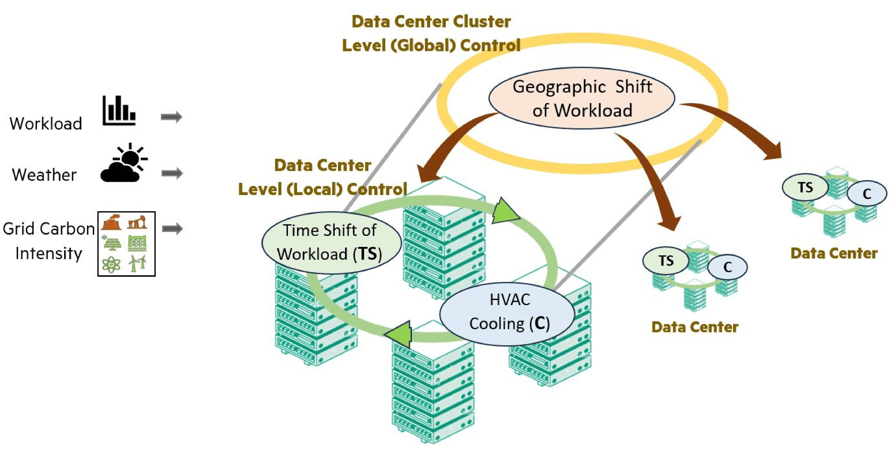

# Green-DCC: Benchmarking Dynamic Workload Distribution Techniques for Sustainable Data Center Cluster

## Table of Contents
1. [Introduction](#introduction)
2. [Installation](#installation)
3. [Usage](#usage)
4. [Benchmarking](#benchmarking)
5. [Experimental Details](#experimental-details)
6. [Provided Locations](#provided-locations)
7. [Contributing](#contributing)
8. [Contact](#contact)
9. [License](#license)

## Introduction

Green-DCC is a benchmark environment designed to evaluate dynamic workload distribution techniques for sustainable Data Center Clusters (DCC). It aims to reduce the environmental impact of cloud computing by distributing workloads within a DCC that spans multiple geographical locations. The benchmark environment supports the evaluation of various control algorithms, including reinforcement learning-based approaches.

### ** Detailed documentation can be found [here](https://hewlettpackard.github.io/green-dcc). **



*Figure: Green-DCC Framework for Data Center Cluster Management.*

Key features of Green-DCC include:

- Dynamic time-shifting of workloads within data centers and geographic shifting between data centers in a cluster.
- Incorporation of non-uniform computing resources, cooling capabilities, auxiliary power resources, and varying external weather and carbon intensity conditions.
- A dynamic bandwidth cost model that accounts for the geographical characteristics and amount of data transferred.
- Realistic workload execution delays to reflect changes in data center capacity and demand.
- Support for benchmarking multiple heuristic and hierarchical reinforcement learning-based approaches.
- Customizability to address specific needs of cloud providers or enterprise data center clusters.

Green-DCC provides a complex, interdependent, and realistic benchmarking environment that is well-suited for evaluating hierarchical reinforcement learning algorithms applied to data center control. The ultimate goal is to optimize workload distribution to minimize the carbon footprint, energy usage, and energy cost, while considering various operational constraints and environmental factors.

The figure above illustrates the Hierarchical Green-DCC Framework for Data Center Cluster Management. In this framework:

- **Top-Level Agent:** Controls the geographic distribution of workloads across the entire DCC. This agent makes strategic decisions to optimize resource usage and sustainability across multiple locations.
- **Lower-Level Agents:** Manage the time-shifting of workloads and the cooling processes within individual data centers. These agents implement the directives from the top-level agent while addressing local operational requirements.
- **Additional Controls:** Can include energy storage, among other capabilities. These controls further enhance the system's ability to optimize for multiple objectives, such as reducing the carbon footprint, minimizing energy usage and costs, and potentially extending to water usage.

The hierarchical structure allows for coordinated, multi-objective optimization that considers both global strategies and local operational constraints.


*Figure: Green-DCC Framework demonstrating Geographic and Temporal Load Shifting Strategies.*

The figure above shows the Green-DCC framework using two main strategies to optimize data center operations and reduce carbon emissions:

- **Geographic Load Shifting:** Dynamically moves workloads between different data centers (DC1, DC2, DC3) based on decisions made by the Top-Level Agent. This strategy leverages regional differences in energy costs, carbon intensity of the grid, and external temperatures.
- **Temporal Load Shifting:** Defers non-critical/shiftable tasks to future time periods within a single data center (e.g., DC3), when conditions are more favorable for energy-efficient operation. Tasks are stored in a Deferred Task Queue (DTQ) and executed during periods of lower carbon intensity, external temperatures, or lower overall data center utilization.


## Installation

To get started with Green-DCC, follow the steps below to set up your environment and install the necessary dependencies.

### Prerequisites

- Python 3.10+
- Ray **2.4.0** (installed when installing the `requirements.txt` file)
- Git
- Conda (for creating virtual environments)

### Setting Up the Environment

1. **Clone the repository**

    First, clone the Green-DCC repository from GitHub:

    ```bash
    git clone https://github.com/HewlettPackard/green-dcc.git
    cd green-dcc
    ```

2. **Create a new Conda environment**

    Create a new Conda environment with Python 3.10:

    ```bash
    conda create --name greendcc python=3.10
    ```

3. **Activate the environment**

    Activate the newly created environment:

    ```bash
    conda activate greendcc
    ```

4. **Install dependencies**

    Install the required dependencies using `pip`:

    ```bash
    pip install -r requirements.txt
    ```


## Usage

This section provides instructions on how to run simulations, configure the environment, and use the Green-DCC benchmark.

### Running Simulations

1. **Navigate to the Green-DCC directory**

    Ensure you are in the `green-dcc` directory:

    ```bash
    cd green-dcc
    ```
    
2. **Run a experiment**

    To run a basic experiment, use the following command:

    ```bash
    python train_truly_hierarchical.py
    ```

    This will start a simulation with the default configuration. The results will be saved in `results/` output directory.

3. **Visualize the experiments with TensorBoard**

    To visualize the experiments while they are running, you can launch TensorBoard. Open a new terminal, navigate to the `results/` directory, and run the following command:

    ```bash
    tensorboard --logdir=./test
    ```

    This will start a TensorBoard server, and you can view the experiment visualizations by opening a web browser and navigating to `http://localhost:6006`.


## Benchmarking

The Green-DCC environment supports benchmarking various Multi Agent / Hierarchical control algorithms to evaluate their effectiveness in optimizing workload distribution and minimizing the carbon footprint of data center clusters. This section provides instructions on how to run benchmarks using different algorithms and configurations.

### Tested Algorithms

While Green-DCC is compatible with a wide range of algorithms provided by Ray RLlib, our experiments have primarily tested and validated the following algorithms:

- **Advantage Actor-Critic (A2C)**
- **Adaptive Proximal Policy Optimization (APPO)**
- **Proximal Policy Optimization (PPO)**

These algorithms have been successfully trained and evaluated within the Green-DCC environment, demonstrating their performance in terms of energy consumption, carbon footprint, and other relevant metrics.

Other algorithms listed on the [Ray RLlib documentation](https://docs.ray.io/en/releases-2.4.0/rllib/rllib-algorithms.html) should also be compatible with Green-DCC, but additional work may be required to adapt the environment to the expected input and output shapes of each method as implemented in RLlib. For more details on these algorithms and how to adapt them for Green-DCC, refer to the [Ray RLlib documentation](https://docs.ray.io/en/releases-2.4.0/rllib/rllib-algorithms.html).


### Running Benchmarks

1. **Navigate to the Green-DCC directory**

    Ensure you are in the `green-dcc` directory:

    ```bash
    cd green-dcc
    ```

2. **Configure the benchmark**

    Edit the configuration files as needed to set up your desired benchmark parameters.

3. **Train and evaluate algorithms**

    To train and evaluate an RL algorithm using Ray, use the appropriate training script. Here are the commands for different configurations:

    - **HRL (Hierarchical Reinforcement Learning) Configuration**:
      ```bash
      python train_truly_hierarchical.py
      ```
    
    - **HL+LLP (High Level + Low-Level Pretrained) Configuration**:
      ```bash
      python baselines/train_geo_dcrl.py
      ```

    - **HLO (High Level Only) Configuration**:
      ```bash
      python baselines/train_hierarchical.py
      ```

    The provided training script (`train_truly_hierarchical.py`) uses Ray for distributed training. Here's a brief overview of the script for PPO of HRL configuration:

    ```python
    import os
    import ray
    from ray import air, tune
    from ray.rllib.algorithms.ppo import PPO, PPOConfig
    from gymnasium.spaces import Discrete, Box
    from ray.rllib.algorithms.ppo import PPOConfig
    
    from envs.truly_heirarchical_env import TrulyHeirarchicalDCRL
    from envs.heirarchical_env import HeirarchicalDCRL, DEFAULT_CONFIG
    from create_trainable import create_wrapped_trainable
    
    NUM_WORKERS = 1
    NAME = "test"
    RESULTS_DIR = './results/'
    
    # Dummy env to get obs and action space
    hdcrl_env = HeirarchicalDCRL()
    
    CONFIG = (
            PPOConfig()
            .environment(
                env=TrulyHeirarchicalDCRL,
                env_config=DEFAULT_CONFIG
            )
            .framework("torch")
            .rollouts(
                num_rollout_workers=NUM_WORKERS,
                rollout_fragment_length=2,
                )
            .training(
                gamma=0.99,
                lr=1e-5,
                kl_coeff=0.2,
                clip_param=0.1,
                entropy_coeff=0.0,
                use_gae=True,
                train_batch_size=4096,
                num_sgd_iter=10,
                model={'fcnet_hiddens': [64, 64]}, 
                shuffle_sequences=True
            )
            .multi_agent(
            policies={
                "high_level_policy": (
                    None,
                    hdcrl_env.observation_space,
                    hdcrl_env.action_space,
                    PPOConfig()
                ),
                "DC1_ls_policy": (
                    None,
                    Box(-1.0, 1.0, (14,)),
                    Discrete(3),
                    PPOConfig()
                ),
                "DC2_ls_policy": (
                    None,
                    Box(-1.0, 1.0, (14,)),
                    Discrete(3),
                    PPOConfig()
                ),
                "DC3_ls_policy": (
                    None,
                    Box(-1.0, 1.0, (14,)),
                    Discrete(3),
                    PPOConfig()
                ),
            },
            policy_mapping_fn=lambda agent_id, episode, worker, **kwargs: agent_id,
            )
            .resources(num_gpus=0)
            .debugging(seed=0)
        )


    if __name__ == "__main__":
        os.environ["RAY_DEDUP_LOGS"] = "0"
        ray.init(ignore_reinit_error=True)
        
        tune.Tuner(
            create_wrapped_trainable(PPO),
            param_space=CONFIG.to_dict(),
            run_config=air.RunConfig(
                stop={"timesteps_total": 100_000_000},
                verbose=0,
                local_dir=RESULTS_DIR,
                name=NAME,
                checkpoint_config=ray.air.CheckpointConfig(
                    checkpoint_frequency=5,
                    num_to_keep=5,
                    checkpoint_score_attribute="episode_reward_mean",
                    checkpoint_score_order="max"
                ),
            )
    ).fit()  
    ```

    This example assumes a DCC with three data centers. To use a different algorithm, such as A2C, you need to replace the `PPOConfig` with `A2CConfig` (or the appropriate config class for the algorithm) and adjust the hyperparameters accordingly. For example:

    ```python
    from ray.rllib.algorithms.a2c import A2C, A2CConfig

    CONFIG = (
            A2CConfig()
            .environment(
                env=TrulyHeirarchicalMSDCRL,
                env_config=DEFAULT_CONFIG
            )
            .framework("torch")
            .rollouts(
                num_rollout_workers=NUM_WORKERS,
                rollout_fragment_length=2,
                )
            .training(
                gamma=0.99,
                lr=1e-5,
                kl_coeff=0.2,
                clip_param=0.1,
                entropy_coeff=0.0,
                use_gae=True,
                train_batch_size=4096,
                num_sgd_iter=10,
                model={'fcnet_hiddens': [64, 64]}, 
            )
            .multi_agent(
            policies={
                "high_level_policy": (
                    None,
                    hdcrl_env.observation_space,
                    hdcrl_env.action_space,
                    A2CConfig()
                ),
                "DC1_ls_policy": (
                    None,
                    Box(-1.0, 1.0, (14,)),
                    Discrete(3),
                    A2CConfig()
                ),
                "DC2_ls_policy": (
                    None,
                    Box(-1.0, 1.0, (14,)),
                    Discrete(3),
                    A2CConfig()
                ),
                "DC3_ls_policy": (
                    None,
                    Box(-1.0, 1.0, (14,)),
                    Discrete(3),
                    A2CConfig()
                ),
            },
            policy_mapping_fn=lambda agent_id, episode, worker, **kwargs: agent_id,
            )
            .resources(num_gpus=0)
            .debugging(seed=1)
        )


    if __name__ == "__main__":
        os.environ["RAY_DEDUP_LOGS"] = "0"
        ray.init(ignore_reinit_error=True)
        
        tune.Tuner(
            create_wrapped_trainable(A2C),
            param_space=CONFIG.to_dict(),
            run_config=air.RunConfig(
                stop={"timesteps_total": 100_000_000},
                verbose=0,
                local_dir=RESULTS_DIR,
                name=NAME,
                checkpoint_config=ray.air.CheckpointConfig(
                    checkpoint_frequency=5,
                    num_to_keep=5,
                    checkpoint_score_attribute="episode_reward_mean",
                    checkpoint_score_order="max"
                ),
            )
        ).fit()
    ```


4. **Compare results**

    After running the benchmarks, you can compare the results by examining the output files in the `results/` directory. These files include detailed metrics on energy consumption, carbon footprint, and workload distribution across data centers. Use these metrics to assess the relative performance of different algorithms and configurations.

### Evaluation Metrics

Green-DCC provides a range of evaluation metrics to assess the performance of the benchmarked algorithms:

- **Energy Consumption**: Total energy consumed by the data centers during the simulation.
- **Carbon Footprint**: Total carbon emissions generated by the data centers, calculated based on the energy mix and carbon intensity of the power grid.
- **Workload Distribution**: Efficiency of workload distribution across data centers, considering factors like latency, bandwidth cost, and data center utilization.

These metrics provide a comprehensive view of the performance of different algorithms and configurations, enabling you to identify the most effective strategies for sustainable data center management.

### Customizing Benchmarks

Green-DCC is designed to be highly customizable, allowing you to tailor the benchmark environment to your specific needs. You can modify the configuration files to:

- Add or remove data center locations.
- Adjust the workload characteristics, such as the proportion of shiftable tasks.
- Change the parameters of the RL algorithms, such as learning rates and discount factors.
- Include additional control strategies, such as energy storage or renewable energy integration.

Refer to the detailed documentation for more information on customizing the Green-DCC environment and running advanced benchmarks.

We are continually expanding Green-DCC to integrate additional control strategies and external energy sources, including auxiliary battery integration and on-site renewable energy generators (solar, wind, etc.). This ongoing development ensures that Green-DCC remains a comprehensive and up-to-date benchmarking tool for sustainable data center management.

## Experimental Details

For all experiments, we considered three different locations: New York (NY), Atlanta (GA), and San Jose (CA). These locations were chosen to present a variety of weather conditions and carbon intensity profiles, creating a comprehensive and challenging evaluation environment. The goal was to develop a policy capable of addressing the unique challenges specific to each location. We utilized weather and carbon intensity data from the month of July. Weather data was sourced from [EnergyPlus](https://energyplus.net/weather), and carbon intensity data was retrieved from the [EIA API](https://api.eia.gov/bulk/EBA.zip). The base workload for our experiments was derived from open-source workload traces provided by Alibaba ([GitHub repository](https://github.com/alibaba/clusterdata)). Users can use their own data for weather, carbon intensity, and workload.

Each data center (DC) had a capacity of 1 Mega-Watt.

Green-DCC offers support for more locations beyond the three selected for these experiments. Detailed information about these additional locations can be found in the [Provided Locations](#provided-locations) section. The diverse climate and carbon intensity characteristics of these locations allow for extensive benchmarking and evaluation of RL controllers.

 **Weather and Carbon Intensity Data**


*Figure Weather conditions (temperature) for New York, Atlanta, and San Jose over the month of July.*


*Figure Carbon intensity profiles for New York, Atlanta, and San Jose over the month of July.*

**Workload Distribution Comparison**


*Figure Comparison of workload distribution across the three data centers under the Do Nothing controller.*


*Figure Comparison of workload distribution across the three data centers under the HLO RL Controller.*


## Provided Locations

Green-DCC supports a wide range of locations, each with distinct weather patterns and carbon intensity profiles. This diversity allows for extensive benchmarking and evaluation of RL controllers under various environmental conditions. The table and the figure below provide a summary of the provided locations, including typical weather conditions and carbon intensity characteristics.

### Provided Location Summaries

| Location   | Typical Weather                         | Carbon Intensity (CI)   |
|------------|-----------------------------------------|-------------------------|
| Arizona    | Hot, dry summers; mild winters          | High avg CI             |
| California | Mild, Mediterranean climate             | Medium avg CI           |
| Georgia    | Hot, humid summers; mild winters        | High avg CI             |
| Illinois   | Cold winters; hot, humid summers        | High avg CI             |
| New York   | Cold winters; hot, humid summers        | Medium avg CI           |
| Texas      | Hot summers; mild winters               | Medium avg CI           |
| Virginia   | Mild climate, seasonal variations       | Medium avg CI           |
| Washington | Mild, temperate climate; wet winters    | Low avg CI              |

*Table: Summary of Provided Locations with Typical Weather and Carbon Intensity Characteristics*

### External Temperature Distribution

The figure below illustrates the external temperature profiles for the different selected locations during the month of July, highlighting the variations in weather conditions that affect cooling requirements and energy consumption.


*Figure: External temperature profiles for the selected locations during July.*

### Carbon Intensity Distribution

The figure below shows the average daily carbon intensity for the selected locations during the month of July, providing insight into the environmental impact of energy consumption at these locations.


*Figure: Average daily carbon intensity for the selected locations during July.*

These locations were chosen because they are typical data center locations within the United States, offering a variety of environmental conditions that reflect real-world challenges faced by data centers.


## Contributing

We welcome contributions to Green-DCC! If you are interested in contributing to the project, please follow the guidelines below.

### How to Contribute

1. **Fork the Repository**

    Start by forking the Green-DCC repository to your GitHub account.

    ```bash
    git clone https://github.com/YOUR_USERNAME/green-dcc.git
    cd green-dcc
    ```

2. **Create a Branch**

    Create a new branch for your feature or bug fix.

    ```bash
    git checkout -b feature-or-bugfix-name
    ```

3. **Make Changes**

    Make your changes to the codebase. Be sure to follow the existing coding style and conventions.

4. **Commit Your Changes**

    Commit your changes with a clear and descriptive commit message.

    ```bash
    git add .
    git commit -m "Description of your changes"
    ```

5. **Push to Your Fork**

    Push your changes to your forked repository.

    ```bash
    git push origin feature-or-bugfix-name
    ```

6. **Create a Pull Request**

    Go to the original Green-DCC repository and create a pull request. Provide a clear description of your changes and any additional context that might be useful for the review.

### Code of Conduct

Please note that we have a [Code of Conduct](CODE_OF_CONDUCT.md). By participating in this project, you agree to abide by its terms.

### Development Guidelines

- Follow the coding style and conventions used in the existing codebase.
- Write clear and concise commit messages.
- Document your code where necessary to make it easier for others to understand.
- Ensure that your changes do not break existing functionality by running tests and validating your code.

### Testing

Before submitting a pull request, make sure your changes pass the existing tests and add new tests if your changes introduce new functionality.

Thank you for your interest in contributing to Green-DCC! We appreciate your support and look forward to your contributions.


## Contact

If you have any questions, feedback, or need assistance, please feel free to reach out to us. We are here to help and would love to hear from you.

For any project-specific queries or issues, you can contact to: [soumyendu.sarkar@hpe.com](soumyendu.sarkar@hpe.com)

### Reporting Issues

If you encounter any issues or bugs with Green-DCC, please report them on our [GitHub Issues](https://github.com/HewlettPackard/green-dcc/issues) page. Provide as much detail as possible to help us understand and resolve the issue.

Thank you for your interest in Green-DCC. We look forward to your contributions and feedback!


## License

Green-DCC is licensed under the MIT License. 

For more details, please refer to the [LICENSE](LICENSE) file in the repository.

By contributing to Green-DCC, you agree that your contributions will be licensed under the MIT License.
