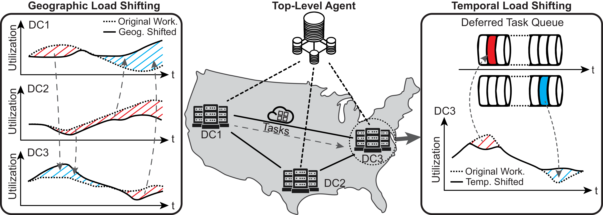

========
Overview
========

Data Center Cluster Model
--------------------------

High-level overview of the operational model of a |F| data center cluster is given below:

.. figure:: ../images/hier.png
   :scale: 18 %
   :alt: SustainCluster Framework for Data Center Cluster Management
   :align: center

The high-level components of |F| are:

  - **Top-Level Agent:** Central agent responsible for **all** spatio-temporal scheduling decisions. At each decision step it determines which tasks to execute immediately, which to defer, and in which datacenter each task should run.  
  - **Additional Controls:** Optional modules (e.g., energy storage) that augment the Top-Level Agent’s ability to optimize for multiple objectives—reducing carbon footprint, minimizing energy usage and cost, and potentially addressing water usage.

Scheduling Strategies
---------------------

Sustain-Cluster uses a unified, agent-based **spatio-temporal** scheduling framework, executed entirely by the Top-Level Agent.

Geographic Load Shifting Strategy
~~~~~~~~~~~~~~~~~~~~~~~~~~~~~~~~~~

Dynamically moves workloads between DC1, DC2, DC3, etc., based on the Top-Level Agent’s real-time view of each datacenter’s carbon intensity, energy price, temperature, and utilization.  
For example, if DC1’s CI and temperature spike, the agent may route new or deferred tasks to DC3, reducing DC1’s load and leveraging DC3’s more favorable conditions.

Temporal Scheduling Decisions
~~~~~~~~~~~~~~~~~~~~~~~~~~~~~

All temporal deferral logic is centralized in the Top-Level Agent. On each step, it evaluates every incoming or queued task and chooses to:

1. **Schedule immediately** in the best datacenter, or  
2. **Defer** to a later time step when overall conditions (lower CI, cooler temperatures, smoother utilization) are more favorable.

Deferred tasks reside in the global scheduler queue until the agent dispatches them.

Spatio-Temporal Scheduling Benefits
~~~~~~~~~~~~~~~~~~~~~~~~~~~~~~~~~~~

By centralizing both **where** and **when** decisions, Sustain-Cluster exploits synergies across space and time: it drives down energy costs, cuts carbon emissions, and smooths utilization by holistically reacting to workload, price, and environmental signals.

Data Center Model
-----------------

|F| models individual datacenters as follows:

.. _sustaindc_model:

.. figure:: ../images/SustainDC.png
   :scale: 25 %
   :alt: Overview of the individual data center
   :align: center

Workloads arrive from a proxy client. Some jobs may be flexible (deferrable); the Top-Level Agent manages all deferrals globally. Servers generate heat, which is removed by an HVAC loop:  

  1. Warm air → Computer Room Air Handler (CRAH)  
  2. Chilled-water loop cools air → returns to IT hall  
  3. Separate water loop rejects heat → cooling tower  

.. _sustaindc_hvac:

.. image:: ../images/Data_center_modelled.png
   :scale: 60 %
   :alt: Overview of the SustainDC HVAC system
   :align: center

Large datacenters may also include battery banks. Batteries charge when CI is low and discharge to support the DC during high-CI periods.

Input Data Sources
------------------

|F| ingests external data streams to simulate realistic conditions:

  - **Workload data** – time-series of computational demand  
  - **Weather data** – ambient temperature, humidity, etc.  
  - **Carbon Intensity data** – grid CO₂ intensity time-series  

For more details on environments, RL algorithms, reward functions, and external data handling, see:

.. toctree::
   :maxdepth: 1
   :titlesonly:

   environments
   externaldata
   algorithms
   reward_function
