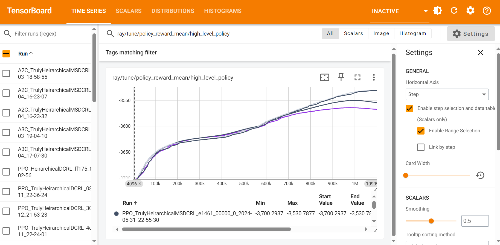

.. _evaluation:

Evaluation
==========

After running the benchmarks, you can compare the results by examining the output files in the ``results/`` directory. These files include detailed metrics on energy consumption, carbon footprint, and workload distribution across data centers. Use these metrics to assess the relative performance of different algorithms and configurations.

Evaluation Metrics
------------------

Sustain-Cluster provides a range of evaluation metrics to assess the performance of the benchmarked algorithms:

- **Energy Consumption**: Total energy consumed by the data centers during the simulation.
- **Carbon Footprint**: Total carbon emissions generated by the data centers, calculated based on the energy mix and carbon intensity of the power grid.
- **Water Usage**: Total water consumed, primarily by cooling systems such as chillers and cooling towers.
- **SLA Violations**: Number or percentage of Service Level Agreement (SLA) breaches due to unmet latency or resource requirements.
- **Workload Distribution**: Efficiency of workload distribution across data centers, considering factors like latency, bandwidth cost, and data center utilization.

These metrics provide a comprehensive view of the performance of different algorithms and configurations, enabling you to identify the most effective strategies for sustainable data center management.

TensorBoard Visualization
-------------------------

Benchmarking results can be monitored using TensorBoard. After starting the training process, view the results with:

.. code-block:: bash

   tensorboard --logdir=/runs/

This will start a TensorBoard server; open your browser at ``http://localhost:6006`` to view the experiment visualizations.

An example of the TensorBoard dashboard for Sustain-Cluster experiments is shown below:

