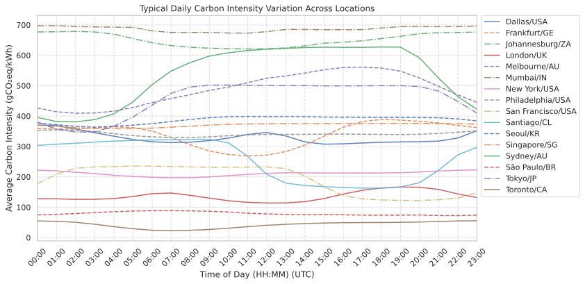

.. _externaldata:

External Input Data
===================

SustainCluster integrates multiple real-world datasets to create realistic and challenging scheduling scenarios that reflect the dynamic nature of global infrastructure and environmental factors.

Summary table of datasets:

.. list-table:: Summary of datasets
   :header-rows: 1
   :widths: 20 25 55

   * - **Dataset**
     - **Source**
     - **Description**
   * - AI Workloads
     - Alibaba Cluster Trace 2020
     - Real-world GPU workload traces from Alibaba's data centers.
   * - Electricity Prices
     - Electricity Maps, GridStatus
     - Real-time electricity prices for various regions.
   * - Carbon Intensity
     - Electricity Maps
     - Real-time carbon intensity data (gCO₂eq/kWh) for various regions.
   * - Weather
     - Open-Meteo
     - Real-time weather data (temperature, humidity) for cooling proxy.
   * - Transmission Costs
     - AWS, GCP, Azure
     - Per-GB transfer costs between regions.

4.1 AI Workloads (Alibaba GPU Cluster Trace)
^^^^^^^^^^^^^^^^^^^^^^^^^^^^^^^^^^^^^^^^^^^^^

* **Source:** We use the `Alibaba Cluster Trace 2020 <https://github.com/alibaba/clusterdata/tree/master/cluster-trace-gpu-v2020>`_, a real-world dataset of GPU jobs from a large production cluster operated by Alibaba PAI. It covers two months (July–August 2020), including over **6 500 GPUs** across **~1 800 machines**. This trace contains **training and inference jobs** using frameworks like TensorFlow, PyTorch, and Graph-Learn. These jobs span a wide range of machine learning workloads, and each job may consist of multiple tasks with multiple instances.

* **Preprocessing:**
  * **Filtering:** Remove very short tasks, keeping only those ≥ 15 minutes (typical of substantial training or inference workloads).
  * **Temporal Extension:** Extend the 2-month trace to cover a full year by replicating observed daily and weekly patterns.
  * **Origin Assignment:** Assign a **probabilistic origin** datacenter to each task based on regional **population** weights and local **time-of-day** activity boosts (simulating higher generation during business hours). See Section 7.3 for details.
  * **Grouping:** Aggregate tasks into 15-minute intervals based on their arrival times to align with the simulation timestep.

* **Dataset Format (After Cleaning):** The cleaned dataset is saved as a Pandas `.pkl` DataFrame file with the following structure:

  +--------------------+-------------------------------------------------------------+
  | interval_15m       | tasks_matrix                                                |
  +====================+=============================================================+
  | 2020-03-01 08:00   | [[job1, tstart, tend, start_dt, duration, cpu, gpu, mem,    |
  |                    |   gpu_mem, bw, day_name, day_num], …]                       |
  +--------------------+-------------------------------------------------------------+
  | 2020-03-01 08:15   | [[jobN, …]]                                                 |
  +--------------------+-------------------------------------------------------------+
  | …                  | …                                                           |
  +--------------------+-------------------------------------------------------------+

  Where:

  - ``interval_15m``: The 15-minute time window (UTC) when the task starts.  
  - ``tasks_matrix``: A NumPy array representing all tasks in that interval. Each task row includes:  
    1. **job_id**: Unique task identifier.  
    2. **start_time**: Start timestamp (Unix).  
    3. **end_time**: End timestamp (Unix).  
    4. **start_dt**: UTC datetime of start.  
    5. **duration_min**: Task duration in minutes.  
    6. **cpu_usage**: Number of CPU cores requested (e.g., `600.0` → 6 cores).  
    7. **gpu_wrk_util**: Number of GPUs requested (e.g., `50.0` → 0.5 GPUs).  
    8. **avg_mem**: Memory used (GB).  
    9. **avg_gpu_wrk_mem**: GPU memory used (GB).  
    10. **bandwidth_gb**: Estimated input data size (GB).  
    11. **weekday_name**: Day name (e.g., Monday).  
    12. **weekday_num**: Integer from 0 (Monday) to 6 (Sunday).

.. admonition:: Resource Normalization

   In the original Alibaba dataset, both CPU and GPU requirements are stored as percentages:

   - `600.0` = 6 vCPU cores  
   - `50.0` = 0.5 GPUs  

   We keep this representation in the `.pkl` file. However, during task extraction and simulation, we normalize these values into actual hardware units using the logic in `extract_tasks_from_row()` (located in `workload_utils.py`):

   .. code-block:: python

      job_name     = task_data[0]
      duration     = float(task_data[4])
      cores_req    = float(task_data[5]) / 100.0    # Convert percentage to core count
      gpu_req      = float(task_data[6]) / 100.0    # Convert percentage to GPU count
      mem_req      = float(task_data[7])            # Memory in GB
      bandwidth_gb = float(task_data[8])            # Data transfer size in GB

      task = Task(job_name, arrival_time, duration,
                  cores_req, gpu_req, mem_req, bandwidth_gb)
      tasks.append(task)

4.2 Electricity Prices
^^^^^^^^^^^^^^^^^^^^^^

* **Sources:** Real historical electricity price data is collected from various sources, including `Electricity Maps <https://www.electricitymaps.com/>`_, `GridStatus.io <https://gridstatus.io/>`_, and regional ISO APIs (e.g., CAISO, NYISO, ERCOT, OMIE).  
* **Coverage:** Data covers the years 2020–2024 for over 20 global regions corresponding to the supported datacenter locations.  
* **Standardization:** Prices are cleaned, converted to a standard format (UTC timestamp, USD/MWh), and aligned with the simulation's 15-minute intervals. For simulation purposes, prices are typically normalized further (e.g., to USD/kWh).  
* **Storage:** Data is organized by region and year in CSV files located under `data/electricity_prices/standardized/`. See `data/electricity_prices/README.md` for details.

4.3 Carbon Intensity
^^^^^^^^^^^^^^^^^^^^

* **Source:** Grid carbon intensity data (grams CO₂-equivalent per kWh) is sourced from the `Electricity Maps API <https://www.electricitymaps.com/>`_.  
* **Coverage:** Provides historical data (2021–2024) for the supported global regions.  
* **Resolution:** Data is typically available at hourly or sub-hourly resolution and is aligned with the simulation's 15-minute timestep.  
* **Units:** Stored and used as gCO₂eq/kWh.

4.4 Weather
^^^^^^^^^^^

* **Source:** Historical weather data, primarily air temperature and potentially wet-bulb temperature, is obtained via the `Open-Meteo API <https://open-meteo.com/>`_.  
* **Coverage:** Data covers the years 2021–2024 for the supported datacenter locations.  
* **Usage:** Temperature data directly influences the simulated efficiency and energy consumption of datacenter cooling systems (HVAC).

4.5 Transmission Costs (per-GB)
^^^^^^^^^^^^^^^^^^^^^^^^^^^^^^^

* **Sources:** Inter-region data transfer costs are based on publicly available pricing information from major cloud providers: `AWS <https://aws.amazon.com/ec2/pricing/on-demand/>`_, `GCP <https://cloud.google.com/vpc/pricing>`_, and `Azure <https://azure.microsoft.com/en-us/pricing/details/bandwidth/>`_.  
* **Format:** We compile this information into matrices representing the cost (in USD) to transfer 1 GB of data between different cloud regions. The specific matrix used depends on the `cloud_provider` configured in the simulation.  
* **Storage:** These cost matrices are stored as CSV files within the `data/` directory and loaded by the `transmission_cost_loader.py` utility.

4.6 Dataset Visualizations
^^^^^^^^^^^^^^^^^^^^^^^^^^

To provide insights into the characteristics of the integrated datasets, the repository includes several visualizations (located in assets/figures/ and generated by scripts like plot_alibaba_workload_stats.py).

**Workload Characteristics**

.. figure:: ../images/svgs/alibaba_task_durations.svg
   :alt: Task Duration Distribution
   :width: 70%
   :align: center
   
   Task Duration Distribution

.. figure:: ../images/svgs/alibaba_resource_usage.svg
   :alt: Resource Usage Distributions
   :width: 70%
   :align: center
   
   Resource Usage Distributions

.. figure:: ../images/svgs/alibaba_task_count_heatmap.svg
   :alt: Task Load Heatmap
   :width: 70%
   :align: center
   
   Task Load Heatmap

.. figure:: ../images/svgs/alibaba_hourly_cpu_requests.svg
   :alt: Hourly CPU Requests
   :width: 70%
   :align: center
   
   Hourly CPU Requests

.. figure:: ../images/svgs/alibaba_hourly_gpu_requests.svg
   :alt: Hourly GPU Requests
   :width: 70%
   :align: center
   
   Hourly GPU Requests

.. figure:: ../images/svgs/alibaba_hourly_memory_requests.svg
   :alt: Hourly Memory Requests
   :width: 70%
   :align: center
   
   Hourly Memory Requests

.. figure:: ../images/svgs/alibaba_task_gantt_resources.svg
   :alt: Task Gantt Chart
   :width: 70%
   :align: center
   
   Task Gantt Chart

**Environmental Factors**

.. figure:: ../images/svgs/temperature_trends.svg
   :alt: Temperature Trends
   :width: 70%
   :align: center
   
   *Average daily temperature across selected datacenter regions (°C)*

.. figure:: ../images/svgs/carbon_intensity_trends.svg
   :alt: Carbon Intensity Trends
   :width: 70%
   :align: center
   
   *Average daily carbon intensity across selected datacenter regions (gCO₂eq/kWh)*

.. figure:: ../images/svgs/electricity_price_patterns.svg
   :alt: Electricity Price Trends
   :width: 70%
   :align: center
   
   *Average hourly electricity price profile over a typical day (UTC time)*

   
   *Average hourly carbon intensity profile over a typical day (UTC time)*