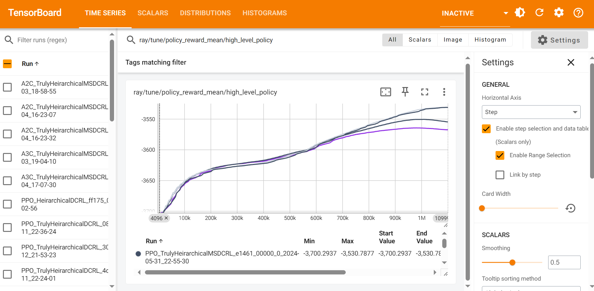

Evaluation
=============================

After running the benchmarks, you can compare the results by examining the output files in the :code:`results/` directory. These files include detailed metrics on energy consumption, carbon footprint, and workload distribution across data centers. Use these metrics to assess the relative performance of different algorithms and configurations

Evaluation Metrics 
-------------------

|F| provides a range of evaluation metrics to assess the performance of the benchmarked algorithms:

  - **Energy Consumption**: Total energy consumed by the data centers during the simulation.
  - **Carbon Footprint**: Total carbon emissions generated by the data centers, calculated based on the energy mix and carbon intensity of the power grid.
  - **Workload Distribution**: Efficiency of workload distribution across data centers, considering factors like latency, bandwidth cost, and data center utilization.

These metrics provide a comprehensive view of the performance of different algorithms and configurations, enabling you to identify the most effective strategies for sustainable data center management.

TensorBoard visualization
--------------------------

Benchmarking results can be monitored using TensorBoard. |F| provides a custom callback implementation called :code:`CustomCallbacks` found in :code:`utils/rllib_callbacks.py` which can be used to track the performance of the model during training with TensorBoard.

After starting the training process, you can view the results using TensorBoard by running the following command in your terminal: :code:`tensorboard --logdir=/results/`. This will start a TensorBoard server, and you can view the experiment visualizations by opening a web browser and navigating to `http://localhost:6006`.

Once TensorBoard is running, you can view various metrics such as the average total energy with battery (:code:`total_energy_with_battery`), the average CO2 footprint (:code:`CO2_footprint_mean`), and the total load left (:code:`load_left_mean`). You can also monitor the model's progress by viewing graphs of the various metrics during training (such as :code:`episode_reward_mean`).

An example of the Tensorboard dashboard for |F| experiments is given below

Custom Metrics
--------------------------

To add new custom metrics to track during training with TensorBoard, you can modify the :code:`CustomCallbacks` class as follows:

  - Create a new key in the :code:`episode.user_data` dictionary in the :code:`on_episode_start` method.
  - Store or collect the value of the desired metric in the :code:`on_episode_step` method.
  - Continue to store or modify the value of the desired metric in the :code:`on_episode_end` method, a function that is called at the end of each episode in the training process and store the final metric value using the :code:`episode.custom_metrics` dictionary.

Once you have added the custom metric to the :code:`CustomCallbacks` class, you can view it in TensorBoard by selecting the appropriate metric from the dropdown list of metrics in the TensorBoard dashboard. Overall, adding custom metrics in this way gives you greater flexibility and control over the training process, allowing you to track specific metrics that are relevant to your use case and goals.

